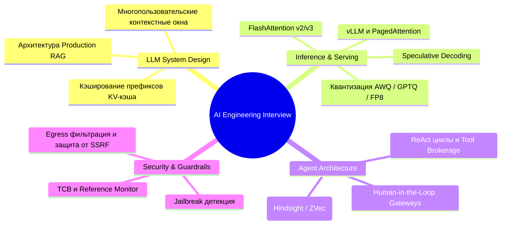

# 🚀 AI Engineering Interview Questions: Полная карта технических интервью в топ AI-лабораториях

> **Ссылка на репозиторий:** [https://github.com/pallavi-shekhar/ai-engineering-interview-questions-company-wise](https://github.com/pallavi-shekhar/ai-engineering-interview-questions-company-wise)  
> **Автор:** Pallavi Shekhar (@pallavi-shekhar)  
> **Слоган:** *«Your Cheat Sheet For AI Engineering Interviews at Top AI Companies — Real questions asked across 35 top labs.»*  
> **Звёзды GitHub:** 940+ ★ (Топ чартов Trendshift)  
> **Охват:** 35 технологических гигантов и AI-стартапов (OpenAI, Anthropic, Google, Meta, Databricks, Mistral, Scale AI и др.)  
> **Лицензия:** CC0-1.0 (Public Domain)  

---

## 🎯 1. В чем ценность данного руководства?

Профессия **AI Engineer** переживает тектонический сдвиг: если пару лет назад на собеседованиях спрашивали базовые вопросы про обучение сверточных сетей и синтаксис LangChain, то сегодня требования включают:
* **LLM System Design:** Проектирование отказоустойчивых RAG-архитектур на миллиарды документов;
* **Инфраструктура инференса:** Понимание PagedAttention, vLLM, FlashAttention, спекулятивного декодирования и квантизации FP8;
* **Оркестрация агентов:** Обработка ошибок инструментов, предотвращение циклов, context window management и безопасность (Prompt Injection / SSRF).

Этот репозиторий агрегирует **реальные вопросы технических раундов из 35 передовых компаний**, структурированные по компаниям и тематическим блокам.

---

## 🗺️ 2. Ключевые тематические модули интервью

---

## 📋 3. Топ-5 реальных вопросов с архитектурных раундов

1. **Anthropic / OpenAI (Inference Optimization):**
   * *«Как устроена виртуализация памяти в PagedAttention и почему наивное выделение памяти под KV-кэш приводит к 60–80% фрагментации памяти GPU?»*
2. **Databricks / Meta (RAG Scale):**
   * *«Спроектируйте систему поиска по корпоративной базе знаний объемом 500 млн документов с гарантированной задержкой p99 < 150 мс и защитой от утечки персональных данных между отделами.»*
3. **Google (Agent Orchestration):**
   * *«Как предотвратить зацикливание агента при возникновении каскадных ошибок вызова внешних API без жесткого прерывания полезного воркфлоу?»*
4. **Scale AI (Data Quality & Evaluation):**
   * *«Как построить надежный автоматизированный конвейер валидации качества синтетических датасетов для файн-тюнинга reasoning-моделей (RLVR/GRPO)?»*
5. **Mistral / Cohere (Model Alignment):**
   * *«В чем математические различия между классическим PPO, DPO и современным GRPO с точки зрения стабильности градиентов и расхода памяти?»*

---

## 🎯 4. Значение для инженера

Руководство служит идеальным компасом не только для подготовки к собеседованиям, но и для **самоаудита профессиональной экспертизы**: оно четко очерчивает границу между знанием поверхностных оберток и настоящим системным дизайном в сфере искусственного интеллекта.
