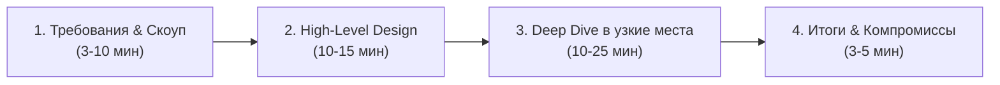
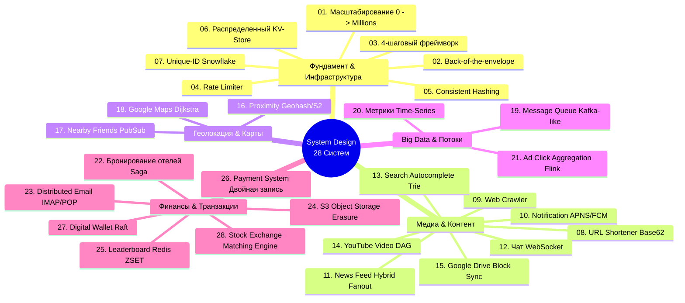

# 🏛️ System Design Notes: Конспект и архитектурная матрица бестселлера Алекса Сю (Vol 1 & Vol 2)

> **Ссылка на репозиторий:** [https://github.com/liquidslr/system-design-notes](https://github.com/liquidslr/system-design-notes)  
> **Интерактивная версия:** [https://pagefy.io/system-design/system-design-interview-by-alex-xu](https://pagefy.io/system-design/system-design-interview-by-alex-xu)  
> **Автор конспекта:** liquidslr  
> **Первоисточник:** Книги Алекса Сю (*Alex Xu, ByteByteGo*) *«System Design Interview – An Insider's Guide» (Volume 1 & Volume 2)*  
> **Звёзды GitHub:** 24,000+ ★  
> **Охват:** 28 глав — от масштабирования с нуля до биржевых движков (Stock Exchange) и распределенных кошельков (Digital Wallet)  

---

## 🎯 1. В чем ценность данного конспекта?

Двухтомник Алекса Сю (*System Design Interview*) стал мировым «золотым стандартом» подготовки к архитектурным секциям в FAANG/BigTech и проектирования реальных распределенных систем. Однако в оригинале книги занимают более 600 страниц плотного текста со сложными диаграммами.

Репозиторий **`liquidslr/system-design-notes`** решает ключевую задачу: **собрать структурированный, лаконичный конспект всех 28 глав**, выделив:
* Четкие формулировки требований (функциональные и нефункциональные).
* Оценки масштаба «на коленке» (*Back-of-the-envelope estimations*).
* Пошаговую эволюцию архитектуры (от простейшей схемы до гео-распределенного кластера).
* Разбор узких мест (*bottlenecks*), граничных условий (*edge cases*) и компромиссов (*trade-offs*).

---

## 🧭 2. Универсальный 4-шаговый фреймворк архитектурного интервью

Любая архитектурная задача на реальном интервью (или на проектном комитете) раскладывается на 4 строгих этапа (рекомендуемый тайминг на 45-минутную сессию):

| Этап | Время | Ключевые действия и цели |
| :--- | :---: | :--- |
| **Шаг 1: Понимание задачи и границ системы** *(Understand the Problem & Scope)* | 3–10 мин | Задавать уточняющие вопросы. Зафиксировать функциональные (что строим) и нефункциональные требования (HA, Latency, Consistency). Сделать грубые расчеты масштаба (QPS, Storage, Network Bandwidth). |
| **Шаг 2: Высокоуровневый дизайн** *(High-Level Design)* | 10–15 мин | Спроектировать API (REST/gRPC), базовую схему данных (SQL vs NoSQL). Нарисовать верхнеуровневую схему компонентов (Clients → DNS → CDN → Load Balancer → Web/API Servers → Cache → DB). |
| **Шаг 3: Глубокое погружение** *(Design Deep Dive)* | 10–25 мин | Сфокусироваться на самых критичных компонентах: алгоритмы rate limiting, партиционирование данных, разрешение коллизий, отказоустойчивость при падении узлов, репликация. |
| **Шаг 4: Подведение итогов и компромиссы** *(Wrap Up)* | 3–5 мин | Обозначить узкие места, мониторинг (метрики, алерты), обработку сбоев, масштабирование следующего порядка (10x growth) и обосновать выбранные компромиссы. |

---

## ⚡ 3. Базовые задержки, которые обязан знать каждый инженер

Алекс Сю подчеркивает важность понимания порядков величин (Latency Numbers Every Programmer Should Know):

* **L1 cache reference:** `~0.5 ns`
* **L2 cache reference:** `~7 ns`
* **RAM reference (Main memory):** `~100 ns`
* **Чтение 1 МБ последовательно из RAM:** `~250 μs` (0.25 ms)
* **SSD random read:** `~150 μs`
* **Чтение 1 МБ последовательно из SSD:** `~1 ms`
* **Чтение 1 МБ последовательно из HDD:** `~20 ms`
* **RTT в рамках одного дата-центра:** `~0.5 ms`
* **RTT между Калифорнией и Нидерландами:** `~150 ms`

> **Золотое правило масштабирования:** Память быстрая, диск медленный. Последовательное чтение в десятки раз быстрее случайного. Сеть через океан — самое дорогое место в архитектуре.

---

## 📚 4. Систематический каталог всех 28 архитектурных систем

Вся кодовая база конспекта структурирована по 28 главам (Volume 1 + Volume 2):

### Блок I: Фундаментальные кирпичики масштабирования (Ch. 1–7)
1. **01. Scale From Zero To Millions Of Users:** Вертикальное vs горизонтальное масштабирование, денормализация, кэширование (Cache-Aside, Write-Through), репликация БД (Master-Replica), шардирование (Sharding by shard key), гео-распределение через CDN и Anycast DNS.
2. **02. Back Of the Envelope Estimation:** Степени двойки, расчет RPS (1 млн запросов в день $\approx$ 12 RPS; 100 млн запросов $\approx$ 1 200 RPS), расчет емкости хранилища и пропускной способности сети.
3. **03. System Design Framework:** Регламент прохождения архитектурных собеседований.
4. **04. Rate Limiter:** 5 ключевых алгоритмов:
   * *Token Bucket* (прост, обрабатывает burst-трафик).
   * *Leaky Bucket* (стабильный темп оттока, FIFO очередь).
   * *Fixed Window Counter* (проблема удвоения лимита на стыке окон).
   * *Sliding Window Log* (высокая точность, но высокое потребление памяти).
   * *Sliding Window Counter* (оптимальный баланс памяти и точности).
   * Реализация распределенного счетчика: Redis с TTL + Lua-скрипты.
5. **05. Consistent Hashing:** Решение проблемы перераспределения данных при добавлении/удалении серверов (вместо $hash(key) \pmod n$). Хэш-кольцо и виртуальные ноды (*virtual nodes*) для устранения дисбаланса нагрузки.
6. **06. Key-Value Store:** Проектирование распределенного хранилища класса Dynamo/Cassandra:
   * CAP-теорема и PACELC.
   * Кворум чтения и записи: $W + R > N$ для строгой согласованности (*Strong Consistency*).
   * Разрешение конфликтов: Векторные часы (*Vector Clocks*) и Last-Write-Wins.
   * Детектирование сбоев: Gossip-протокол.
   * Движок хранения узла: LSM-Tree + SSTable + Bloom Filter.
7. **07. Unique-Id Generator:** Генерация 64-битных уникальных ID в распределенной среде без единой точки отказа. Twitter Snowflake: 1 бит (знак) + 41 бит (timestamp) + 5 бит (Datacenter ID) + 5 бит (Machine ID) + 12 бит (Sequence number).

### Блок II: Сервисы контента, медиа и обмена сообщениями (Ch. 8–15)
8. **08. URL Shortener:** Алгоритм сжатия Base62, хэширование MD5/SHA с разрешением коллизий, генерация диапазонных ID через distributed counter.
9. **09. Web Crawler:** Архитектура поискового робота: URL Frontier (приоритеты и politeness), DNS-кэш, фильтрация дубликатов через Bloom-фильтры, распределенный парсинг HTML.
10. **10. Notification System:** Унифицированный шлюз пуш-уведомлений (iOS APNS, Android FCM, SMS Twilio, Email SendGrid), очереди сообщений, дедупликация и защита от флуда.
11. **11. News Feed System:** Модели распространения контента:
    * *Fanout-on-write (Push)*: Быстрое чтение, но взрывной рост при наличии знаменитостей (*celebrity problem*).
    * *Fanout-on-read (Pull)*: Медленное чтение, экономия ресурсов.
    * *Hybrid Model*: Push для обычных пользователей, Pull для аккаунтов с миллионами подписчиков.
12. **12. Chat System:** Поддержка миллионов одновременных соединений: переключение HTTP Polling $\to$ WebSocket, серверы присутствия (*Presence Servers*), синхронизация непрочитанных сообщений, Mochi/Kafka брокеры.
13. **13. Search Autocomplete:** Структура данных Trie (префиксное дерево), кэширование Top-K результатов в каждом узле дерева, асинхронный MapReduce пайплайн для обновления весов запросов.
14. **14. YouTube:** Конвейер загрузки и обработки видео: Blob Storage (S3), DAG-ориентированный транскодинг (разбиение на чанки, сжатие в форматы H.264/AV1, генерация манифестов HLS/DASH), стриминг через CDN.
15. **15. Google Drive:** Синхронизация файлов: разделение файла на блоки по 4 МБ, дедупликация блоков по SHA-256, дельта-синхронизация (*delta-sync*), версионирование в метаданных БД, Notification Server на WebSockets.

### Блок III: Геолокация и пространственные сервисы (Ch. 16–18)
16. **16. Proximity Service (Поиск ближайших объектов):** Сравнение пространственных индексов: 2D решетка vs Geohash (преобразование широты/долготы в строку Base32) vs Quadtree vs Uber H3 / Google S2.
17. **17. Nearby Friends:** Отслеживание друзей поблизости в реальном времени: постоянные WebSocket-соединения, гео-шардированный Redis Pub/Sub, расчет расстояния по формуле гаверсинусов, TTL-кэширование локаций.
18. **18. Google Maps:** Масштабный картографический сервис: иерархическая тайловая сетка (векторные тайлы для разных зумов), алгоритмы поиска кратчайшего пути (A* / Contraction Hierarchies на графах дорожной сети), прогнозирование времени прибытия (ETA) с учетом истории трафика.

### Блок IV: Big Data, мониторинг и стриминг (Ch. 19–21)
19. **19. Distributed Message Queue:** Архитектура distributed log (аналог Apache Kafka): топики, партиции, сегментные файлы на диске, механизм Zero-Copy (`sendfile`), репликация через In-Sync Replicas (ISR), Consumer Groups.
20. **20. Metrics Monitoring and Alerting System:** Сбор и визуализация тайм-серий: модель Pull (Prometheus) vs модель Push, Time-Series Database (TSDB: Gorilla/InfluxDB с алгоритмами сжатия double-delta и XOR), движок правил алертинга.
21. **21. Ad Click Event Aggregation:** Потоковая обработка миллиардов кликов: разделение Event Time и Processing Time, оконные функции (Tumbling vs Sliding Windows), механизмы Watermarking для учета запаздывающих событий, гарантии Exactly-Once доставки.

### Блок V: Финансовые, транзакционные и mission-critical системы (Ch. 22–28)
22. **22. Hotel Reservation System:** Предотвращение овербукинга: пессимистические блокировки (`SELECT FOR UPDATE`), оптимистические блокировки (версионирование записей), распределенные транзакции через Saga-паттерн и двухфазную фиксацию (2PC).
23. **23. Distributed Email Service:** Архитектура почтового сервиса: протоколы SMTP, POP3, IMAP, распределенное хранилище писем (Object Store для аттачментов + NoSQL/LSM для тел писем), спам-фильтрация и поиск.
24. **24. S3-like Object Storage:** Объектное распределенное хранилище: разделение сервиса метаданных и сервиса данных, хранение неизменяемых блоков, защита от потери дисков через Erasure Coding (схема $8+4$ вместо тройной репликации), Garbage Collection удаленных объектов.
25. **25. Real-time Gaming Leaderboard:** Таблица лидеров для миллионов игроков: Redis Sorted Sets (`ZADD`, `ZREVRANK`), шардирование по диапазонам очков, альтернативные структуры на Segment Trees при работе с реляционными базами данных.
26. **26. Payment System:** Платежная система уровня Amazon/Stripe:
   * **Двойная бухгалтерская запись (Double-Entry Bookkeeping):** Каждая копейка учитывается в двух местах (дебет и кредит), сумма всех записей в системе всегда равна 0.
   * **Идемпотентность (Idempotency):** Использование ключей идемпотентности во избежание повторного списания при сетевых сбоях.
   * **Reconciliation Loop (Сверка):** Ежедневная автоматическая сверка записей внутреннего реестра с банковскими выписками от эквайеров.
27. **27. Digital Wallet:** Распределенный электронный кошелек: модель балансов в оперативной памяти для ультранизкой задержки, обеспечение строгой консистентности через Raft-консенсус, репликация State Machine.
28. **28. Stock Exchange:** Электронная биржа акций (NYSE/NASDAQ):
   * Движок сопоставления заявок (*Matching Engine*): стакан ордеров (Order Book L1, L2, L3), FIFO + ценовой приоритет.
   * Детерминированное исполнение: секвенсор входящих заявок (LMAX Disruptor), кольцевой буфер без блокировок (*lock-free ring buffer*).
   * Сверхнизкая задержка: минимизация сетевых прыжков, бинарный протокол FIX/ITCH, исполнение в памяти, zero-garbage collection.

---

## ⚖️ 5. Сводная матрица компромиссов (Trade-offs Cheatsheet)

| Проблема | Вариант А | Вариант Б | Когда выбирать вариант А | Когда выбирать вариант Б |
| :--- | :--- | :--- | :--- | :--- |
| **Сетевое взаимодействие** | REST / JSON | gRPC / Protocol Buffers | Публичные внешние API, браузерные клиенты | Внутреннее межсервисное общение (микросервисы), низкая задержка |
| **Репликация БД** | Синхронная | Асинхронная | Финансовые данные, где недопустима потеря даже 1 транзакции | Высоконагруженные медиа-сервисы, где критична скорость ответа |
| **Разрешение конфликтов** | Last Write Wins (LWW) | Vector Clocks | Низкие требования к потере промежуточных правок | Многопользовательское редактирование, корзины покупок (Amazon) |
| **Хранение медиа** | Replication (3x) | Erasure Coding ($M+N$) | Небольшие горячие данные с мгновенным доступом | Холодные архивы, петабайтные хранилища (экономия до 50–60% емкости) |
| **Конкурентность бронирования** | Pessimistic Lock | Optimistic Lock | Очень высокий конфликт на один ресурс (горячий концерт) | Низкий уровень коллизий (большой отель с тысячами номеров) |

---

## 🔗 6. Интеграция в общую базу знаний

Данный конспект является теоретическим и архитектурным фундаментом для других разделов базы знаний:
* Практическое применение в интервью: [📄 AI Engineering Interviews](file:///home/blackzeshi/Documents/Notes/00_strategy_and_roadmaps/ai-engineering-interviews.md)
* Визуальные схемы базовых паттернов: [📄 System Design 101](file:///home/blackzeshi/Documents/Notes/06_developer_tools_and_apps/system-design-101.md)
* Архитектура агентных брокеров и шлюзов: [📄 Tool Broker Architecture](file:///home/blackzeshi/Documents/Notes/02_agent_runtimes_and_harnesses/tool-broker-architecture.md)
* Стандарт безопасности ядра: [📄 TCB & Reference Monitor](file:///home/blackzeshi/Documents/Notes/05_security_osint_and_guardrails/tcb-agent-security.md)
