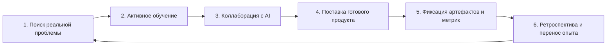

# 🚀 Up (人生进阶指南): Руководство по инженерному росту и созданию ценности в эпоху AI

> **Ссылка на репозиторий:** [https://github.com/byoungd/up](https://github.com/byoungd/up)  
> **Автор:** Хань Сянькай (韩先凯, псевдоним: Липу / 离谱, основатель Ciyuan Cloud)  
> **Название:** *«人生进阶指南｜AI 时代终身学习» (Life Level-Up Guide: Lifelong Learning in the AI Era)*  
> **Звёзды GitHub:** 67.0k+ ★  
> **Форматы:** Открытый репозиторий, EPUB, PDF, Web-книга  
> **Лицензия:** CC BY-NC 4.0  

---

## 🎯 1. В чем главная идея манифеста?

В эпоху генеративного ИИ готовые ответы, куски кода и поверхностные планы стали стоить дешево и генерируются за считанные секунды. Однако настоящая инженерная ценность не исчезла — она сместилась в более глубокие слои:
* **Понимание того, какие вопросы действительно стоит задавать.**
* **Способность отличать надежные доказательства от правдоподобных галлюцинаций.**
* **Умение превращать сгенерированный совет в работающий, поддерживаемый цифровой продукт.**
* **Готовность нести персональную ответственность за архитектурные и продуктовые решения.**

---

## 🔄 2. Непрерывный цикл решения задач (The Core Loop)

Книга формализует практический шестишаговый цикл, позволяющий инженеру не зависеть от хайпа и сохранять устойчивость:

1. **Обнаружение проблемы (Problem Discovery):** Фокусировка на том, что реально болит у пользователей или системы, а не на модных технологиях ради технологий.
2. **Активное обучение (Active Learning):** Погружение в фундаментальные принципы предметной области перед автоматизацией.
3. **Партнерство с AI (AI Collaboration):** Использование кодинг-агентов как высокоскоростных исполнителей при сохранении критического контроля над архитектурой.
4. **Завершение реальной задачи (Real Delivery):** Доведение проекта до коммита, деплоя и живых пользователей (готовый продукт важнее абстрактных черновиков).
5. **Сохранение доказательств (Evidence Preservation):** Фиксация метрик эффективности, замеров производительности и кода в открытом доступе.
6. **Ретроспектива (Transferable Review):** Извлечение универсальных паттернов, которые можно перенести в следующий проект.

---

## 📚 3. Разделение типов информации

Автор вводит жесткую информационную гигиену при работе с материалами и промптами:
* **Научные исследования (Research Evidence):** Должны сопровождаться прямой ссылкой на методологию и границы применимости.
* **Личный опыт (Personal Experience):** Воспринимается как единичный кейс, а не универсальное правило.
* **Действующие инструкции (Actionable Frameworks):** Пошаговые воспроизводимые алгоритмы, применимые на практике.
