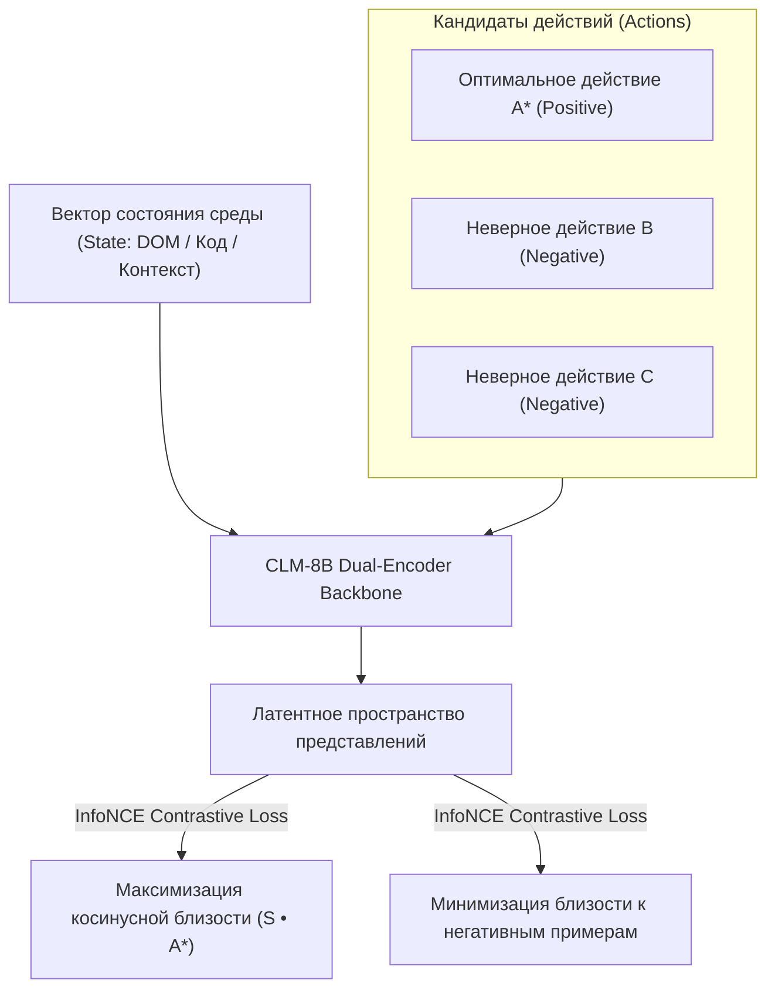

# 🧠 Contrastive Language Models (CLM): Новый класс моделей System-1 для прямого сопоставления состояний и действий

> **Ссылка на репозиторий:** [https://github.com/Contrastive-LM/CLM](https://github.com/Contrastive-LM/CLM)  
> **Организация:** Contrastive-LM Research  
> **Слоган:** *«A new class of System One models trained with a contrastive learning objective that connects states and actions. Serving CLM-8B.»*  
> **Звёзды GitHub:** 1.1k+ ★ (Топ чартов Trendshift)  
> **Стек:** Python 3.10+, PyTorch, Hugging Face, FlashAttention-2, vLLM, TypeSafe API  
> **Флагманская модель:** CLM-8B (Hugging Face)  
> **Лицензия:** MIT  

---

## 🎯 1. В чем фундаментальный инсайт CLM?

Традиционные языковые модели обучаются задаче **Next-Token Prediction (NTP)**:
* Модель оптимизирует вероятность следующего токена в тексте.
* Однако в задачах принятия решений агентом (выбор действия по состоянию среды) NTP заставляет модель тратить вычислительные ресурсы на грамматику и формулировку слов, а не на **геометрию связи между текущим состоянием (State) и доступными действиями (Actions)**.

**Концепция Contrastive Language Models (CLM):**
> Обучение языковой модели через **контрастивную функцию потерь (Contrastive Objective)**, проецирующую вектор текущего состояния среды $S$ и вектор оптимального действия $A^*$ в единое геометрическое пространство с максимальным скалярным произведением, одновременно отдаляя неоптимальные альтернативы.



---

## ⚡ 2. Ключевые преимущества CLM перед классическими LLM

1. **System-1 архитектура прямого выбора:** CLM выбирает действие за один проход эмбеддингов, не генерируя авторегрессионных токенов.
2. **Связь с парадигмой Option-Attention:** Идеально дополняет модели Jev и Laya, предоставляя математически выверенное латентное пространство для ранжирования миллионов действий.
3. **Исключение галлюцинаций в семантическом поиске:** Обученные CLM-векторы превосходят стандартные эмбеддинги BERT/E5 в задачах поиска релевантных инструментов (Tool Selection) и кода.
4. **Совместимость с TypeSafe API:** Готовые интерфейсы для интеграции с агентными харнесами.

---

## 💻 3. Пример использования CLM-8B для выбора действия

```python
import torch
from clm import ContrastiveLM

# Загрузка предобученной модели CLM-8B
model = ContrastiveLM.from_pretrained("Contrastive-LM/CLM-8B", torch_dtype=torch.bfloat16)

state = "База данных PostgreSQL перегружена медленными запросами на таблице orders"
action_candidates = [
    "Перезагрузить сервер базы данных",
    "Добавить индекс CREATE INDEX CONCURRENTLY на поле user_id",
    "Удалить старые строки из таблицы orders без бэкапа",
    "Увеличить max_connections в postgresql.conf"
]

# Вычисление контрастивной близости за 1 прямой прогон
scores = model.score_actions(state=state, actions=action_candidates)

best_action_idx = scores.argmax().item()
print(f"Оптимальное действие: {action_candidates[best_action_idx]}")
print(f"Степень соответствия (Logits): {scores[best_action_idx]:.4f}")
```

---

## 🎯 4. Значение для теории и практики AI

CLM представляет собой важный шаг к **преодолению ограничений чисто авторегрессионного моделирования**, объединяя гибкость понимания естественного языка с математической строгостью контрастивного обучения действиям.
