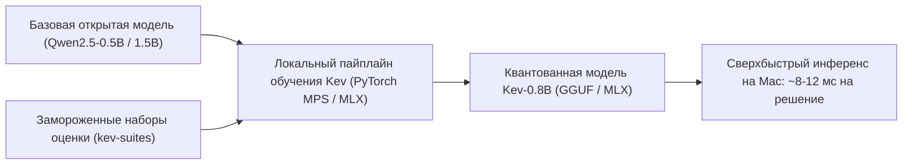

# 🧠 Kev: Сверхкомпактные модели Option-Attention, обучаемые и запускаемые на персональном ноутбуке

> **Ссылка на репозиторий:** [https://github.com/jaredpalmer/kev](https://github.com/jaredpalmer/kev)  
> **Автор:** Jared Palmer (@jaredpalmer) — создатель Turborepo, Formik, TSDX  
> **Слоган:** *«Small Jev-like decision models you can train and run on your MacBook.»*  
> **Звёзды GitHub:** 2.9k+ ★  
> **Веса моделей:** Kev-0.8B, Kev-4B, Kev-9B (Hugging Face)  
> **Стек:** Python 3.11+, PyTorch (MPS/CUDA), Apple MLX, Hugging Face Datasets  
> **Лицензия:** MIT  

---

## 🎯 1. В чем главная идея Kev?

Архитектура **Option-Attention** произвела революцию в скорости работы агентов, однако большинство ранних реализаций требовали либо серверных карт уровня NVIDIA A100/H100, либо закрытых облачных API.

**Джаред Палмер доказал обратное:**
> Полноценную модель быстрых решений (System-1 Decision Model) можно натренировать и запускать **локально на обычном MacBook с процессором Apple Silicon (M-серии)** на базе открытой архитектуры `Qwen2.5-0.5B`.



---

## ⚡ 2. Технические особенности реализации

1. **Базовый фундамент Qwen2.5:** Использование ультракомпактной модели `Qwen2.5-0.5B` позволило уместить процесс обучения в скромные объемы объединенной памяти Mac (Unified Memory) — от 16 до 36 ГБ.
2. **Прямое считывание логитов:** Модель не производит авторегрессионный цикл `decode()`. Вместо этого на последней позиции входного промпта извлекаются логиты по списку кандидатов.
3. **Замороженные тестовые сьюты (`kev-suites`):** Набор фиксированных эталонных датасетов для верификации точности ранжирования инструментов, классификации намерений и выбора UI-элементов.
4. **Кроссплатформенный экспорт:** Готовые веса легко конвертируются в формат Apple MLX для суб-10 мс вывода без нагрева устройства.

---

## 💻 3. Запуск инференса на Python

```python
from kev import KevModel, OptionRanks

# Загрузка компактной модели прямо в память MacBook (M1/M2/M3/M4)
model = KevModel.from_pretrained("jaredpalmer/kev-0.8b", device="mps")

query = "Очистить кэш сборки проекта и переустановить node_modules"
candidates = [
    "git reset --hard",
    "rm -rf node_modules package-lock.json && npm install",
    "npm run build",
    "docker system prune -a"
]

# Ранжирование опций за один прямой прогон (0 токенов вывода)
ranked_results = model.rank(context=query, options=candidates)

for r in ranked_results:
    print(f"[{r.score:.3f}] {r.option}")
```

---

## 🎯 4. Значение для разработчиков локального софта

Kev открывает дорогу созданию персональных терминальных CLI-утилит, умных менеджеров буфера обмена и локальных агентов, которые работают абсолютно автономно, мгновенно реагируют на действия пользователя и не тратят платные токены на рутинную классификацию.
