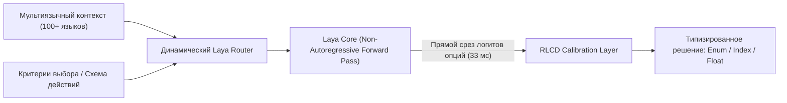

# 🧠 Laya: Мультиязычный неавторегрессионный движок дискретных решений System-1

> **Ссылка на репозиторий:** [https://github.com/NandhaKishorM/laya](https://github.com/NandhaKishorM/laya)  
> **Автор:** Nandha Kishor M (@NandhaKishorM)  
> **Слоган:** *«Multilingual, non-autoregressive System 1 decision engine. Typed decisions over 100+ languages in a single forward pass — 33 ms.»*  
> **Звёзды GitHub:** 13.6k+ ★ (#1 Daily & Weekly в чартах Trendshift)  
> **Стек:** Python, PyTorch, Hugging Face Transformers, MLX, CoreML, CUDA  
> **Лицензия:** Apache-2.0  

---

## 🎯 1. В чем фундаментальный инсайт Laya?

Если первые эксперименты с архитектурой **Option-Attention** (такие как `Jev` и `OpenJev`) доказали эффективность отказа от посимвольной генерации токенов в пользу прямого чтения логитов на английском языке, то **Laya** выводит этот принцип на глобальный уровень:
1. **Мультиязычность из коробки:** Поддержка более **100 естественных языков** для формулирования критериев и выбора действий без деградации точности.
2. **Экстремальная скорость System-1:** Время принятия решения — **33 мс** на стандартном GPU и **5–14 мс** на чипах Apple Silicon при нулевой генерации токенов (Zero Output Tokens).
3. **Обучение RLCD (Reinforcement Learning with Strictly Proper Scoring Rules):** Отказ от стандартной кросс-энтропии в пользу оптимизации калиброванных вероятностей, что гарантирует математическую достоверность скоринга альтернатив.



---

## ⚡ 2. Сравнение с классическими LLM

| Параметр | Авторегрессионная LLM (Chat/Instruct) | Laya (System-1 Decision Engine) |
|---|:---:|:---:|
| **Механизм вывода** | Посимвольная генерация JSON-строки | Прямой срез логитов за **1 Forward Pass** |
| **Сгенерировано токенов** | 50 – 250 токенов | **0 токенов** |
| **Задержка (Latency)** | 800 – 3500 мс | **33 мс** (GPU) / **5–14 мс** (Apple Silicon) |
| **Надежность парсинга** | Риск синтаксических ошибок JSON | Гарантированная строгая типизация (Enum/Bool) |
| **Мультиязычность** | Падение скорости на редких токенизаторах | Равномерная задержка на 100+ языках |

---

## 🏗️ 3. Аппаратная экосистема: MLX и CoreML

Успех Laya породил выделенные высокоскоростные рантаймы:
* **`laya-mlx`:** Нативная реализация для Apple Silicon на базе фреймворка MLX. Выдает решения за **7–14 мс** на чипах M3 Max без использования тяжеловесного PyTorch.
* **`laya-coreml`:** Полный перенос графа вычислений на Apple Neural Engine (ANE). Задержка составляет всего **~5 мс**, что делает Laya идеальным решением для фоновых мобильных и десктопных ассистентов с минимальным расходом батареи.

---

## 💻 4. Пример использования API

```python
from laya import LayaDecisionEngine, OptionSet

# Инициализация движка с авто-выбором оптимального бэкенда (CUDA / MLX / CPU)
engine = LayaDecisionEngine.from_pretrained("convaiinnovations/laya-multilingual")

# Определение типизированного пространства вариантов на любом языке
options = OptionSet([
    "Выполнить поиск в документации",
    "Запросить уточнение у пользователя",
    "Запустить модульные тесты",
    "Завершить выполнение задачи"
])

context = "Пользователь сообщил об ошибке NullPointerException в модуле auth.py."

# Принятие решения в один проход (33 мс, 0 сгенерированных токенов)
decision = engine.decide(context=context, options=options)

print(f"Выбранное действие: {decision.selected_option}")
print(f"Уверенность (калиброванная вероятность): {decision.confidence:.4f}")
print(f"Время вывода: {decision.latency_ms:.2f} ms")
```

---

## 🎯 5. Значение для агентных систем

Laya разделяет когнитивную нагрузку агента:
* **System-1 (Laya):** Быстрые, рефлекторные микро-решения (роутинг шагов, фильтрация спама, выбор инструментов, валидация условий цикла).
* **System-2 (Тяжелые LLM):** Глубокие рассуждения, синтез кода и написание развернутой документации.
Такая гибридная схема снижает расходы на API в 5–10 раз и устраняет задержки интерфейса.
