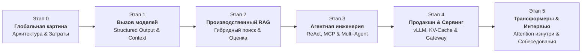

# 🧠 LLM-Master: Полностековая инженерная дорожная карта и учебник по LLM

> **Ссылка на репозиторий:** [https://github.com/youngyangyang04/llm-master](https://github.com/youngyangyang04/llm-master)  
> **Официальный портал курса:** [KamaCoder LLM Notes (卡码笔记-大模型专栏)](https://notes.kamacoder.com/llm/)  
> **Автор:** Young (youngyangyang04 / Карл) — автор культовых образовательных платформ CodeTop и KamaCoder (500,000+ разработчиков).  
> **Категория:** `01_llm_architecture_and_training`  
> **Звёзды GitHub:** 410+ ★ (Быстрорастущий образовательный репозиторий)  
> **Объем:** 150+ детальных инженерных глав, практические проекты, банк задач технических собеседований  
> **Лицензия:** MIT  

---

## 🎯 1. В чем миссия LLM-Master?

В индустрии колоссальный избыток поверхностных материалов: статей в стиле *«Как вызвать OpenAI API за 5 минут»* или абстрактных математических выкладок по дифференциальной геометрии оптимизаторов.

`LLM Master` решает главную проблему индустрии: **отсутствие структурированной траектории перехода практикующего backend- и fullstack-разработчика (Go, Java, C++, Python) в полноценного AI Application / Agent Platform инженера**.

Курс не останавливается на объяснении *«что это за концепция»*, а фокусируется на ключевых инженерных вопросах:
* **Почему выбрана именно такая архитектура?**
* **Как реализовать систему в производственном коде с учетом отказоустойчивости?**
* **Как локализовать и устранить сбои (latency, cost, hallucinations, bad recall)?**
* **Как аргументированно защитить системный дизайн на сеньорских собеседованиях?**

---

## 🗺️ 2. Шестиэтапная дорожная карта инженера (Engineering Roadmap)

Обучение построено по строгой цепочке зависимостей знаний, от базовых вызовов моделей до микроархитектуры трансформеров:

### Подробный разбор этапов:

### 🔹 Этап 0: Глобальная картина и системные границы
* **Жизненный цикл модели:** Pre-training $\rightarrow$ Post-training (SFT / Alignment) $\rightarrow$ Inference.
* **Декомпозиция стоимости:** расчет токенов, ценообразование контекстного окна, задержки ввода/вывода.
* **Четкое разделение зон ответственности:** *AI Application Engineer* (RAG, Agent, Tooling) vs *AI Infra Engineer* (vLLM, RoCE, Triton) vs *Algorithm Researcher* (Архитектура сетей, Pretraining).

### 🔹 Этап 1: Инженерия взаимодействия с моделями (Model Calling Fundamentals)
* Промпт-инжиниринг как контракт: Few-shot, Chain-of-Thought, System Instructions.
* **Structured Outputs:** Гарантированная генерация JSON по схеме (JSON Schema, Pydantic, Zod, Grammars).
* **Streaming SSE (Server-Sent Events):** Асинхронная доставка чанков, обработка прерываний и тайм-аутов.
* **Function Calling / Tool Use:** Спецификация инструментов, парсинг аргументов, валидация типов.
* **Context Engineering:** Управление контекстным окном, стратегии сжатия, семантическая обрезка (Truncation vs Summarization).

### 🔹 Этап 2: Производственный RAG (Production-Grade RAG Pipeline)
* **Ingestion & Chunking:** Анализ структуры документов (PDF, Markdown, HTML), чанкинг с учетом синтаксических границ (Markdown/Code AST aware).
* **Гибридный поиск (Hybrid Retrieval):** Комбинация плотных векторных эмбеддингов (Dense, HNSW/IVF) и разреженного лексического поиска (Sparse, BM25).
* **Reranking:** Применение Cross-Encoder моделей (BGE-Reranker, Cohere) для финальной фильтрации топ-N документов.
* **Цитирование и атрибуция:** Привязка утверждений модели к конкретным фрагментам источника (Citation mapping).
* **Оценка качества RAG (RAG Triad & RAGAS):**
  * *Context Relevance* (релевантность извлеченного контекста запросу);
  * *Groundedness / Faithfulness* (соответствие ответа извлеченному контексту без галлюцинаций);
  * *Answer Relevance* (соответствие ответа исходному вопросу пользователя).

### 🔹 Этап 3: От воркфлоу к автономным агентам (Agent Engineering)
* Паттерн **ReAct** (Reason + Act): циклы рассуждения, вызова тулов и наблюдения.
* **Архитектура инструментов и MCP:** Разработка серверов Model Context Protocol, разграничение прав доступа.
* **Управление состоянием и память:** Чекпоинты агента (State Persistence), оперативная рабочая память, долговременная семантическая память (Episodic / Semantic Store).
* **Отказоустойчивость агента:** Стратегии восстановления после ошибок (Tool execution failure recovery, self-reflection, budget bounding).
* **Мульти-агентные системы (Multi-Agent Patterns):** Архитектура Planner $\rightarrow$ Worker $\rightarrow$ Reviewer, координация через DAG задач, протоколы коммуникации.

### 🔹 Этап 4: Продакшн-инженерия, сервинг и оптимизация
* **Inference Engines:** Архитектура vLLM и SGLang, PagedAttention, распределение блоков памяти под KV-кэш.
* **Квантование моделей:** Понимание AWQ, GPTQ, FP8, INT4 и их влияния на точность и пропускную способность.
* **AI Gateway:** Rate-limiting по токенам (Token Bucket), семантическое кэширование (GPTCache), fallback-маршрутизация между провайдерами.
* **Производственные метрики:**
  * **TTFT** (Time To First Token) — время до первого токена;
  * **TPOT** (Time Per Output Token) — скорость генерации потока;
  * **Goodput** — доля запросов, уложившихся в SLA по задержке;
  * Емкостное планирование GPU-кластеров.

### 🔹 Этап 5: Архитектура Transformer и подготовка к интервью
* Разбор математики трансформеров: Scaled Dot-Product Attention, проекции $Q, K, V$, Multi-Head Attention, RoPE (Rotary Position Embedding).
* Написание минимального трансформера (**Tiny Transformer**) на чистом PyTorch с нуля.
* Тонкости файн-тюнинга: LoRA, QLoRA, различия SFT vs RLHF vs DPO vs KTO.
* Систематизация знаний для прохождения интервью на Senior/Staff позиции в ведущие технологические компании (ByteDance, Tencent, Alibaba, международный бигтех).

---

## 💼 3. Четыре Capstone-проекта для портфолио

Курс ориентирован на практический результат: каждый этап завершается полноценным проектом, спроектированным по стандартам production-grade систем:

| Проект | Архитектурный фокус | Минимальный стандарт сдачи (Acceptance Criteria) |
|---|---|---|
| **1. Промышленный AI-ассистент** | Streaming, Structured Outputs, Tool Calls | Потоковый SSE-вывод, строгая валидация JSON Schema, расчет стоимости токенов, контрактные автотесты. |
| **2. Корпоративная база знаний (RAG)** | Ingestion, Hybrid Search, Rerank, Evaluation | Фиксированный golden test-set, интеграция BM25 + Qdrant/Milvus, BGE-Reranker, бенчмарк RAGAS с бейслайном качества. |
| **3. Инструментальный AI-агент** | State Machine, Checkpointing, MCP, Retry | Машина состояний на графах, поддержка протокола MCP, сохранение чекпоинтов, лимиты бюджета вызовов, OpenTelemetry-трейсинг. |
| **4. Высоконагруженный AI Gateway** | Reverse Proxy, KV-Cache, Rate Limiting, Metrics | Семантический кэш, распределенный rate limiter, мониторинг TTFT/TPOT, стресс-тестирование locust/vegeta с отчетом емкости. |

---

## 🎯 4. Методология прохождения собеседований

В репозитории собрана обширная база реальных технических собеседований (включая детальный разбор 4 раундов в ByteDance на позицию Agent Developer). Рекомендуется использовать унифицированную структуру ответов на архитектурные вопросы:

$$\text{Бизнес-проблема} \longrightarrow \text{Технический выбор} \longrightarrow \text{Системный дизайн} \longrightarrow \text{Метрики} \longrightarrow \text{Оптимизация сбоев} \longrightarrow \text{Итоговый результат}$$

---

## 🔗 5. Синергия с материалами базы знаний

* [01. AI Infra Book Ли Боцзе](file:///home/blackzeshi/Documents/Notes/01_llm_architecture_and_training/ai-infra-book.md) — математический и аппаратный фундамент (Roofline-модели, расчеты памяти KV-кэша, RDMA), детально раскрывающий этап 4 курса LLM-Master.
* [01. Dive into LLMs](file:///home/blackzeshi/Documents/Notes/01_llm_architecture_and_training/dive-into-llms.md) — академический разбор базовых моделей и механизмов Attention.
* [01. AI Engineering from Scratch](file:///home/blackzeshi/Documents/Notes/01_llm_architecture_and_training/ai-engineering-from-scratch.md) — пошаговая реализация компонентов ИИ-систем на чистом Python.
* [02. AI Agent Book Ли Боцзе](file:///home/blackzeshi/Documents/Notes/02_agent_runtimes_and_harnesses/ai-agent-book.md) — фундаментальный учебник по архитектуре агентных систем (ReAct, Planning, Tool Use), напрямую расширяющий этап 3.
* [00. Мастер-учебный план (Master Curriculum)](file:///home/blackzeshi/Documents/Notes/00_strategy_and_roadmaps/master-curriculum.md) — стратегическая дорожная карта практического освоения базы знаний.
