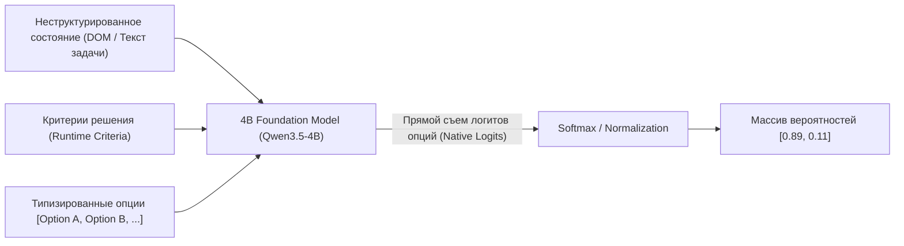

# 🧠 OpenJev: Локальные System-1 модели выбора решений через прямые логиты (Zero Output Tokens)

> **Ссылка на репозиторий:** [https://github.com/TheoLeeCJ/openjev](https://github.com/TheoLeeCJ/openjev)  
> **Автор:** Theo Lee (@TheoLeeCJ)  
> **Слоган:** *«Can we run something like Jev on a 3090 at home? No waitlist, direct typed option logits, 0 output tokens.»*  
> **Звёзды GitHub:** 460+ ★ (Топ-11 ежедневного чарта Trendshift)  
> **Стек:** Python 3.10+, PyTorch, Hugging Face Transformers, vLLM / FlashAttention, WebGPU  
> **Базовая модель:** Qwen/Qwen3.5-4B (BF16)  
> **Лицензия:** MIT  

---

## 🎯 1. В чем фундаментальный инсайт OpenJev?

Большинство решений, которые принимает AI-агент в процессе работы, являются **бинарными или дискретными выборами**:
* *«Маршрутизировать запрос в инструмент А или Б?»*
* *«Повторить попытку или вернуть ошибку?»*
* *«Подтверждают ли факты данное утверждение (Да / Нет)?»*
* *«Какой элемент интерфейса нажать среди 20 кнопок на экране?»*

Традиционный подход вызывает чат-модель (Chat LLM), которая тратит время на посимвольную авторегрессивную генерацию JSON-строки `{"action": "click", "target": 4}`, после чего вызывающий софт немедленно парсит этот текст обратно в простой `if-else`.

**Подход OpenJev:**
> *«Считывать вероятности типизированных опций напрямую из логитов модели за **ОДИН прямой проход (Forward Pass)**. Ноль сгенерированных токенов, ноль задержек на декодирование, ноль ошибок парсинга JSON!»*

---

## ⚡ 2. Сравнение производительности: Прямые логиты против авторегрессии

Тест на одной потребительской видеокарте **NVIDIA RTX 3090 (24 ГБ VRAM)** на модели Qwen3.5-4B (BF16) при оценке 21 бинарного критерия над одним состоянием:

| Способ получения решения | Время выполнения | Сгенерировано токенов | Результат |
|---|:---:|:---:|---|
| **Прямые типизированные логиты OpenJev** | **1.023 с** | **0 токенов** | 21 пара вероятностей |
| **Авторегрессионный JSON-массив** | 5.332 с | 111 токенов | Валидный JSON-массив из 21 значения |

* **Ускорение в 5.21 раза** по сравнению с компактным выводом JSON.
* **Переиспользование префикса KV-кэша (Prefix Reuse):** если одно и то же длинное состояние (например, DOM страницы или контекст задачи) оценивается по 21 независимому критерию, OpenJev вычисляет эмбеддинги состояния **один раз**, а затем параллельно прогоняет суффиксы критериев, достигая скорости **20.03 решений в секунду** (777 решений за 38.8 секунды)!

---

## 🏗️ 3. Архитектура работы: Механизм Option-Attention



### Ключевые архитектурные свойства:
1. **Динамическое определение в рантайме (Runtime-defined):** Список доступных опций и критериев не зашит жестко в веса, а передается в запросе. Модель способна ранжировать любое динамическое число $N$ кандидатов.
2. **Отсутствие декодирующего цикла:** Модель завершает работу сразу после фазы Prefill/Prompt evaluation. Логиты токенов-идентификаторов опций считываются на последней позиции.
3. **Согласованность с коммерческим TypeSafe Jev:** OpenJev воспроизводит интерфейсный паттерн и форму тензоров коммерческого сервиса Jev, но полностью открыт для локального запуска без подписок и очередей ожидания.

---

## 💻 4. Быстрый старт и запуск на RTX 3090

### Установка:
```bash
git clone https://github.com/TheoLeeCJ/openjev.git
cd openjev
python -m venv .venv && source .venv/bin/activate
pip install -e '.[test]'
```

### Запуск скоринга решений:
```bash
CUDA_VISIBLE_DEVICES=0 openjev-score \
  --mode direct \
  --model Qwen/Qwen3.5-4B \
  --input examples/decisions.jsonl \
  --output results.jsonl
```

### Режим разделяемого состояния (Shared Prefix Mode):
Если в батче исследуется одно длинное состояние по множеству критериев, флаг `--mode shared` кэширует KV-кэш состояния и оценивает критерии параллельно, ускоряя инференс до 20 decisions/sec.

---

## 🔗 5. Синергия с базой знаний

* [02. Jev Ultrafast (Browser Use)](file:///home/blackzeshi/Documents/Notes/02_agent_runtimes_and_harnesses/jev-ultrafast.md) — клиентская реализация сверхбыстрого агента, использующая интерфейсный паттерн Option-Attention для автоматизации браузера за секунды.
* [01. LLM-Master](file:///home/blackzeshi/Documents/Notes/01_llm_architecture_and_training/llm-master.md) — полностековый курс, где в разделах оптимизации инференса (vLLM, KV-Cache) разбираются методы прямого съема логитов и сжатия задержек.
* [01. MiniMind: Обучение сверхлегких LLM с нуля](file:///home/blackzeshi/Documents/Notes/01_llm_architecture_and_training/minimind.md) — компактные архитектуры моделей для локального размещения на ограниченном оборудовании.
