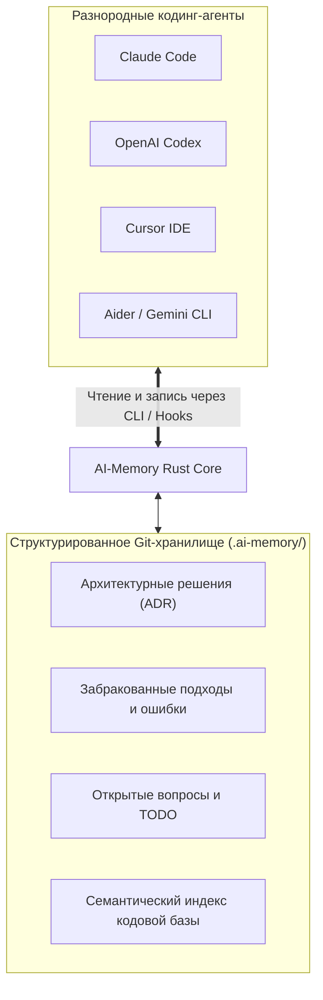

# 🤖 AI-Memory: Кросс-агентный персистентный слой долговременной памяти на Rust

> **Ссылка на репозиторий:** [https://github.com/akitaonrails/ai-memory](https://github.com/akitaonrails/ai-memory)  
> **Автор:** Fabio Akita (@akitaonrails)  
> **Слоган:** *«Long-term memory for AI coding agents. Quit Claude Code mid-task, start OpenAI Codex in the same directory, continue without re-explaining the architecture.»*  
> **Звёзды GitHub:** 7.9k+ ★  
> **Стек:** Rust 1.95+, Git-интеграция, Markdown, Vector/BM25 Search  
> **Поддерживаемые агенты:** 20+ харнесов (Claude Code, Cursor, Codex, Gemini CLI, OpenCode, Aider, Devin и др.)  
> **Лицензия:** MIT  

---

## 🎯 1. В чем фундаментальная проблема изоляции агентов?

У каждого современного AI-агента есть собственный встроенный механизм памяти:
* Claude Code ведет локальные текстовые заметки;
* Cursor сохраняет контекст в проприетарной базе данных;
* Windsurf и Codex используют свои изолированные индексы.

**Проблема «Глухих стен» (Walled Gardens):**
> Память привязана к одной конкретной утилите на одной машине. Стоит разработчику сменить инструмент посреди сложной задачи (например, перейти из терминального Claude Code в визуальный Cursor), как агент **полностью теряет контекст** и начинает предлагать решения, которые команда уже забраковала час назад.

**Решение AI-Memory:**
> Единый, не зависящий от вендора слой долговременной памяти, хранящийся в репозитории проекта под версионным контролем Git.



---

## ⚡ 2. Ключевые возможности

1. **Бесшовный Handoff между инструментами:** Вы можете начать архитектурный рефакторинг в Claude Code, прервать сессию и продолжить в Cursor или Codex. Новый агент мгновенно подхватывает контекст без необходимости заново скармливать промпты.
2. **Фиксация неудачных попыток:** Система явно запоминает: *«Мы уже пробовали библиотеку X версии 2.0, она вызывает race condition в модуле Y»*, что предохраняет новых агентов от циклического повторения ошибок.
3. **Хранение в Git:** Память коммитится вместе с кодом, обеспечивая синхронизацию между всеми членами команды и CI/CD-пайплайнами.
4. **Высокопроизводительное ядро на Rust:** Мгновенный поиск релевантных фрагментов памяти через гибридный семантико-лексический индекс за единицы миллисекунд.

---

## 💻 3. Пример использования в терминале

```bash
# Инициализация памяти в репозитории
ai-memory init

# Фиксация ключевого архитектурного решения
ai-memory record decision "Переход на Tokio v1.40 для асинхронного сетевого ввода-вывода"

# Фиксация тупикового подхода
ai-memory record failed-approach "Попытка использовать mutex вокруг всего кэша вызвала дедлок при высоких нагрузках"

# Экспорт контекста для текущей агентной сессии
ai-memory inject --harness claude-code
```

---

## 🎯 4. Значение для командной разработки

AI-Memory превращает контекст взаимодействия с ИИ из эфемерного кэша отдельной программы в **персистентный актив компании**, доступный всей команде независимо от используемых редакторов и подписок.
