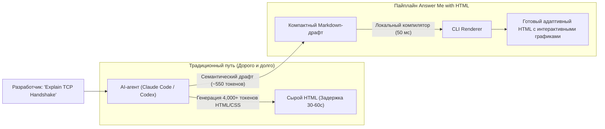

# 📊 Answer Me with HTML: Интерактивная визуализация ответов AI-агентов с экономией токенов

> **Ссылка на репозиторий:** [https://github.com/QingYunA/answer-me-with-html](https://github.com/QingYunA/answer-me-with-html)  
> **Разработчик:** QingYunA  
> **Слоган:** *«Ask a hard question, get a page you can actually read instead of a wall of text. The model writes ~1/7 of the tokens.»*  
> **Звёзды GitHub:** 750+ ★ (№4 Daily в чартах Trendshift)  
> **Стек:** JavaScript / Node.js, HTML5, CSS3, Claude Code Plugin, Cursor Skill  
> **Лицензия:** MIT  

---

## 🎯 1. В чем проблема стандартных ответов LLM и прямой генерации HTML?

Когда разработчик просит кодинг-агента (Claude Code, Cursor, Codex) объяснить сложную архитектурную проблему, сравнить технологии или построить карту взаимосвязей модулей, возникают две крайности:
1. **Бесконечная «стена текста» в терминале:** Десятки экранов неструктурированного Markdown-текста, в котором тяжело ориентироваться, невозможно интерактивно фильтровать таблицы и масштабировать диаграммы.
2. **Прямая генерация HTML агентом (`write full HTML`):** Модели умеют верстать HTML, но за это приходится платить колоссальную цену во времени ожидания и токенах вывода (output tokens). Модель вынуждена побуквенно генерировать каждый тег `<div>`, сотни классов утилитных стилей, CSS-сетки и координаты SVG-графиков. Вывод занимает минуты и быстро исчерпывает контекстные лимиты.

**Answer Me with HTML решает эту дилемму с помощью промежуточной компиляции:**
* Модель пишет только **компактный семантический драфт** с минимальной разметкой (тратя всего ~1/7 токенов от полного HTML).
* Локальный CLI-компилятор за **50 миллисекунд** превращает этот драфт в интерактивную, адаптивную одностраничную HTML-страницу с готовым дизайном, аккордеонами, таблицами и графиками.



---

## ⚡ 2. Ключевые возможности и архитектура

1. **Экономия до 85% токенов вывода:** Модель освобождается от написания шаблонного CSS и верстки контейнеров. Скорость получения ответа вырастает в 5–7 раз.
2. **Богатый набор визуальных компонентов:** Автоматическая поддержка сравнительных таблиц с подсветкой различий, сворачиваемых блоков (collapsible panels), шагов алгоритмов и таймлайнов.
3. **Мгновенный рендеринг:** Генерация страницы занимает менее 50 мс на локальной машине без обращения к внешним облачным сервисам.
4. **Кросс-агентная поддержка:** Нативный скилл для Claude Code, Cursor, Codex CLI и OpenCode.

---

## 💻 3. Установка и практическое использование

### Установка плагина в Claude Code:
```bash
# Установка плагина из репозитория
claude plugin add QingYunA/answer-me-with-html
```

### Пример запроса к агенту:
```text
> Объясни трехстороннее рукопожатие TCP и покажи состояния сокетов
> Сравни Redis и KeyDB для нашего кэширующего слоя в виде интерактивной матрицы
> Построй карту зависимостей пакетов в этом монорепозитории
```

Агент формирует лаконичный структурированный срез и передает его утилите рендеринга, после чего страница автоматически открывается во встроенном или системном браузере.
