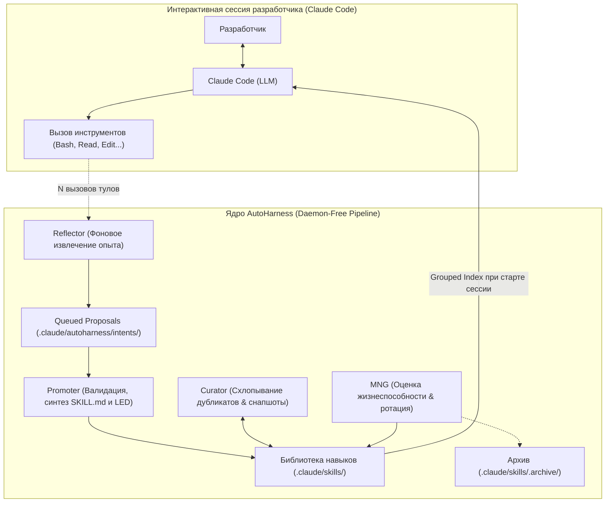

# 🦾 AutoHarness: Самообучающийся слой навыков для кодинг-агентов (Self-Learning Skill Layer)

> **Ссылка на репозиторий:** [https://github.com/tigerless-labs/autoharness](https://github.com/tigerless-labs/autoharness)  
> **Разработчик:** Tigerless Labs  
> **Слоган:** *«Self-learning skill layer for Claude Code: learns from real work, merges duplicates, updates in use, prunes the unused.»*  
> **Звёзды GitHub:** 4.6k+ ★  
> **Стек:** Python 3.11+, Linux / macOS, Claude Code Plugin Architecture  
> **Лицензия:** MIT  

---

## 🎯 1. В чем концептуальный прорыв AutoHarness?

Современная парадигма развития AI-агентов разделилась на два лагеря: **«Big Model»** (увеличение параметров базовой LLM) и **«Big Harness»** (усложнение и оптимизация окружения, рантайма и инструментов агента). 

Исследования показывают поразительный результат: **одна и та же базовая модель** может демонстрировать прыжок качества решения сложных задач с **42% до 78%** на бенчмарке CORE-Bench ([HAL paper arXiv:2510.11977](https://arxiv.org/abs/2510.11977)) исключительно за счет продуманного харнеса. Однако до сих пор харнесы переписывались разработчиками вручную под каждое новое поколение моделей.

**AutoHarness реализует самообучающийся слой навыков (Skill Layer), который эволюционирует сам:**
1. **Обучение на реальном контексте (Zero Synthetic Overhead):** В отличие от традиционных подходов с генерацией синтетических данных или тяжелыми offline-циклами replay, AutoHarness дистиллирует навыки непосредственно из вашей текущей рабочей сессии в Claude Code.
2. **Консолидация вместо захламления:** Вместо бесконечного накопления дублирующих промптов и инструкций AutoHarness объединяет навыки для схожих сценариев, обновляет их при обнаружении новых нюансов и безопасно архивирует невостребованные.
3. **Строгая изоляция авторства:** Инструмент отслеживает происхождение каждого файла и **модифицирует исключительно те навыки, которые создал сам**. Ручные скрипты, пользовательские `SKILL.md` и сторонние плагины никогда не затрагиваются.



---

## 🏗️ 2. Внутренняя архитектура и компоненты пайплайна

AutoHarness спроектирован как **бесдемонная (daemon-free) система**. Вся координация происходит по факту событий и лениво при старте новой сессии, не потребляя фоновых ресурсов CPU и памяти.

### Основные модули системы:

| Модуль | Назначение и механика работы |
| :--- | :--- |
| **Reflector** *(Извлечение)* | Работает в фоне после завершения хода, когда число вызовов тулов превышает заданный порог (`AUTOHARNESS_REFLECT_EVERY_N`). Анализирует окно транскрипта и формулирует гипотезу полезного навыка без блокировки пользователя. |
| **Promoter** *(Синтез)* | Преобразует черновик предложения в валидную директорию с файлом `SKILL.md`, прикрепляет доказательства (`references/evidence-*.md`) и регистрирует операцию в журнале LED. Разделяет локальные навыки проекта (`.claude/skills/`) и глобальные инженерные практики (`~/.claude/skills/`). |
| **MNG** *(Управление жизненным циклом)* | Пересчитывает метрики востребованности раз за сессию при старте. Использует показатель **Usage Rate** (отношение числа загрузок к числу запросов с момента создания навыка). Это исключает устаревание из-за закрытого ноутбука. Новые навыки получают испытательный срок (probation), в течение которого они защищены от ротации. |
| **Curator** *(Консолидация)* | Периодический проход по всей библиотеке. Находит семантически близкие навыки и объединяет их под зонтичные абстракции (umbrella skills). Перед слиянием обязательно делает тарболл-снапшот дерева навыков. |
| **LED** *(Ledger)* | Неизменяемый sidecar-журнал `.ledger.jsonl` в каждой папке навыка. Содержит точную историю: почему навык был создан, кем и когда обновлен, со ссылками на конкретные срезы транскрипта сессии. |

---

## 📊 3. Метрики жизненного цикла: три измерения использования

Одной из главных проблем систем памяти агентов является иллюзия полезности (когда агент читает файл, но не следует ему). В AutoHarness в файле `.sidecar.json` ведется строгое разделение трех типов сигналов:

1. **`use` (Load):** Модель явно активировала и исполнила навык в контексте задачи. **Только этот счетчик влияет на выживание навыка в MNG.**
2. **`view` (Scan):** Сессия просто прочитала описание директории или оглавление. Это подтверждает релевантность в поиске (recall), но не гарантирует соответствие (adherence).
3. **`patch` (Improvement):** Факт внесения правок и уточнений промоутером. Загрузка после патча интерпретируется как успешное повторное использование после доработки.

> [!NOTE]
> **Принцип архивации вместо удаления:**  
> AutoHarness никогда не удаляет файлы навсегда. Навыки, не подтвердившие полезность во время испытательного срока или вытесненные при исчерпании лимита пула (`AUTOHARNESS_CAPACITY_PROJECT`), перемещаются в `.claude/skills/.archive/<name>/`. Перемещение папки обратно мгновенно возвращает навык в строй со всей сохраненной историей.

---

## 📁 4. Структура файлового артефакта навыка

Каждый навык, порожденный системой, представляет собой стандартную прозрачную директорию на диске:

```text
.claude/skills/git-interactive-rebase/
├── SKILL.md                 # Нативный markdown-навык для Claude Code
├── .ledger.jsonl            # Append-only журнал решений (LED)
├── .sidecar.json            # Счетчики использования (use, view, patch)
├── references/              # Обезличенные подтверждающие дампы сессий
│   └── evidence-21cd22cc.md
└── scripts/                 # (Опционально) Вспомогательные shell/python утилиты
```

### Пример записи в `.ledger.jsonl`:
```json
{"action": "create", "reason": "User executed complex multi-branch cherry-pick with conflict resolution", "evidence": "references/evidence-4a1b8e21.md"}
{"action": "patch",  "reason": "Clarified that --strategy-option=theirs is required for vendored assets", "evidence": "references/evidence-9f2c3d11.md"}
```

---

## ⚖️ 5. Сравнение подходов к управлению навыками агентов

| Параметр | Бесконечный рост (Unbounded) | Offline Benchmark-Gated ([Self-Harness](https://arxiv.org/abs/2606.09498)) | Timer + Resident Daemon ([Hermes](https://github.com/NousResearch/hermes-agent)) | **AutoHarness** |
| :--- | :--- | :--- | :--- | :--- |
| **Ограничение пула навыков** | ❌ Нет | ✅ Да | ✅ Да | ✅ **Да (авто-архивация)** |
| **Сигнал валидации** | Отсутствует | Оценка на синтетическом бенчмарке | Астрономическое время неактивности | **Реальное применение в бою (Adherence)** |
| **Триггер сессии обучения** | — | Офлайн пакетная обработка | Таймер холостого хода демона | **Объем работы в текущей сессии** |
| **Требование внешнего оракула** | Нет | Да (валидатор тестов) | Нет | **Нет (Self-contained)** |
| **Фоновый демон** | Нет | Нет | Требуется постоянный процесс | **Нет (Ленивый расчет)** |

---

## 🚀 6. Быстрый старт и конфигурация

Установка через систему плагинов Claude Code:

```bash
# Установка плагина в окружение Claude Code
claude plugin add tigerless-labs/autoharness
```

### Тонкая настройка чувствительности через переменные окружения:

```json
{
  "env": {
    "AUTOHARNESS_REFLECT_EVERY_N": "10",
    "AUTOHARNESS_MATURITY_PROJECT": "20",
    "AUTOHARNESS_CAPACITY_PROJECT": "15",
    "AUTOHARNESS_GLOBAL_ENABLED": "true"
  }
}
```

* `AUTOHARNESS_REFLECT_EVERY_N`: Запуск рефлексии каждые N вызовов инструментов.
* `AUTOHARNESS_MATURITY_PROJECT`: Количество запросов на испытательный срок до проверки жизнеспособности.
* `AUTOHARNESS_CAPACITY_PROJECT`: Максимальный лимит активных навыков в проекте перед включением ротации.
