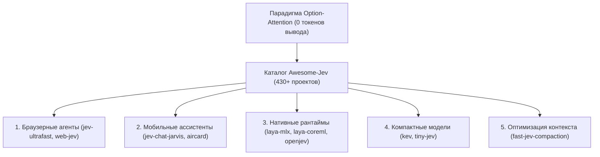

# 🤖 Awesome-Jev: Полный экосистемный каталог проектов на базе Option-Attention и System-1 архитектуры

> **Ссылка на репозиторий:** [https://github.com/heyjunpenn/awesome-jev](https://github.com/heyjunpenn/awesome-jev)  
> **Куратор:** Junpenn (@heyjunpenn)  
> **Сайт экосистемы:** [https://jevbest.com](https://jevbest.com)  
> **Слоган:** *«A verified, community-maintained catalog of 430+ open-source projects built with Jev across 11 categories and 27 languages.»*  
> **Звёзды GitHub:** 300+ ★  
> **Формат:** Astro, Markdown, GitHub Pages  
> **Лицензия:** MIT  

---

## 🎯 1. В чем историческое значение движения Jev?

Осенью 2026 года в мире AI-агентов произошел один из самых стремительных технологических сдвигов:
* Появилось понимание, что **90% шагов агента не требуют генерации связного текста**. Агенту нужно просто выбрать: куда кликнуть, какой инструмент вызвать или какое условие проверить.
* Парадигма **Option-Attention** (чтение логитов вариантов за 1 прямой проход без декодирования токенов) сократила задержки агентов с секунд до единиц миллисекунд.
* Проект `Awesome-Jev` стал центральным координационным хабом этого движения, каталогизируя сотни открытых форков, рантаймов и специализированных агентов.

---

## 📂 2. Таксономия каталога: 11 ключевых категорий

1. **Ultra-Fast Browser Agents:** Проекты автоматизации браузера (`browser-use/jev-ultrafast`, бронирование рейсов за 7 секунд).
2. **Multilingual Decision Engines:** Многоязычные неавторегрессионные движки решений (`NandhaKishorM/laya`).
3. **Native Apple Silicon Runtimes:** Экстремально оптимизированные реализации под чипы M-серии и Apple Neural Engine (`laya-mlx`, `laya-coreml`).
4. **Local Hardware Models:** Модели, адаптированные для обучения на потребительском железе (`jaredpalmer/kev`, `TheoLeeCJ/openjev`).
5. **Context Compaction Plugins:** Плагины сжатия контекста для Claude Code и кодинг-ассистентов (`fast-jev-compaction`).
6. **Mobile Copilots:** Экранные ассистенты поверх Accessibility API (`jev-chat-jarvis`).
7. **Reinforcement Learning Baselines:** Среды обучения агентов действиям в играх и интерфейсах (`jevlike`).
8. **Tool Routing Frameworks:** Сверхбыстрые диспетчеры инструментов для LangGraph, AutoGen и CrewAI.
9. **Form & Data Extraction:** Неавторегрессионные классификаторы документов и парсеры.
10. **Robotics & Edge Control:** Применение Option-Attention в микроконтроллерах и робототехнике.
11. **Benchmarking & Evals:** Наборы воспроизводимой валидации точности калиброванных вероятностей.

---

## 🎯 3. Навигационная ценность для исследователей

`Awesome-Jev` служит идеальной отправной точкой для любого инженера или исследователя, желающего:
* Перевести своих агентов на сверхбыстрый рефлекторный цикл System-1;
* Найти готовые веса моделей под нужный язык или железо;
* Избежать дублирования архитектурных велосипедов при проектировании агентных систем нового поколения.
