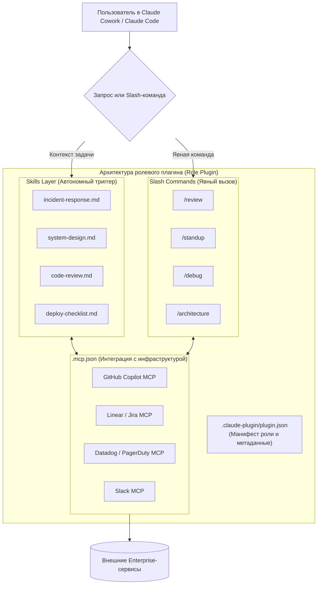

# 🏢 Claude Knowledge Work Plugins: Корпоративная экосистема ролевых плагинов от Anthropic

> **Ссылка на репозиторий:** [https://github.com/anthropics/knowledge-work-plugins](https://github.com/anthropics/knowledge-work-plugins)  
> **Организация:** Anthropic  
> **Слоган:** *«Plugins that turn Claude into a specialist for your role, team, and company. Built for Claude Cowork, also compatible with Claude Code.»*  
> **Звёзды GitHub:** 27,000+ ★  
> **Стек:** Model Context Protocol (MCP), Markdown Skills, JSON Manifests, Claude CLI  
> **Лицензия:** Apache 2.0  

---

## 🎯 1. В чем смена парадигмы: от «промптования» к декларативной роли

С появлением автономных десктопных и CLI-агентов (таких как **Claude Cowork** и **Claude Code**) ключевой проблемой в корпоративном секторе стал разрыв между возможностями «умной универсальной модели» и жесткими внутренними стандартами компаний:
* Универсальная LLM не знает внутренней структуры сервисов компании, принятого стиля написания PR, формата оформления фиче-спецификаций или протокола закрытия бухгалтерского периода.
* Каждому сотруднику приходилось заново объяснять модели в промптах контекст задачи, подключать разрозненные API и напоминать о правилах безопасности.

**Knowledge Work Plugins от Anthropic** формализуют концепцию **«Агентного сотрудника под конкретную роль»**:
Плагин инкапсулирует в себе всё, что требуется специалисту (разработчику, юристу, продакту, финансовому аудитору):
1. **Скиллы (Skills):** Глубокие процедурные знания, алгоритмы принятия решений и чек-листы в виде Markdown.
2. **Коннекторы (Connectors via MCP):** Прямые шлюзы к рабочему стеку инструментов через Model Context Protocol (GitHub, Linear, Jira, Slack, Snowflake, Datadog и др.).
3. **Команды (Slash Commands):** Явные точки входа для типовых бизнес-сценариев (`/standup`, `/review`, `/debug`, `/reconciliation`).
4. **Субагенты (Sub-agents):** Фоновые агенты для параллельного исполнения сложных задач.

Все компоненты плагина построены по принципу **File-Based, Zero-Code**: только структурированные файлы Markdown и JSON, без компиляции, сложной оркестровки и сторонней инфраструктуры.



---

## 🧩 2. Анатомия плагина: структура каталогов и манифесты

Каждый плагин в репозитории имеет единообразную структуру:

```text
plugin-name/
├── .claude-plugin/
│   └── plugin.json          # Манифест роли, версии, авторов и зависимостей
├── .mcp.json                # Конфигурация MCP-серверов и OAuth-портов
├── commands/                # Явные слэш-команды (/команда)
└── skills/                  # Доменные знания и алгоритмы работы
    ├── skill-alpha/
    │   └── SKILL.md
    └── skill-beta/
        └── SKILL.md
```

### Конфигурация подключений: `.mcp.json`
Вместо написания собственного кода интеграции плагины декларируют внешние сервисы через официальные HTTP/SSE MCP-серверы:

```json
{
  "mcpServers": {
    "github": {
      "type": "http",
      "url": "https://api.githubcopilot.com/mcp/"
    },
    "linear": {
      "type": "http",
      "url": "https://mcp.linear.app/mcp"
    },
    "datadog": {
      "type": "http",
      "url": "https://mcp.datadoghq.com/api/unstable/mcp-server/mcp"
    },
    "pagerduty": {
      "type": "http",
      "url": "https://mcp.pagerduty.com/mcp"
    },
    "slack": {
      "type": "http",
      "url": "https://mcp.slack.com/mcp",
      "oauth": {
        "clientId": "...",
        "callbackPort": 3118
      }
    }
  }
}
```

---

## 📦 3. Разбор официальных ролевых плагинов

В репозитории представлены готовые плагины под ключевые корпоративные роли:

### 1. `engineering` (Инженерия и разработка ПО)
* **Назначение:** Ежедневный ассистент разработчика и техлида — от стендапов до разбора инцидентов на проде.
* **Слэш-команды:**
  * `/standup` — агрегирует активность за день (коммиты, открытые PR, тикеты в Linear/Jira, треды в Slack) и генерирует четкий отчет.
  * `/review` — проводит многоаспектный аудит изменений (безопасность, производительность, следование архитектурным гайдлайнам).
  * `/debug` — структурированный сеанс отладки: воспроизведение бага, изолирование причины, диагностика и подготовка фикса.
  * `/architecture` — анализ системного дизайна, оценка компромиссов и формулирование RFC / ADR.
* **Навыки (Skills):** `incident-response`, `deploy-checklist`, `tech-debt`, `testing-strategy`, `documentation`.

### 2. `product-management` (Управление продуктом)
* **Назначение:** Превращение хаотичных сигналов пользователей в структурированные спецификации и роадмапы.
* **Навыки:**
  * `write-spec` — составление PRD с User Stories, метриками успеха, граничными случаями и техническими зависимостями.
  * `synthesize-research` — анализ интервью пользователей и тикетов саппорта из Amplitude, Intercom, Fireflies.
  * `competitive-brief` — систематический сравнительный анализ фич конкурентов.
  * `metrics-review`, `sprint-planning`, `stakeholder-update`.

### 3. `finance` (Финансы и бухгалтерия)
* **Назначение:** Автоматизация закрытия отчетных периодов и проверка соответствия регуляторным нормам.
* **Навыки:**
  * `reconciliation` — сверка банковских транзакций и бухгалтерских проводок.
  * `journal-entry-prep` — генерация двойных проводок (debit/credit) по стандартам GAAP/IFRS.
  * `variance-analysis` — план-факт анализ бюджетов и отклонений.
  * `sox-testing` & `audit-support` — сбор аудиторского следа и тестирование контролей SOX.
* **MCP-коннекторы:** Snowflake, BigQuery, Databricks, Microsoft 365.

### 4. `legal` (Юридический отдел и комплаенс)
* **Назначение:** Первичный аудит договоров и снижения нагрузки на штатных юристов.
* **Навыки:**
  * `review-contract` — построчный анализ рисков, штрафных санкций и обязательств.
  * `triage-nda` — экспресс-проверка типовых соглашений о неразглашении на соответствие политике компании.
  * `compliance-check` — оценка соответствия GDPR, CCPA, отраслевым лицензиям.
  * `legal-risk-assessment` — оценка судебных и репутационных рисков.

### 5. `data` (Аналитика данных и BI)
* **Назначение:** Быстрый переход от сырых таблиц к валидированным инсайтам.
* **Навыки:** `sql-queries` (оптимизированные запросы под Snowflake/BigQuery), `statistical-analysis` (A/B тесты, доверительные интервалы), `build-dashboard`, `validate-data`.

### 6. Дополнительные специализированные плагины:
* **`bio-research`:** подключение к базам биомедицинских данных (PubMed, bioRxiv, ClinicalTrials.gov, ChEMBL, Benchling, Open Targets).
* **`enterprise-search`:** кросс-сервисный поиск через Slack, Notion, Jira, Asana, Google Drive.
* **`customer-support`:** триаж входящих тикетов, генерация статей для базы знаний.
* **`cowork-plugin-management`:** мета-плагин для быстрой генерации новых плагинов компании.

---

## 🛠️ 4. Установка и адаптация («Making Them Yours»)

### Установка в Claude Code CLI:
```bash
# 1. Добавить маркетплейс Anthropic в локальный CLI
claude plugin marketplace add anthropics/knowledge-work-plugins

# 2. Установить плагин конкретной роли (например, engineering)
claude plugin install engineering@knowledge-work-plugins

# 3. Установить плагин для продуктовых менеджеров
claude plugin install product-management@knowledge-work-plugins
```

### Принцип корпоративной кастомизации:
Плагины от Anthropic намеренно сделаны как открытые шаблоны:
1. **Замена стека инструментов:** Отредактируйте `.mcp.json`, указав адреса внутренних инстансов GitLab, YouTrack или Redmine вместо GitHub и Linear.
2. **Внедрение внутреннего контекста:** Добавьте в файлы `skills/*.md` правила архитектурного комитета компании, стиль оформления кода (Style Guide), регламенты релизов и SLA на инциденты.
3. **Создание внутренних плагинов:** С помощью шаблона легко создаются кастомные роли: например, `devops-sre`, `security-auditor` или `marketing-copywriter`.

---

## 💡 5. Выводы для архитектуры AI-агентов

1. **MCP как объединяющий интерфейс:** Anthropic окончательно закрепляет Model Context Protocol в качестве стандарта подключения агентов к корпоративной инфраструктуре.
2. **Markdown как язык программирования поведения агента:** Отказ от сложных конфигураций в коде в пользу структурированных Markdown-скиллов делает управление поведением агентов прозрачным и доступным для нетехнических экспертов (юристов, финансистов, HR).
3. **Ролевая специализация превосходит Mega-Prompts:** Разделение контекста на изолированные ролевые плагины предотвращает «замусоривание» контекстного окна и снижает вероятность галлюцинаций.
