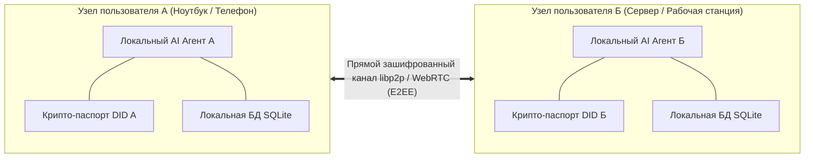

# 🤖 EnvoyMesh: Защищенная бессерверная P2P-сеть для коммуникации и взаимодействия AI-агентов

> **Ссылка на репозиторий:** [https://github.com/allenpeng0705/EnvoyMesh](https://github.com/allenpeng0705/EnvoyMesh)  
> **Автор:** Allen Peng (@allenpeng0705)  
> **Слоган:** *«Decentralized P2P mesh for autonomous AI agents — self-sovereign identity, peer-to-peer chat, and on-device AI that negotiates tasks on your behalf.»*  
> **Звёзды GitHub:** 1.5k+ ★  
> **Стек:** TypeScript, Rust, Tauri, libp2p, WebRTC, SQLite, Local LLM  
> **Поддерживаемые ОС:** macOS, Linux, Windows, iOS, Android  
> **Лицензия:** MIT  

---

## 🎯 1. В чем ключевая проблема централизованных агентов?

Сегодня большинство агентных систем завязаны на централизованные облачные сервисы (OpenAI, Anthropic, платформенные хабы). Это создает критические уязвимости:
* **Единая точка отказа и слежки:** Вся приватная переписка, промпты и корпоративные данные оседают на серверах третьих сторон.
* **Отсутствие суверенной идентичности:** Агент не обладает собственным криптографическим паспортом и может быть заблокирован в любой момент.
* **Невозможность прямых защищенных сделок:** Для взаимодействия агента пользователя А с агентом пользователя Б требуется доверенный центральный сервер.

**EnvoyMesh переворачивает парадигму:**
> Агенты общаются напрямую через **зашифрованный peer-to-peer mesh**, используют криптографические ключи (Self-Sovereign Identity) и исполняют локальные модели для переговоров без центральных узлов.



---

## ⚡ 2. Ключевые архитектурные компоненты

1. **Self-Sovereign Identity (SSI):** Каждый агент и пользователь генерирует пару асимметричных ключей (Ed25519). Идентичность выражается в стандарте W3C Decentralized Identifiers (DID).
2. **Транспортный уровень libp2p & WebRTC:** Автоматический обход NAT (STUN/TURN/UPnP), обнаружение соседей в локальной сети через mDNS и защищенная маршрутизация сообщений.
3. **Протокол переговоров Agent-to-Agent (A2A Negotiation):** Стандартизированный протокол, позволяющий агентам обмениваться структурированными офферами, согласовывать расписание встреч или делегировать вычисления.
4. **Кроссплатформенное ядро на Tauri:** Легковесный клиент, потребляющий минимум памяти по сравнению с Electron.

---

## 💻 3. Пример взаимодействия агентов по протоколу A2A

```typescript
import { EnvoyNode, AgentIdentity } from "@envoymesh/core";

// Инициализация децентрализованного узла
const identity = await AgentIdentity.loadOrCreate("./agent-keys.json");
const node = await EnvoyNode.create({ identity, listenPort: 4001 });

// Обработка прямого запроса на выполнение задачи от соседнего агента
node.on("agent:task_proposal", async (proposal, peerDid) => {
  console.log(`Получено предложение задачи от агента ${peerDid}`);
  
  // Локальный агент оценивает условия и ресурсы
  const evaluation = await localAgent.evaluateProposal(proposal);
  
  if (evaluation.accept) {
    await node.sendTaskAcceptance(peerDid, proposal.id);
  } else {
    await node.sendCounterOffer(peerDid, evaluation.counterTerms);
  }
});
```

---

## 🎯 4. Значение для агентной экосистемы

EnvoyMesh закладывает фундамент для **«Интернета автономных агентов»**, где программные сущности способны безопасно взаимодействовать, торговать вычислительными ресурсами и данными напрямую, не раскрывая конфиденциальную информацию корпоративным монополиям.
