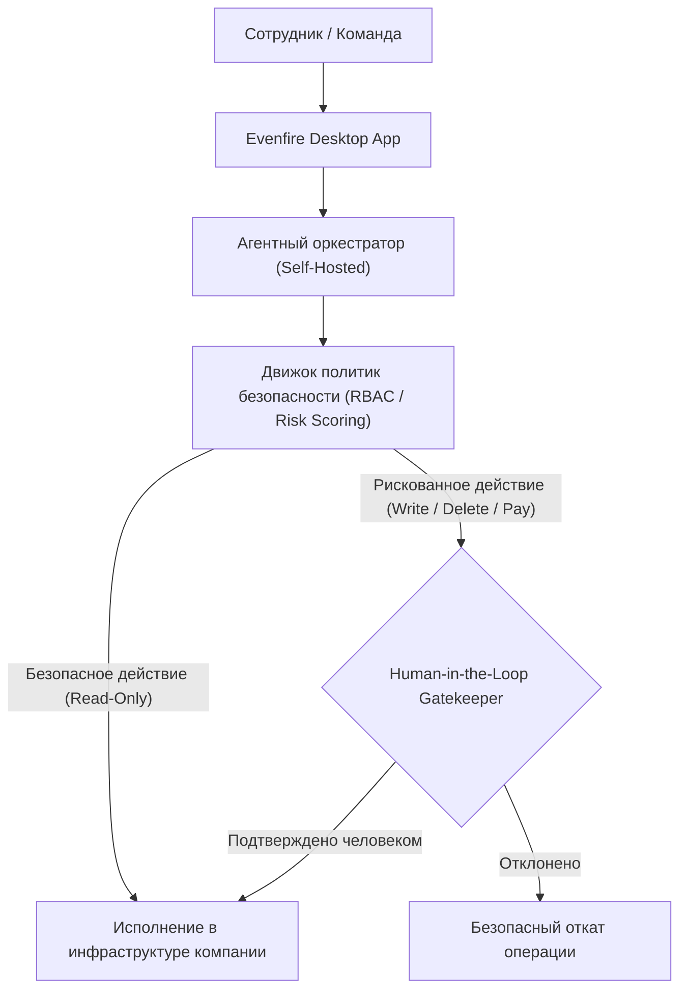

# 🤖 Evenfire: Корпоративная платформа управляемого исполнения действий агентов (Intelligence Layer)

> **Ссылка на репозиторий:** [https://github.com/evenfire-ai/evenfire](https://github.com/evenfire-ai/evenfire)  
> **Организация:** Evenfire AI  
> **Слоган:** *«Build your company's intelligence layer, without losing control. Bring your own model keys; every risky action waits for a human yes.»*  
> **Звёзды GitHub:** 360+ ★  
> **Стек:** TypeScript, Node.js, React, PostgreSQL, Docker, MCP  
> **Архитектура:** Self-hosted Backend + Native Desktop App  
> **Лицензия:** MPL-2.0  

---

## 🎯 1. В чем проблема запуска агентов в реальном бизнесе?

Создать агента, который рассуждает в чате — простая задача. Однако когда агент получает доступ к боевым инструментам (удаление записей в БД, списание средств, деплой на прод, отправка писем клиентам), бизнес сталкивается с огромными рисками:
* **Галлюцинации с реальными последствиями:** Случайный вызов опасного API при неверной интерпретации запроса.
* **Утечка приватных данных:** Передача чувствительных корпоративных секретов через облачные шлюзы вендоров.
* **Отсутствие аудита:** Невозможно восстановить цепочку решений, приведшую к сбою.

**Evenfire предоставляет защищенный управляющий слой:**
> Полностью open-source платформа, позволяющая развернуть приватных агентов на собственной инфраструктуре с жестким разграничением прав и подтверждением критических действий человеком.

---

## ⚡ 2. Ключевые возможности платформы

1. **Принцип «Human-in-the-Loop Gatekeeper»:** Любая потенциально деструктивная операция (мутация базы данных, вызов внешнего платежного API) приостанавливается до явного одобрения ответственным сотрудником в десктопном интерфейсе.
2. **Bring Your Own Keys (BYOK):** Поддержка любых провайдеров (OpenAI, Anthropic, локальные модели через vLLM/Ollama) с прямым хранением ключей в изолированном контуре.
3. **Ролевой контроль доступа (RBAC):** Гранулярные права на то, какие инструменты и базы данных доступны конкретным агентам и отделам.
4. **Полный сквозной аудит:** Журналирование каждого шага, аргументов вызовов и полученных ответов для комплаенса и ретроспективного анализа.

---

## 🎯 3. Значение для enterprise-внедрения

Evenfire устраняет главный психологический и регуляторный барьер на пути внедрения автономных агентов в реальные бизнес-процессы, превращая непредсказуемый «черный ящик» в контролируемый, подотчетный и прозрачный рабочий инструмент.
