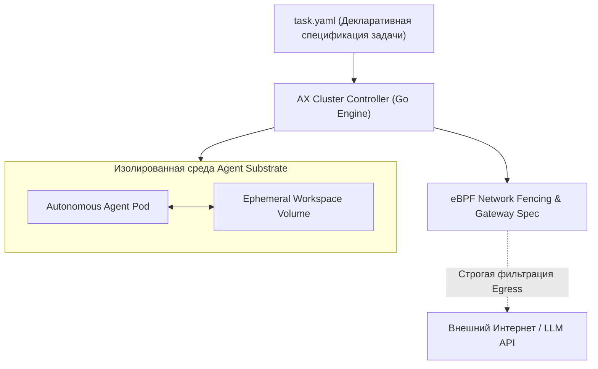

# 🤖 Google AX: Высокопроизводительный кластерный оркестратор автономных агентных нагрузок

> **Ссылка на репозиторий:** [https://github.com/google/ax](https://github.com/google/ax)  
> **Организация:** Google  
> **Слоган:** *«Declare an agentic task with workspaces and gateway specifications. AX sandboxes it, wires up its workspace, fences its network, and helps running it at scale.»*  
> **Звёзды GitHub:** 6.6k+ ★ (#3 Weekly в чартах Trendshift)  
> **Стек:** Go 1.23+, Agent Substrate, Kubernetes CRDs, gRPC, eBPF  
> **Лицензия:** Apache-2.0  

---

## 🎯 1. В чем фундаментальный вызов агентных нагрузок?

Традиционные оркестраторы контейнеров (Kubernetes, Nomad) проектировались для **детерминированных микросервисов**:
* Долгоживущие поды;
* Предсказуемое потребление ресурсов;
* Статичные сетевые политики и ingress-маршруты.

**Автономные AI-агенты ведут себя принципиально иначе:**
1. **Динамический жизненный цикл:** Агент может завершить работу за 5 секунд или исследовать кодовую базу 4 часа.
2. **Недоверенный исполняемый код:** Агент генерирует и выполняет произвольный bash-код и скрипты, что требует микро-песочниц уровня виртуализации.
3. **Угрозы сетевой эксфильтрации:** Риск атак типа Server-Side Request Forgery (SSRF) и внедрения вредоносных системных промптов через интернет.

**Google AX — это специализированный Kubernetes для агентов**, созданный для запуска миллиардов изолированных агентных сессий в кластере.



---

## ⚡ 2. Архитектура и декларативный манифест `task.yaml`

AX использует привычную декларативную модель в стиле Kubernetes:

```yaml
apiVersion: ax.io/v1alpha1
kind: AgentTask
metadata:
  name: security-vulnerability-patch
  namespace: engineering-agents
spec:
  # Определение базовой рабочей среды
  workspace:
    gitRepository:
      url: "git@github.com:enterprise/core-service.git"
      branch: "main"
    isolationLevel: "microvm"  # Песочница на базе микро-ВМ
    
  # Сетевые барьеры (Network Fencing)
  networkPolicy:
    egress:
      - allow: "api.anthropic.com"
      - allow: "github.com"
      - deny: "*"  # Полная блокировка остального трафика для предотвращения SSRF
      
  # Конфигурация брокера инструментов
  toolGateway:
    allowedTools:
      - "code_search"
      - "replace_file_content"
      - "run_isolated_tests"
    approvalRequired:
      - "git_push"
      
  # Лимиты ресурсов и таймауты
  limits:
    maxDuration: "30m"
    maxCostUsd: 2.50
```

---

## 🛡️ 3. Ключевые возможности Google AX

* **Agent Substrate Sandboxing:** Мгновенный запуск изолированных микро-окружений с минимальным оверхедом памяти.
* **eBPF Network Fencing:** Фильтрация исходящего сетевого трафика на уровне ядра Linux для предотвращения утечки секретов и SSRF-атак.
* **Tool Gateway Specification:** Централизованный контроль за тем, какие системные вызовы и MCP-инструменты разрешено использовать агенту.
* **Горизонтальное масштабирование:** Архитектура очередей и планировщика рассчитана на распределение миллионов задач в кластере без деградации контроллера.

---

## 🎯 4. Значение для индустрии

Google фактически установил **первый открытый промышленный стандарт оркестрации агентов**. AX позволяет предприятиям перейти от самодельных скриптов запуска агентов в Docker к зрелой, масштабируемой и безопасной кластерной инфраструктуре.
