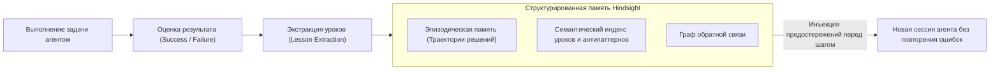

# 🤖 Hindsight: Самообучающаяся долговременная память и устранение повторных ошибок агентов

> **Ссылка на репозиторий:** [https://github.com/vectorize-io/hindsight](https://github.com/vectorize-io/hindsight)  
> **Организация:** Vectorize.io  
> **Научная статья:** [arXiv:2512.12818](https://arxiv.org/abs/2512.12818)  
> **Слоган:** *«Hindsight: Agent Memory That Learns. Stop your agents from making the same mistake twice.»*  
> **Звёзды GitHub:** 28.8k+ ★ (#2 Daily в чартах Trendshift)  
> **Стек:** Python 3.10+, TypeScript, FastEmbed, SQLite-vec / Qdrant, REST API  
> **Лицензия:** Apache-2.0  

---

## 🎯 1. В чем фундаментальный инсайт Hindsight?

Большинство систем агентной памяти (Agent Memory) работают как **пассивные RAG-хранилища**:
* Тексты сессий просто нарезаются на чанки и складываются в векторную БД.
* При повторении похожей задачи агент извлекает тонны несвязанных логов, но **не понимает причинно-следственной связи** между своими действиями и полученным результатом.
* Как итог: агент наступает на одни и те же архитектурные «грабли» десятки раз за проект.

**Подход Hindsight (на базе научной статьи arXiv:2512.12818):**
> Агентная память должна быть **самообучающейся и структурированной по принципу Hindsight Experience Replay (HER)**. Система автоматически извлекает уроки (Lessons Learned), связывает действия с успехом или ошибкой и динамически корректирует будущее поведение агента.



---

## ⚡ 2. Ключевые архитектурные модули

1. **Эпизодическая память (Episodic Store):** Запоминает полные цепочки вызовов инструментов, состояние окружения и финальный результат (успех или падение).
2. **Генератор рефлексии (Reflection Engine):** Анализирует неудачные шаги и формулирует лаконичное императивное правило: *«При сборке пакета X обязательно передавай флаг `--no-cache`, иначе падает линковщик»*.
3. **Динамический инжектор контекста:** Перед выполнением потенциально опасной команды агент получает предупреждение из прошлого опыта прямо в системный промпт.
4. **Кросс-языковые SDK:** Официальные клиенты для Python (`pip install hindsight-api`) и TypeScript (`npm install @vectorize-io/hindsight-client`).

---

## 💻 3. Пример интеграции в агентный цикл

```python
from hindsight import HindsightClient

client = HindsightClient(api_key="local-or-cloud")

# 1. Запрос релевантного опыта перед началом сложной задачи
past_lessons = client.recall(
    task="Настройка сборки Rust-модуля с Python-биндингами через PyO3",
    threshold=0.85
)

for lesson in past_lessons:
    print(f"⚠️ Учти прошлый опыт: {lesson.summary}")
    # Например: 'Не использовать pyo3 версии 0.21 с Python 3.13 без nightly-фичи'

# 2. Фиксация результата и автоматическое обучение на исходе
client.record_session(
    task_id="task-481",
    status="success",
    steps_taken=["cargo build --release", "maturin develop"],
    learnings=["Maturin требует установки patchelf в Alpine Linux"]
)
```

---

## 🎯 4. Практическая ценность

Hindsight переводит агентные системы от статуса «вечно забывчивых ботов» к **настоящим обучающимся сотрудникам**, накапливающим профессиональный инженерный опыт на протяжении месяцев непрерывной эксплуатации.
