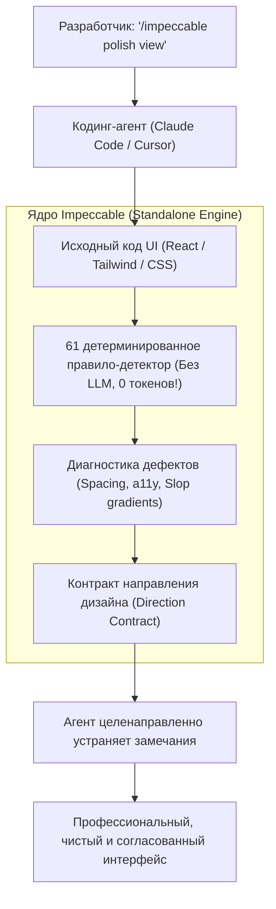

# 🎨 Impeccable: Дизайн-система и детерминированные правила верстки для AI кодинг-агентов

> **Ссылка на репозиторий:** [https://github.com/pbakaus/impeccable](https://github.com/pbakaus/impeccable)  
> **Автор:** Пол Бакаус (Paul Bakaus, создатель Google AMP, бывший Principal Architect в Google и jQuery UI)  
> **Слоган:** *«The design language that makes your AI harness better at design.»*  
> **Звёзды GitHub:** 75.8k+ ★  
> **Стек:** JavaScript / Rust Engine, Standalone CLI (`npx impeccable`), Claude Code, Cursor, Codex, Antigravity  
> **Лицензия:** Apache-2.0  

---

## 🎯 1. В чем проблема «Вайб-кодинга» во фронтенде?

С появлением кодинг-агентов (Claude Code, Cursor, Codex) разработчики получили возможность создавать работающие прототипы за считанные минуты. Однако фронтенд, сгенерированный ИИ без строгих рамок, страдает от характерных болезней («AI Slop»):
* Случайные фиолетовые градиенты и неоновые темные свечения.
* Несогласованная типографика (чрезмерное использование Inter, нарушение ритма заголовков).
* Тесные кликабельные зоны (нарушение стандартов доступности a11y для сенсорных экранов).
* Раздутые отступы, скачущая сетка и отсутствие визуальной иерархии.

**Impeccable формализует дизайн в виде строгой инженерной системы:**
1. **61 детерминированное правило проверки:** Никаких случайных галлюцинаций LLM при проверке. Быстрый локальный статический анализатор сканирует CSS, HTML и JSX без обращения к API и без затрат токенов.
2. **24 специализированные команды:** Единый словарь взаимодействия человека и агента: `/impeccable polish`, `audit`, `distill`, `bolder`, `quieter`, `animate`.
3. **Хуки жизненного цикла агента:** Автоматическая валидация интерфейса перед коммитом (Stop pass baseline) с защитой от регрессий.



---

## 🛠️ 2. Парадигмы создания интерфейсов: Comp-First vs Code-First

При инициализации проекта (`/impeccable init`) разработчик выбирает один из двух путей генерации интерфейса (`buildPath`):
* **Comp-First (Сначала макет):** Если в окружении агента подключена генерация изображений, агент сначала синтезирует полноразмерный визуальный макет высокого разрешения, согласует его с человеком и затем верстает код в точности по макету.
* **Code-First (Сначала код):** Быстрый путь для легковесных сред. Агент сразу пишет код компонентов, строго опираясь на правила дизайн-системы и контракт ограничений.

---

## 🚀 3. Быстрый старт и команды CLI

```bash
# Инициализация в проекте
npx impeccable install

# Запуск в контексте AI-агента
/impeccable init

# Автономный аудит директории без ИИ (для CI/CD)
npx impeccable detect src/ --json

# Аудит живого URL через установленный Chromium
npx impeccable detect https://my-app.dev
```

### Основные команды для общения с агентом:
* `/impeccable audit` — глубокий аудит доступности, отступов и цветового контраста.
* `/impeccable polish` — микро-выравнивание элементов и полировка шрифтовых пар.
* `/impeccable bolder` — усиление визуальных акцентов, контраста и весов шрифтов.
* `/impeccable quieter` — приглушение визуального шума, смягчение границ и очистка интерфейса.
