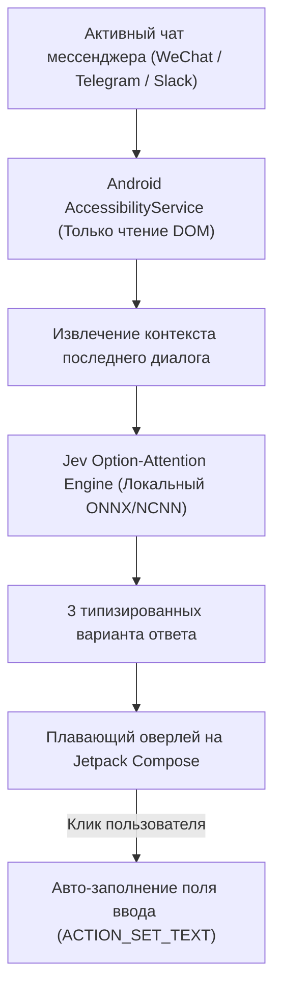

# 🤖 Jev-Chat Jarvis: Мобильный экранный «диалоговый второй пилот» без root и хуков

> **Ссылка на репозиторий:** [https://github.com/jev-chat/jev-chat-jarvis](https://github.com/jev-chat/jev-chat-jarvis)  
> **Организация:** Jev-Chat Ecosystem  
> **Слоган:** *«装在手机上的对话副驾：在任何聊天 App 里读懂对方、给出候选回复、一键填入输入框，发不发由你。»*  
> **Звёзды GitHub:** 2.7k+ ★ (#2 Daily в чартах Trendshift)  
> **Стек:** Kotlin, Jetpack Compose, Android AccessibilityService, NCNN/ONNX Runtime, Jev Option-Attention  
> **Поддерживаемые платформы:** Android 11+, macOS, Windows  
> **Лицензия:** GPL-3.0  

---

## 🎯 1. Архитектурная идея: Неинвазивный ассистент

Большинство попыток автоматизировать мобильное общение сводятся либо к созданию тяжелых чат-ботов, либо к опасным модификациям приложений (Xposed, Frida, патчинг APK), что приводит к банам аккаунтов.

**Jev-Chat Jarvis решает задачу принципиально иначе:**
1. **Полная неинвазивность:** Работает исключительно поверх стандартного системного сервиса специальных возможностей Android (**`AccessibilityService`**).
2. **Только чтение экрана:** Приложение пассивно распознает последние входящие реплики в активном окне (WeChat, Telegram, WhatsApp, Slack, Feishu, X).
3. **Мгновенный скоринг ответов через Jev:** Модель Option-Attention за один прямой прогон формирует 3 контекстно-выверенных варианта ответа (деловой, нейтральный, эмоциональный/юмористический).
4. **Контроль за пользователем (Human-in-the-Loop):** Нажатие на плавающий бейдж автоматически вставляет выбранный текст в поле ввода текущего мессенджера. Окончательное решение об отправке принимает человек.

---

## ⚡ 2. Ключевые преимущества

* **Нулевой риск бана:** Никаких хуков памяти, подмены трафика или перехвата сокетов. С точки зрения ОС приложение ведет себя как стандартная утилита экранного доступа.
* **Суб-секундный отклик:** Использование легковесных квантованных моделей Jev позволяет генерировать варианты ответа прямо на мобильном процессоре смартфона без задержек сетевого вызова.
* **Приватность данных:** Контекст переписки обрабатывается локально и не отправляется на сторонние аналитические сервера.
* **Мульти-мессенджерная поддержка:** Универсальный парсер иерархии узлов `AccessibilityNodeInfo` адаптируется к интерфейсу любого приложения обмена сообщениями.

---

## 🔒 3. Механизм безопасности и права доступа

Приложение требует минимально необходимый набор разрешений:
1. `BIND_ACCESSIBILITY_SERVICE` — чтение видимого текста сообщений на экране и заполнение поля ввода.
2. `SYSTEM_ALERT_WINDOW` — отображение плавающего виджета с подсказками поверх других приложений.
Приложение **не требует Root**, не запрашивает доступ к файловой системе и может функционировать в режиме «Airplane Mode» с полностью локальным весовым пакетом.
