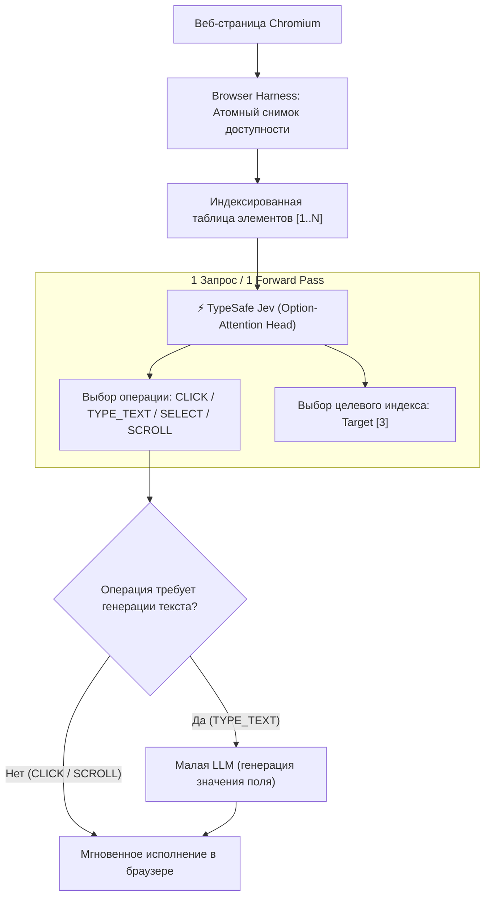

# ⚡ Jev Ultrafast: Браузерный агент со сверхбыстрым пространством действий (Option-Attention)

> **Ссылка на репозиторий:** [https://github.com/browser-use/jev-ultrafast](https://github.com/browser-use/jev-ultrafast)  
> **Организация:** [browser-use](https://github.com/browser-use) × TypeSafe  
> **Слоган:** *«A browser agent with a dynamic, indexed action space. Zürich → London on Google Flights in 7.1 seconds.»*  
> **Звёзды GitHub:** 1,200+ ★ (Топ-8 ежедневного чарта Trendshift)  
> **Стек:** Python 3.10+, TypeSafe Jev API, Browser Harness, Playwright/Chromium, uv  
> **Лицензия:** MIT  

---

## 🎯 1. В чем революция скорости? Конец медленного ReAct-цикла

Традиционные браузерные агенты (`browser-use`, Playwright agents, Claude Computer Use) чудовищно медлительны:
* На каждом шаге агент делает скриншот страницы (2–5 секунд на сжатие и отправку);
* Передает картинку или 200 КБ сырого HTML в большую мультимодальную модель;
* Ждет 3–8 секунд, пока LLM авторегрессивно генерирует токен за токеном цепочку рассуждений (CoT) и JSON вызова инструмента;
* Итог: на банальное заполнение формы из 4 полей уходит **40–60 секунд**.

**Jev Ultrafast решает задачу за 7.1 секунды (поиск рейса Цюрих $
ightarrow$ Лондон на Google Flights с нуля)**.

### Архитектурный секрет: Разделение на System-1 и System-2
Вместо того чтобы заставлять большую LLM генерировать текст там, где нужно просто нажать на кнопку, архитектура Jev использует **модель быстрого выбора (System-1 Option-Attention)**:
1. Страница парсится за один атомный вызов браузера в структурированную таблицу пронумерованных интерактивных элементов `[1..N]`.
2. Модель Jev за **один сетевой запрос и один прямой проход (Forward Pass)** без генерации текста выбирает операцию (`CLICK`, `TYPE_TEXT`, `SELECT`, `SCROLL_UP`, `SCROLL_DOWN`, `WAIT`, `DONE`) и индекс целевого элемента.
3. Небольшая языковая модель (Small LLM) подключается **только тогда**, когда операция — `TYPE_TEXT`, чтобы сгенерировать конкретную строку ввода.

---

## 🏗️ 2. Динамическое индексированное пространство действий

На каждом шаге наблюдения агент формирует компактную таблицу элементов:

```text
[1] button    Change ticket type · Round trip
[2] combobox  Where from?        · San Francisco
[3] combobox  Where to?          · empty
[4] textbox   Departure          · empty
[5] button    Search flights
```



### Почему система двигается мгновенно:
* **Ноль скриншотов в основном цикле агента:** Jev потребляет только структурированное состояние (семантическую таблицу доступности). Скриншоты рендерятся отдельно только для визуального инспектора человеком.
* **Один сетевой раундтрип на цикл принятия решений:** Головы предсказания операции (`operation`) и цели (`click_target`, `type_text_target`) делят единое эмбеддинг-пространство состояния.
* **Атомный опрос браузера:** Механизм `browser-harness` за один IPC-вызов считывает видимые контролы, имена и значения, сохраняя ссылки на нативные узлы DOM.

---

## 💻 3. Практический запуск и использование

### Запуск интерактивного инспектора:
```bash
git clone https://github.com/browser-use/jev-ultrafast.git
cd jev-ultrafast
uv sync
cp .env.example .env
# Указать ключи API в .env
uv run jev
```
Дашборд открывается на `http://127.0.0.1:8766`. Инспектор отображает элементы с их вероятностями и визуализирует выбор модели в реальном времени.

### Использование библиотеки в коде:
```python
from jev_ultrafast import Agent

with Agent(
    "https://www.google.com/travel/flights?hl=en",
    "Find one-way flights from Zurich to London on September 20, 2026, "
    "for one adult in economy. Stop when matching flight options are visible.",
) as agent:
    for state in agent.run():
        print(f"Elapsed: {state['elapsed_ms']}ms, Status: {state['status']}")
```

---

## 🔗 4. Синергия с базой знаний

* [01. OpenJev: Локальные System-1 модели действий](file:///home/blackzeshi/Documents/Notes/01_llm_architecture_and_training/openjev.md) — открытая имплементация архитектуры Jev для запуска на локальных видеокартах RTX 3090/4090 без облачных API.
* [06. Tencent BrowserSkill](file:///home/blackzeshi/Documents/Notes/06_developer_tools_and_apps/browserskill.md) — альтернативный подход к автоматизации реального залогиненного браузера разработчика через изолированное Agent Window.
* [06. Crawl4AI: LLM-ориентированный краулер](file:///home/blackzeshi/Documents/Notes/06_developer_tools_and_apps/crawl4ai.md) — инструмент для глубокого чтения и парсинга контента страниц.
* [02. AI Agent Book Ли Боцзе](file:///home/blackzeshi/Documents/Notes/02_agent_runtimes_and_harnesses/ai-agent-book.md) — теоретический фундамент планирования и разгрузки систем принятия решений (System-1 vs System-2).
