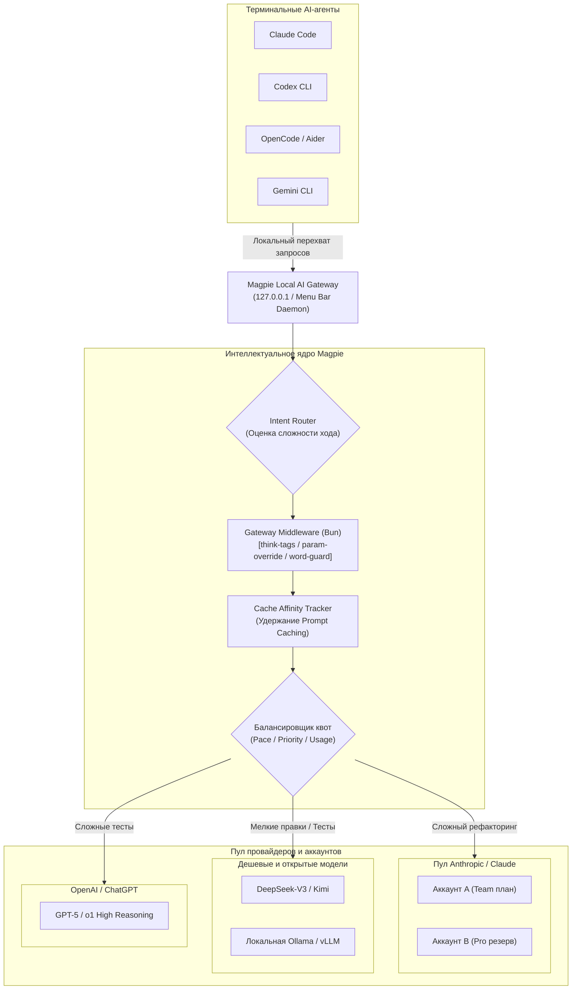

# 🐦 Magpie: Универсальный локальный AI-шлюз, роутер моделей и диспетчер квот для терминальных агентов

> **Ссылка на репозиторий:** [https://github.com/yetone/magpie](https://github.com/yetone/magpie)  
> **Официальный сайт:** [https://usemagpie.ai](https://usemagpie.ai)  
> **Разработчик:** yetone (автор известного проекта `avante.nvim`)  
> **Слоган:** *«Every agent's model. One place. Claude Code on Kimi. Codex on DeepSeek. Gemini CLI on GLM. OpenCode on your ChatGPT plan.»*  
> **Звёзды GitHub:** 8,500+ ★ (#6 в мировом Daily топе Trendshift)  
> **Стек:** Go (высокопроизводительный локальный шлюз), TypeScript / Bun (рантайм плагинов и middleware), Next.js / Tailwind (дашборд в Menu Bar / Docker)  
> **Лицензия:** MIT  

---

## 🎯 1. Архитектурная проблема: хаос квот и вендор-лок в эру кодинг-агентов

С распространением терминальных кодинг-агентов (**Claude Code**, **OpenAI Codex CLI**, **Gemini CLI**, **OpenCode**, **Aider**, **Cline**) разработчики столкнулись с тремя тяжелыми проблемами:

1. **Жесткий вендор-лок:**  
   Каждый агент намертво привязан к собственному провайдеру: Claude Code требует официальный ключ Anthropic, Codex CLI требует OpenAI. Запустить Claude Code через сверхдешевый DeepSeek-V3, локальную Ollama или подписку ChatGPT Plus официально невозможно или требует сложных хаков с проксированием.
2. **Исчерпание квот посреди задачи (Quota Death):**  
   Агент выполняет многошаговый рефакторинг из 40 вызовов инструментов. На 25-м шаге провайдер возвращает ошибку `429 Rate Limit Exceeded` или исчерпание часового лимита. Сессия аварийно завершается, весь накопленный контекст и промежуточные правки теряются.
3. **Фрагментация конфигураций:**  
   MCP-серверы, системные инструкции, токены и кастомные скиллы приходится вручную дублировать в десятки разных конфигов (`~/.claude.json`, `~/.codex/config.toml`, `.gemini/settings.json`).

**Magpie встает прозрачным локальным шлюзом (`127.0.0.1:port`) между всеми CLI-агентами и миром LLM-провайдеров**, управляя маршрутизацией, мульти-аккаунтами и затратами на лету.



---

## ⚡ 2. Ключевые архитектурные механизмы Magpie

### 1. Бесшовный Quota Failover (Мульти-аккаунты без падения сессий)
Magpie позволяет объединять ключи и учетные записи в **роутинг-группы (Routing Groups)**.
* Если во время активной сессии Claude Code исчерпывается квота первого аккаунта, Magpie **перехватывает ошибку 429 и прозрачно перенаправляет этот же запрос на следующий доступный аккаунт пула**.
* Агент в терминале даже не замечает сбоя — генерация продолжается в штатном режиме.
* **Стратегии балансировки:**
  * `priority`: строгая иерархия (основной рабочий ключ $\to$ запасной ключ $\to$ резервная модель);
  * `pace`: вычисляет оставшуюся квоту и темп расхода, отдавая приоритет аккаунту с наибольшим запасом ресурсов до часа сброса окна;
  * `usage`: равномерное распределение запросов по наименее загруженным участникам группы;
  * `round-robin`: циклическое чередование ключей для обхода лимитов частоты запросов (RPM).

---

### 2. Prompt Cache Affinity (Сохранение серверного кэша промптов)
Главный финансовый бич кодинг-агентов — растущий контекст проекта. В современных моделях (Anthropic, OpenAI, DeepSeek) действует серверный кэш промптов (*Prompt Caching*), дающий скидку до 80–90% на повторно переданные токены.
* **Проблема слепого балансировщика:** Если слать запросы одного диалога на разные серверы/аккаунты, кэш сбрасывается, и за каждый шаг приходится платить полную стоимость 100k+ токенов контекста.
* **Решение Magpie:** Вся сессия диалога жестко привязывается (**Cache Affinity**) к конкретному апстрим-аккаунту, пока его серверный кэш остается «горячим». Ротация на другой аккаунт происходит только при физическом исчерпании лимита.

---

### 3. Intent Routing (Маршрутизация по намерениям)
Не каждый запрос требует вызова флагманской дорогой модели за $15/1M токенов:
* Входящий промпт и контекст нового хода сначала анализируются быстрой и дешевой вспомогательной моделью.
* **Простые синтаксические исправления, форматирование, генерация однострочников** автоматически перенаправляются на дешевые или локальные модели (DeepSeek-V3, Haiku, Flash).
* **Многофайловые изменения, архитектурные рассуждения и отладка сложных багов** направляются на флагманские модели рассуждений (Claude 3.5 Sonnet, o1, GPT-5).
* Экран *Routing View* визуализирует цепочку принятия решений в реальном времени.

---

### 4. Gateway Middleware и рантайм плагинов на Bun
Magpie содержит встроенную среду исполнения плагинов на базе **Bun**, позволяющую модифицировать трафик на лету через JavaScript-хуки (`onRequest`, `onEvent`, `onResponse`):

```javascript
// alias.middleware.js — динамическая замена модели
export function onRequest(body, ctx) {
  if (body.model === "fast") {
    return { ...body, model: "deepseek/deepseek-chat" };
  }
}
```

#### Готовые модули middleware «из коробки»:
* **`think-tags`**: автоматически вырезает теги рассуждений `<think>...</think>` для клиентов, которые их не поддерживают, либо преобразует их в нативное поле `reasoning_content`.
* **`param-override`**: динамическое переопределение параметров запроса (температура, top_p, контекстный лимит) под конкретные модели.
* **`model-map`**: переименование моделей (агент запрашивает `claude-3-5-sonnet`, а шлюз фактически отправляет запрос в альтернативный эндпоинт, сохраняя для агента ожидаемое имя в ответе).
* **`word-guard`**: фильтрация конфиденциальных слов и токенов на лету.

---

### 5. Единая библиотека (Unified Library for MCP & Skills)
Вместо настройки каждого агента по отдельности:
* Разработчик один раз описывает в интерфейсе Magpie системные промпты, правила проекта и серверы **Model Context Protocol (MCP)**.
* Magpie автоматически генерирует и синхронизирует соответствующие конфигурационные файлы для всех установленных на машине агентов в их родных форматах (`~/.claude.json`, `.gemini/settings.json` и др.), гарантируя удаление только тех строк, которые были сгенерированы шлюзом.

---

### 6. Дашборд затрат и аналитики (Usage & Cost)
* Учет токенов, кэш-ридов и кэш-райтов в реальном времени с расчетом стоимости в долларах или юанях.
* Отслеживание остатков квот по всем аккаунтам с заблаговременным предупреждением до момента сгорания неизрасходованных лимитов платных подписок.
* Интерактивный каталог сессий: возможность в 1 клик перезапустить любую историческую сессию агента прямо в терминале.
* Экспорт телеметрии по протоколу **OpenTelemetry (OTLP)** в корпоративные системы мониторинга (Datadog, Prometheus).

---

## ⚖️ 3. Сравнительный анализ: Magpie vs LiteLLM vs New API vs Cost-Xray

| Параметр | LiteLLM | New API (One API) | cost-xray | Magpie (`yetone/magpie`) |
| :--- | :--- | :--- | :--- | :--- |
| **Целевой сценарий** | Бэкенд-разработка, микросервисы | Публичный шеринг API ключей, биллинг | Пассивный MITM-аудит контекста LLM | **Персональный рабочий стол разработчика и кодинг-агенты** |
| **Интерфейс** | Python библиотека / CLI | Веб-панель на Go/React | Локальный веб-дашборд | **Нативный Menu Bar / CLI / Docker / Web UI** |
| **Агентный фокус** | Общий API прокси | Общий API прокси | Анализ токенов | **Нативная поддержка Claude Code, Codex, OpenCode, Aider** |
| **Кэш-аффинити** | Базовое | Ограниченное | Только пассивный учет | **Глубокий Cache Affinity для сохранения Prompt Caching** |
| **Ротация аккаунтов** | Ошибки падают клиенту | Статический балансировщик | Нет | **Бесшовный failover прямо посреди запущенной сессии** |
| **Синхронизация MCP** | Нет | Нет | Нет | **Единая библиотека (раскладывает MCP по конфигам агентов)** |

---

## 💡 4. Архитектурные выводы и польза для разработчика

1. **Экономия бюджета до 70–80%:** Сочетание *Intent Routing* (простые правки в дешевые модели) и жесткого *Cache Affinity* (сохранение серверных кэшей контекста) кардинально срезает расходы на агентную разработку.
2. **Непрерывность рабочих процессов:** Защита от ошибок `429 Too Many Requests` через фоновый пул резервных ключей исключает срывы длительных задач рефакторинга.
3. **Независимость от монополий:** Возможность использовать превосходный эргономичный интерфейс Claude Code CLI с любыми альтернативными моделями (DeepSeek, Kimi, GLM, Llama-3).

---

## 🔗 Связанные материалы базы знаний

* ⚡ [cost-xray: Пассивный MITM-анализ затрат контекста LLM](file:///home/blackzeshi/Documents/Notes/06_developer_tools_and_apps/cost-xray.md)
* 🐳 [Docker Agent: Декларативный OCI-рантайм и безопасность агентов](file:///home/blackzeshi/Documents/Notes/02_agent_runtimes_and_harnesses/docker-agent.md)
* 🧠 [VibeWise: Инженерное менторство и сохранение контроля при вайб-кодинге](file:///home/blackzeshi/Documents/Notes/02_agent_runtimes_and_harnesses/vibe-wise.md)
* 🤖 [AutoHarness: Самообучающийся слой навыков для кодинг-агентов](file:///home/blackzeshi/Documents/Notes/02_agent_runtimes_and_harnesses/autoharness.md)
* 🔀 [Архитектура Tool Broker & Execution Blocker](file:///home/blackzeshi/Documents/Notes/02_agent_runtimes_and_harnesses/tool-broker-architecture.md)
