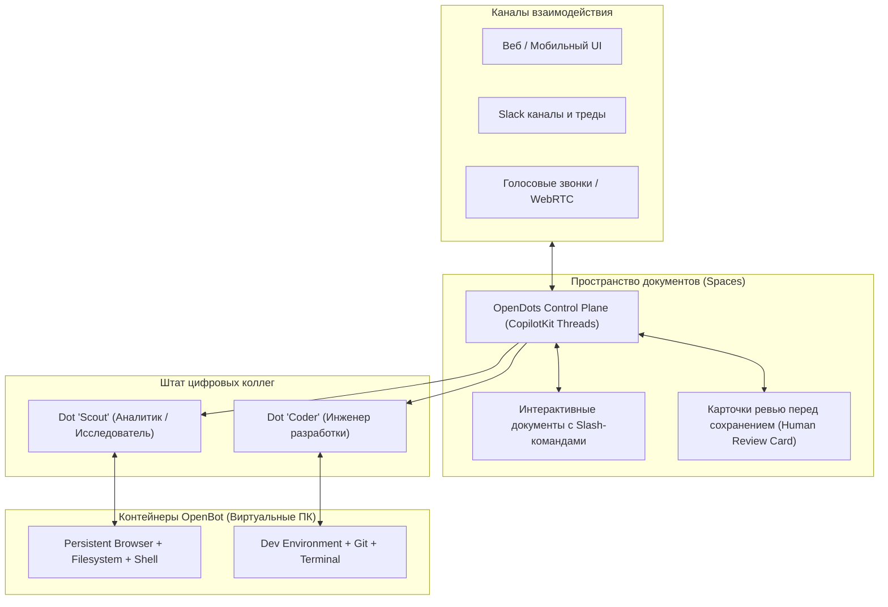

# 👥 OpenDots: Мульти-агентное пространство задач с виртуальными ПК для каждого сотрудника

> **Ссылка на репозиторий:** [https://github.com/CopilotKit/OpenDots](https://github.com/CopilotKit/OpenDots)  
> **Разработчик:** CopilotKit & AG-UI Team  
> **Слоган:** *«Always-on AI coworkers that move between text, calls, and Slack. An open-source template for persistent AI agents, each with its own computer.»*  
> **Звёзды GitHub:** 2.9k+ ★  
> **Стек:** TypeScript, Next.js, React, CopilotKit, AG-UI, Docker, OpenBot  
> **Лицензия:** MIT (Fully Self-Hostable)  

---

## 🎯 1. В чем концепция цифровых коллег (Dots)?

В большинстве современных систем агенты являются эфемерными: чат закрылся — сессия пропала, установленные утилиты и профиль браузера стёрлись.

**OpenDots реализует концепцию постоянных цифровых сотрудников (Persistent AI Coworkers):**
1. **Каждый агент («Dot») имеет собственный виртуальный компьютер:** Благодаря интеграции с супервизором контейнеров **OpenBot**, каждый агент получает изолированную среду с персистентным профилем браузера, файловой системой и bash-терминалом, которые сохраняются между перезапусками.
2. **Многоканальное присутствие:** Один и тот же агент может отвечать разработчику в веб-интерфейсе, участвовать в тредах Slack и подключаться к аудио-звонкам.
3. **Человек в контуре (Human Takeover):** Пользователь может в любой момент открыть экран компьютера агента (Live Computer View), перехватить управление мышью или клавиатурой и продолжить действие вручную.



---

## 🛠️ 2. Ключевые архитектурные сущности

* **Spaces (Пространства документов):** Интерактивная база знаний компании, похожая на Notion, с поддержкой вложенных страниц, Markdown-режима, полнотекстового поиска и автосохранения. Агенты читают страницы Spaces как контекст и сохраняют туда результаты работы.
* **Review Before Saving (Контроль изменений):** Агент не может молча перезаписать важный документ. Перед сохранением в чате всплывает интерактивная карточка диффа (Review Card), где человек подтверждает или корректирует черновик.
* **Specialist Roles:** Декларативная настройка ролей: имя, аватар, системные инструкции, списки доступных API-ключей и гранулярные права доступа к терминалу и сети.

---

## 🚀 3. Развертывание и запуск

Платформа полностью открыта и предназначена для самостоятельного хостинга (Self-Hosted):

```bash
# Клонирование шаблона
git clone https://github.com/CopilotKit/OpenDots.git
cd OpenDots

# Установка зависимостей и запуск контейнеров
pnpm install
docker compose up -d

# Запуск dev-сервера
pnpm dev
```
