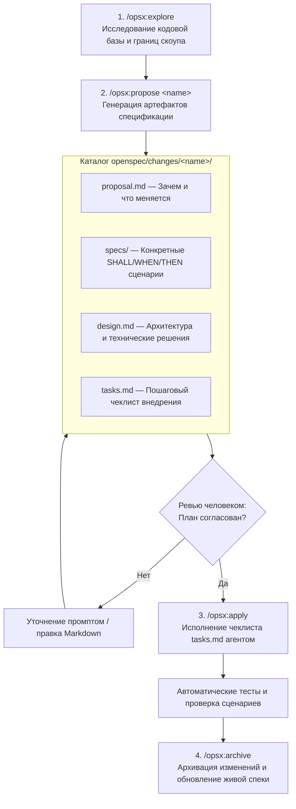

# 📐 OpenSpec: Спецификационно-ориентированная разработка (SDD) для кодинг-агентов

> **Ссылка на репозиторий:** [https://github.com/Fission-AI/OpenSpec](https://github.com/Fission-AI/OpenSpec)  
> **Организация:** [Fission AI](https://github.com/Fission-AI)  
> **Слоган:** *«Spec-driven development (SDD) for AI coding assistants. Fluid not rigid, iterative not waterfall.»*  
> **Звёзды GitHub:** 68,800+ ★ (Лидер методологий AI-кодинга)  
> **Стек:** TypeScript / Node.js, Markdown-спецификации, CLI `/opsx`, плагины для Cursor, Claude Code, Codex  
> **Лицензия:** MIT  

---

## 🎯 1. В чем проблема «вайб-кодинга» и почему нужен SDD?

С появлением автономных кодинг-агентов (Claude Code, Cursor, Copilot Workspace) разработчики столкнулись с феноменом **«галлюцинаций вслепую»**:
1. Разработчик дает агенту расплывчатый промпт: *«Добавь темную тему»*.
2. Агент начинает хаотично менять десятки файлов, ломает существующие CSS-классы, ставит несовместимые библиотеки и создает технический долг.
3. Разработчик тратит часы на откат правок и ручное исправление «творчества» ИИ.

**Методология Spec-Driven Development (SDD):**
> *«Сначала согласуй строгую архитектурную спецификацию и сценарии приемки в Markdown, и только после явного одобрения человеком разреши агенту прикасаться к коду.»*

OpenSpec формализует жизненный цикл разработки с ИИ, делая его итеративным, прозрачным и масштабируемым от личных пет-проектов до корпоративных монорепозиториев.

---

## 🔄 2. Артефактно-ориентированный конвейер `/opsx`

OpenSpec вводит строгий 4-шаговый цикл работы через команды `/opsx`:



### Структура спецификации (Plain Markdown):
Спецификации пишутся на чистом, понятном человеку и машине Markdown без сложного синтаксиса:

```markdown
## ADDED Requirements

### Requirement: Theme selection
The app SHALL let users switch between light and dark themes,
defaulting to the system preference.

#### Scenario: User toggles dark mode
- **WHEN** the user clicks the theme toggle
- **THEN** the app switches to dark mode and persists the choice in localStorage
```

---

## 🏢 3. Межрепозиторные спецификации (OpenSpec Stores)

В корпоративных командах одна фича редко живет в одном репозитории: она затрагивает бэкенд на Go, фронтенд на Next.js и мобильное приложение.

OpenSpec решает эту проблему концепцией **Stores**:
* Спецификации выносятся в отдельный Git-репозиторий архитектурного планирования.
* Кодинг-агенты во всех связанных кодовых базах подключают этот репозиторий как источник правды (Single Source of Truth) в режиме read-only.
* Исключается рассинхронизация между контрактами бэкенда и интерфейсами фронтенда.

---

## 🚀 4. Интеграция с рабочими агентными средами

### Установка пакета:
```bash
npm install -g @fission-ai/openspec
```

### Использование в диалоге с Claude Code / Cursor:
```text
# 1. Исследование идеи фичи
/opsx:explore "Хочу добавить аутентификацию по Passkeys"

# 2. Формирование предложения и чеклиста
/opsx:propose passkeys-auth

# 3. Человек читает proposal.md, design.md и tasks.md
# После одобрения запускается реализация:
/opsx:apply

# 4. Фиксация результата и архивация
/opsx:archive
```

---

## 🔗 5. Синергия с базой знаний

* [02. Awesome DESIGN.md](file:///home/blackzeshi/Documents/Notes/02_agent_runtimes_and_harnesses/awesome-design-md.md) — методология архитектурных дизайн-манифестов для кодинг-агентов, отлично дополняющая спецификации OpenSpec.
* [02. Open Code Review (Alibaba)](file:///home/blackzeshi/Documents/Notes/02_agent_runtimes_and_harnesses/open-code-review.md) — автоматический аудит соответствия реализованного кода архитектурным правилам перед мерджем.
* [02. Agent-Skills (Tech Leads Club)](file:///home/blackzeshi/Documents/Notes/02_agent_runtimes_and_harnesses/agent-skills.md) — манифесты навыков `SKILL.md`, на базе которых функционируют команды `/opsx`.
