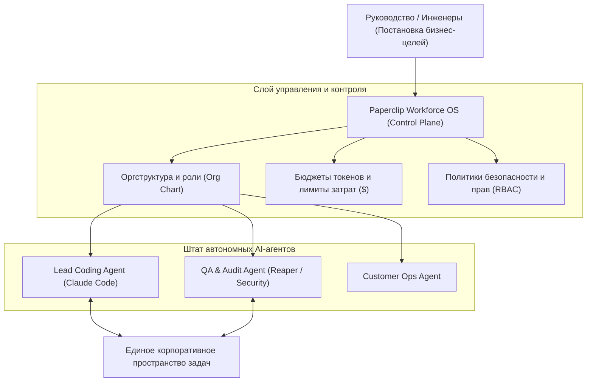

# 🤖 Paperclip: Платформа управления цифровой рабочей силой компании (Workforce OS)

> **Ссылка на репозиторий:** [https://github.com/paperclipai/paperclip](https://github.com/paperclipai/paperclip)  
> **Организация:** Paperclip AI  
> **Слоган:** *«If an autonomous agent is an employee, Paperclip is the company. Manage business goals, not pull requests.»*  
> **Звёзды GitHub:** 83.8k+ ★ (#1 Daily в чартах Trendshift)  
> **Стек:** Node.js, TypeScript, React, PostgreSQL, Docker, MCP, Tailscale  
> **Лицензия:** Apache-2.0  

---

## 🎯 1. В чем концептуальный прорыв Paperclip?

Большинство существующих агентных фреймворков (CrewAI, AutoGen, LangGraph) фокусируются на **низкоуровневой механике**: как передать промпт от одного агента другому или как вызвать bash-команду.

**Paperclip смотрит на проблему с точки зрения управления компанией (Management Layer):**
* В компании работают десятки разнородных агентов (Claude Code, Hermes, OpenClaw, специализированные исследовательские боты).
* Руководителю и инженерам нужен не бесконечный лог терминала, а **оргструктура (Org Chart)**, **бюджеты по отделам**, **согласование целей (Goal Alignment)** и **политики безопасности (Governance)**.



---

## ⚡ 2. Ключевые возможности платформы

1. **Иерархическая организационная структура (Org Chart):** Агенты распределяются по отделам с четкой субординацией, зонами ответственности и процедурами эскалации нерешенных проблем.
2. **Управление бюджетами и лимитами:** Возможность жестко ограничить максимальный суточный или проектный бюджет на API для каждого агента или команды.
3. **Согласование целей вместо микро-менеджмента:** Пользователь формулирует высокоуровневые бизнес-результаты (Objectives & Key Results), а Paperclip декомпозирует их на подзадачи между профильными агентами.
4. **Интеграция с корпоративным контуром:** Поддержка закрытых сетей через Tailscale, интеграция с мессенджерами (Slack, Discord, Telegram) и self-hosted развертывание в Docker.

---

## 💻 3. Пример декларативной конфигурации отдела

```yaml
# department.yaml
department: CoreEngineering
budget:
  monthly_limit_usd: 1500
  alert_threshold: 0.8
lead_agent:
  name: "Atlas-Lead"
  runtime: "claude-code"
  model: "claude-3-7-sonnet"
  delegation_policy: "auto_assign"
team:
  - role: "FrontendSpecialist"
    agent: "Hermes-Coder"
    max_concurrent_tasks: 3
  - role: "SecurityAuditor"
    agent: "TrailOfBits-Coop"
    approval_required_for: ["git_push", "cloud_deploy"]
```

---

## 🎯 4. Значение для индустрии

Paperclip превращает хаотичный «вайб-кодинг» и разрозненные CLI-скрипты в **институционализированную цифровую организацию**, позволяя бизнесу масштабировать штат автономных сотрудников без потери управляемости и контроля за расходами.
