```mermaid
flowchart LR
    Task["Задача: Добавить выбор даты"] --> Standard["Обычный кодинг-агент"]
    Task --> Pony["Агент с плагином Ponytail"]

    Standard --> Overeng["npm install flatpickr + CSS + Wrapper Component + Timezones (404 строки кода)"]
    Pony --> Minimal["<input type='date'> (23 строки с валидацией, 0 зависимостей)"]
```

# 🧘 Ponytail: Мышление самого ленивого сеньора в команде

> **Ссылка на репозиторий:** [https://github.com/DietrichGebert/ponytail](https://github.com/DietrichGebert/ponytail)  
> **Автор:** Дитрих Геберт (Dietrich Gebert)  
> **Слоган:** *«He says nothing. He writes one line. It works. The best code is the code you never wrote.»*  
> **Звёзды GitHub:** 154.2k+ ★ (Абсолютный лидер мировых чартов)  
> **Совместимость:** Claude Code, Cursor, Codex, DeepSeek Harness, Google Antigravity (20+ агентов)  
> **Лицензия:** MIT  

---

## 🎯 1. В чем философия Ponytail?

Вы наверняка встречали такого человека в инженерных командах: хвостик на затылке, овальные очки, работает в компании дольше, чем существует Git-репозиторий. Вы приносите ему 50 строк кода новой фичи; он молча смотрит на них, удаляет 49 строк и оставляет одну, которая решает задачу стандартными средствами платформы.

**Ponytail внедряет этот менталитет прямо в системный промпт и скиллы вашего AI-агента:**
* **Оверинжиниринг агентов:** Когда вы просите обычного агента сделать выбор даты (Date Picker), он устанавливает библиотеку `flatpickr`, пишет пятислойный React-компонент, импортирует CSS-стили и начинает рассуждать про временные зоны (400+ строк кода).
* **С Ponytail:** Агент вспоминает, что в HTML5 уже есть нативный элемент платформы:
  ```html
  <!-- ponytail: browser has one -->
  <input type="date">
  ```



---

## 📊 2. Результаты бенчмарков: Claude Code на реальном репозитории

Тестирование проводилось на официальном шаблоне FastAPI + React (`tiangolo/full-stack-fastapi-template`) при выполнении 12 реальных инженерных задач (Haiku 4.5, n=4):

| Метрика эффективности | Обычный агент (Baseline) | Примитивный промпт «пиши в одну строку» | **Агент с Ponytail** |
| :--- | :--- | :--- | :--- |
| **Объем сгенерированного кода (LOC)** | 100% | -33% | **-54% (до -94% на перегруженных задачах)** |
| **Расход токенов** | 100% | -14% | **-22% токенов** |
| **Стоимость сессии ($)** | 100% | -21% | **-20% затрат** |
| **Время выполнения задачи** | 100% | -30% | **-27% быстрее** |
| **Безопасность и валидация ошибок** | 100% | ⚠️ 95% (теряет проверки) | **✅ 100% (сохраняет все барьеры)** |

> [!IMPORTANT]
> Примитивные промпты вида *«Пиши ультракоротко»* опасны: они часто выбрасывают блоки `try/catch` и валидацию входных данных. **Ponytail сохраняет 100% проверок надежности**, вырезая исключительно архитектурный жир и ненужные зависимости.

---

## 🚀 3. Быстрая установка

```bash
# Установка через npm / npx
npx @dietrichgebert/ponytail install

# Либо добавление как плагина в Claude Code
claude plugin add DietrichGebert/ponytail
```
