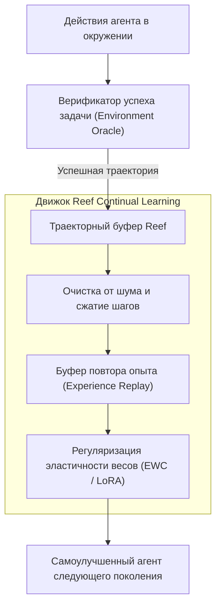

# 🤖 Reef: Инфраструктура непрерывного самосовершенствования автономных агентов

> **Ссылка на репозиторий:** [https://github.com/Human-Agent-Society/reef](https://github.com/Human-Agent-Society/reef)  
> **Организация:** Human-Agent Society  
> **Слоган:** *«Reef is the first open-source infrastructure for continual self-improving agents.»*  
> **Звёзды GitHub:** 5.1k+ ★ (Топ чартов Trendshift)  
> **Стек:** Python 3.12+, PyTorch, Hugging Face, SQLite/DuckDB, LoRA/PEFT  
> **Пакет PyPI:** `reef-infra`  
> **Лицензия:** Apache-2.0  

---

## 🎯 1. В чем проблема статических агентов?

Современный AI-агент статичен:
* При каждом запуске он начинает с чистого листа весов базовой модели.
* Если агент нашел элегантное решение нестандартной инженерной проблемы, этот опыт **исчезает вместе с завершением процесса**.
* Попытки периодически дообучать модель (fine-tuning) на новых логах приводят к **катастрофическому забыванию (Catastrophic Forgetting)**: агент начинает лучше решать новые задачи, но полностью разучивается выполнять базовые инструкции.

**Reef предлагает инженерную архитектуру Continual Learning:**
> Систематический сбор успешных траекторий решений, автоматическая фильтрация шума, буфер повтора опыта (Experience Replay Buffer) и безопасное обновление адаптеров (LoRA/PEFT) без деградации фундаментальных навыков.



---

## ⚡ 2. Ключевые возможности `reef-infra`

1. **Траекторный регистратор (Trajectory Logger):** Прозрачный перехват состояний, промптов, вызовов инструментов и промежуточных наблюдений с минимальным оверхедом по памяти.
2. **Защита от катастрофического забывания:** Алгоритмы регуляризации весов (Elastic Weight Consolidation) и генеративное воспроизведение ключевых базовых датасетов.
3. **Автономный цикл самообучения (Self-Improving Loop):** Агент может в ночное время запускать фазу консолидации дневного опыта, обновляя локальные LoRA-адаптеры.
4. **Метрики адаптации:** Встроенные бенчмарки для проверки того, что агент действительно прогрессирует при решении задач в целевой предметной области.

---

## 💻 3. Пример использования с Python

```python
from reef import ReefHarness, ExperienceCollector

# Инициализация агента с поддержкой непрерывного обучения
harness = ReefHarness.load(
    base_model="Qwen/Qwen2.5-Coder-7B-Instruct",
    adapter_dir="./agent_continual_lora"
)

collector = ExperienceCollector(storage_path="./reef_experience.db")

# Выполнение сложной задачи
with collector.trace_session(task="Оптимизация SQL-запроса с индексами") as session:
    result = harness.run(session)
    if result.is_success():
        session.mark_exemplary() # Помечаем траекторию как эталон для дообучения

# Запуск фонового шага консолидации опыта
harness.consolidate_experience(batch_size=32, lr=1e-5)
```

---

## 🎯 4. Значение для автономии агентов

Reef устраняет ключевое ограничение современных систем — их неизменность во времени, открывая дорогу созданию агентов, которые с каждым рабочим днем становятся умнее и опытнее в конкретной кодовой базе компании.
