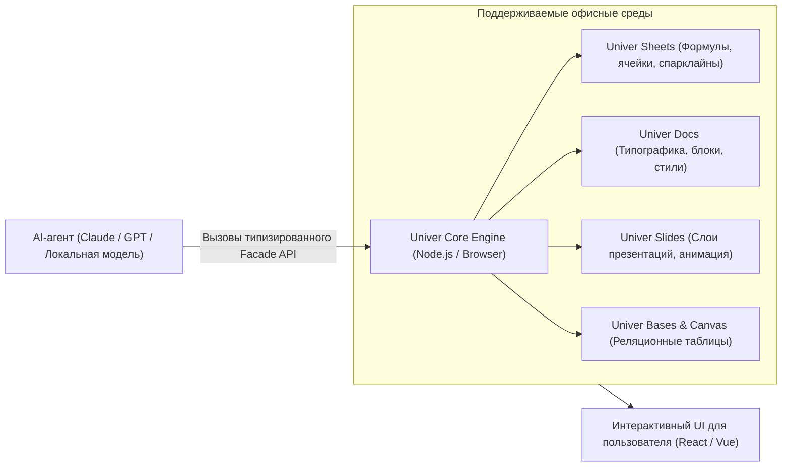

# 🤖 Univer: Открытый офисный харнес и среда манипулирования документами для AI-агентов

> **Ссылка на репозиторий:** [https://github.com/dream-num/univer](https://github.com/dream-num/univer)  
> **Организация:** DreamNum Inc.  
> **Слоган:** *«The Office Harness for AI Agents — Spreadsheets, Documents, Presentations, Bases, Boards, and PDFs in one runtime.»*  
> **Звёзды GitHub:** 18.2k+ ★ (#9 Weekly в чартах Trendshift)  
> **Стек:** TypeScript, HTML5 Canvas, WebGL, Node.js, React / Vue  
> **Лицензия:** Apache-2.0  

---

## 🎯 1. В чем проблема работы агентов с офисными документами?

Офисные форматы (Excel, Word, PowerPoint) — это основа бизнес-коммуникации. Однако классические AI-агенты работают с ними крайне примитивно:
* Конвертируют таблицы в плоский текст/Markdown, **полностью теряя формулы**, форматирование ячеек, диапазоны и диаграммы.
* Не способны надежно манипулировать сложными многостраничными макетами и стилями.
* Генерируют поврежденные бинарные файлы `.xlsx` и `.docx` через самодельные скрипты.

**Univer решает эту проблему, выступая как «Офисный рантайм» (Office Harness):**
> Полнофункциональный движок электронных таблиц, документов и презентаций, отрисовываемый на Canvas с **единым типизированным API (Facade API)**, доступным как в браузере, так и на сервере в среде Node.js для AI-агентов.



---

## ⚡ 2. Ключевые возможности

1. **Единый фасадный API (Facade API):** Агент может программно писать формулы `=VLOOKUP(...)`, менять цвета заливки ячеек, форматировать абзацы и строить графики через чистые TypeScript-методы.
2. **Высокопроизводительный Canvas-рендеринг:** Отрисовка таблиц с миллионами ячеек без лагов DOM-дерева на 60 FPS.
3. **Встроенный движок формул (Formula Engine):** Полная совместимость со стандартными формулами Microsoft Excel и Google Sheets, включая массивы и вычисления на лету.
4. **Бесшовная встраиваемость:** Легко монтируется в корпоративные веб-приложения, ERP-системы или десктопные воркспейсы.

---

## 💻 3. Пример взаимодействия агента с Univer Sheets через Facade API

```typescript
import { UniverSheetsCore } from "@univerjs/core";
import { FUniver } from "@univerjs/facade";

const fUniver = FUniver.newAPI(univerInstance);
const activeWorkbook = fUniver.getActiveWorkbook();
const sheet = activeWorkbook.getActiveSheet();

// Агент выполняет финансовый расчет и форматирование ячеек
sheet.getRange("A1").setValue("Выручка Q3");
sheet.getRange("B1").setValue(154000);

sheet.getRange("A2").setValue("Расходы Q3");
sheet.getRange("B2").setValue(92000);

// Установка формулы прибыли
sheet.getRange("A3").setValue("Чистая прибыль");
sheet.getRange("B3").setFormula("=B1-B2");

// Стилизация результата
sheet.getRange("A3:B3").setFontWeight("bold").setBackgroundColor("#dcfce7");
```

---

## 🎯 4. Значение для автоматизации бизнеса

Univer дает агентам возможность взаимодействовать с бизнес-пользователями на их родном языке — языке интерактивных электронных таблиц и презентаций, устраняя необходимость экспорта и ручной верстки отчетов.
