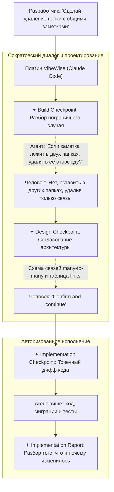

# 🧠 VibeWise: Инженерное менторство и сохранение контроля при работе с кодинг-агентами

> **Ссылка на репозиторий:** [https://github.com/nykooi1/vibe-wise](https://github.com/nykooi1/vibe-wise)  
> **Разработчик:** nykooi1  
> **Слоган:** *«You build. AI writes. A Claude Code plugin that puts learning first and keeps you in control while AI writes the code you designed.»*  
> **Звёзды GitHub:** 1.3k+ ★  
> **Стек:** Python, Claude Code Plugin Architecture, Interactive TUI Dialogues  
> **Лицензия:** MIT  

---

## 🎯 1. В чем главная угроза «Вайб-кодинга» для инженера?

С распространением автономных кодинг-агентов (Claude Code, Cursor, Codex) возник феномен **«Vibe-кодинга»**: разработчик формулирует общую задачу, агент генерирует десятки файлов и функций, человек нажимает `Accept`, проверяет, что проект запускается, и переходит к следующей фиче.

Однако через 2–3 недели такой разработки неизбежно наступают системные проблемы:
* **Атрофия архитектурного мышления:** Разработчик перестает анализировать пограничные случаи, структуры данных и цену выбранных компромиссов.
* **Потеря контроля над кодовой базой («Black Box Syndrome»):** Создатель приложения не может объяснить на код-ревью или при сбое на проде, почему база данных спроектирована именно так и где кроются узкие места производительности.
* **Иллюзия компетентности:** Скорость генерации кода скрывает пробелы в понимании работы распределенных систем, транзакций и безопасности.

**VibeWise переворачивает динамику: «Человек проектирует — ИИ пишет код» (You build. AI writes):**
Вместо того чтобы молча строчить код, агент берет на себя роль опытного тимлида и ментора: **он сначала заставляет разработчика продумать архитектуру и граничные условия**, помогает взвесить компромиссы, и лишь после явного согласования приступает к реализации.



---

## 🚦 2. Трехуровневая система контрольных точек (Checkpoints)

VibeWise разбивает поток работы над фичей на структурированные контрольные точки:

| Контрольная точка | Что происходит на этом этапе | Результат этапа |
| :--- | :--- | :--- |
| **✦ Build Checkpoint** | Агент выявляет неоднозначности в требованиях, спрашивает человека о поведении в краевых случаях и предлагает выбрать архитектурный подход. | Четкое понимание логики работы системы до генерации кода. |
| **✦ Design Checkpoint** | Фиксация предложенного решения (схема таблиц, контракты API, диаграмма зависимостей). Код еще не пишется. | Кнопка **Confirm and continue** фиксирует архитектурный контракт. |
| **✦ Implementation Checkpoint** | Агент формулирует конкретный план правок, список изменяемых файлов и тестов. | Кнопка **Implement this step** дает агенту право на запись кода. |
| **✦ Implementation Report** | Развернутый разбор завершенной задачи: какие файлы изменены, почему это соответствует принятому решению, какие тесты добавлены. | Полная прозрачность и усвоение полученного опыта разработчиком. |

---

## 🎓 3. Адаптивность под уровень инженера

Плагин автоматически или по запросу пользователя меняет глубину менторства:

* **Beginner (Начинающий):** Разжевывание незнакомых абстракций, наглядные текстовые диаграммы, декомпозиция больших задач на элементарные шаги.
* **Intermediate (Мидл):** Меньше определений, упор на межмодульные связи, обработку ошибок, валидацию и масштабируемость.
* **Advanced (Сеньор):** Проверка на прочность скрытых допущений, анализ редких сценариев отказа (failure modes), деградации производительности и race conditions.

---

## 🔒 4. Локальность и приватность

* **Вся история и артефакты хранятся локально:** Настройки обучения, профиль разработчика и карта проекта живут в папке `.vibe-wise/` внутри вашего репозитория.
* **Zero Telemetry:** Никаких сторонних серверов, аккаунтов или облачных прокси. Плагин работает строго внутри локального контекста Claude Code.
* **Безопасный сброс:** Команда `/vibe-wise:reset` создает резервную копию заметок в `backups/`, не затрагивая исходный код проекта.

---

## 🚀 5. Установка и запуск в Claude Code

Установка плагина через маркетплейс Claude Code:

```bash
# 1. Добавление маркетплейса
/plugin marketplace add nykooi1/vibe-wise

# 2. Установка плагина
/plugin install vibe-wise@vibe-wise

# 3. Запуск режима интерактивного обучения в проекте
/vibe-wise:learn
```

### Быстрые команды управления стилем взаимодействия:
* *«Используй меньше чекпоинтов»* — переход в режим быстрой разработки.
* *«Сфокусируйся на архитектуре бэкенда»* — углубленный опрос по базам данных и сервисам.
* *«Just implement this one»* — разовый пропуск обсуждения для тривиальных однострочных правок.
* *«Приостанови обучение»* — временный возврат к обычному поведению Claude Code.
