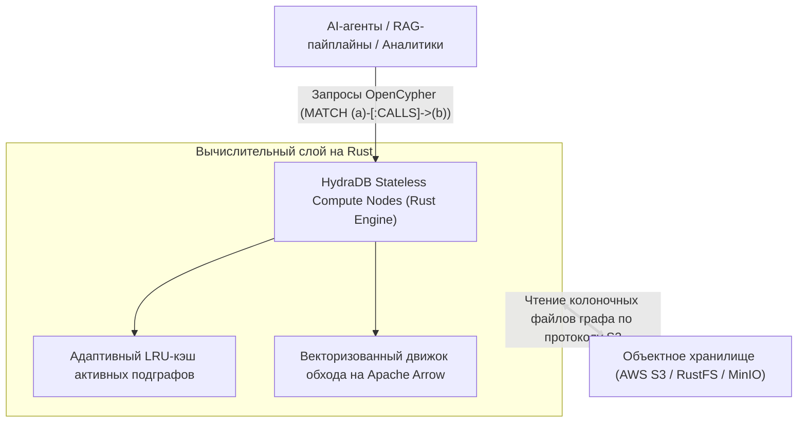

# 🏛️ HydraDB: Графовая база данных нового поколения с разделением вычислений и объектного хранения

> **Ссылка на репозиторий:** [https://github.com/hydra-db/hydradb](https://github.com/hydra-db/hydradb)  
> **Организация:** HydraDB Team  
> **Слоган:** *«Fast, cloud-native graph database on object storage. OpenCypher compliant, written in pure Rust.»*  
> **Звёзды GitHub:** 6.4k+ ★ (Топ чартов Trendshift)  
> **Стек:** Pure Rust 1.91+, Apache Arrow, OpenCypher TCK, AWS S3 / MinIO / Ceph  
> **Лицензия:** AGPL-3.0  

---

## 🎯 1. В чем архитектурная революция HydraDB?

Классические графовые СУБД (Neo4j, Memgraph, TigerGraph) строились вокруг архитектуры **Share-Nothing или локальных SSD-дисков**:
* Дорогое хранение: чтобы держать миллиарды связей и узлов, требуются гигантские объемы дорогой RAM и быстрых NVMe-дисков.
* Сложное масштабирование: репликация графа и перераспределение шардов сопряжены с высокими накладными расходами.
* Невозможность независимого масштабирования: вы платите за процессорные ядра, даже когда вам нужно просто увеличить объем хранимого графа знаний.

**Подход HydraDB (Cloud-Native Architecture):**
> **Полное разделение вычислений и хранения (Compute-Storage Separation).** Графовые индексы, ребра и свойства узлов упаковываются в колоночные форматы на базе Apache Arrow и хранятся напрямую в дешевом объектном хранилище (Amazon S3, MinIO, RustFS).



---

## ⚡ 2. Ключевые преимущества

1. **Десятикратная экономия инфраструктуры:** Стоимость хранения терабайтных корпоративных графов знаний в S3 на 85–90% ниже, чем на постоянных SSD-дисках серверов Neo4j.
2. **100% совместимость с OpenCypher:** Поддержка стандартного языка графовых запросов OpenCypher (пройдена официальная сертификация OpenCypher TCK).
3. **Безопасность памяти на Rust:** Отсутствие пауз сборщика мусора (GC pauses), что критично для аналитических запросов с обходом миллионов ребер за миллисекунды.
4. **Адаптивный колоночный формат:** Свойства узлов хранятся в формате Parquet/Arrow, что позволяет аналитическим движкам (DuckDB, ClickHouse) сканировать метаданные без участия графового сервера.

---

## 💻 3. Пример выполнения запроса OpenCypher

```cypher
// Поиск цепочек вызовов уязвимых микросервисов в архитектурном графе
MATCH (service:Microservice)-[:DEPENDS_ON*1..3]->(lib:Library {name: "openssl"})
WHERE lib.version < "3.0.0"
RETURN service.name, lib.version, count(*) AS risk_score
ORDER BY risk_score DESC
LIMIT 10;
```

---

## 🎯 4. Значение для AI и Графов Знаний

HydraDB — это идеальный фундамент для **Enterprise Knowledge Graphs и Memory RAG**: агенты могут динамически дополнять огромный корпоративный граф онтологий, не опасаясь переполнения дисков и непомерных счетов за инфраструктуру.
