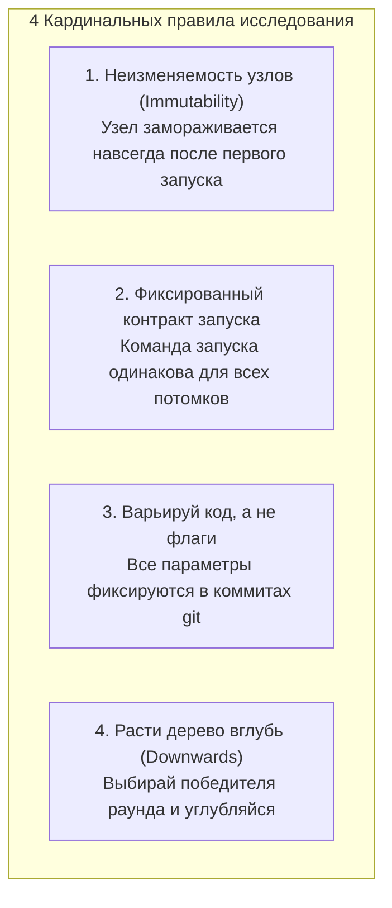
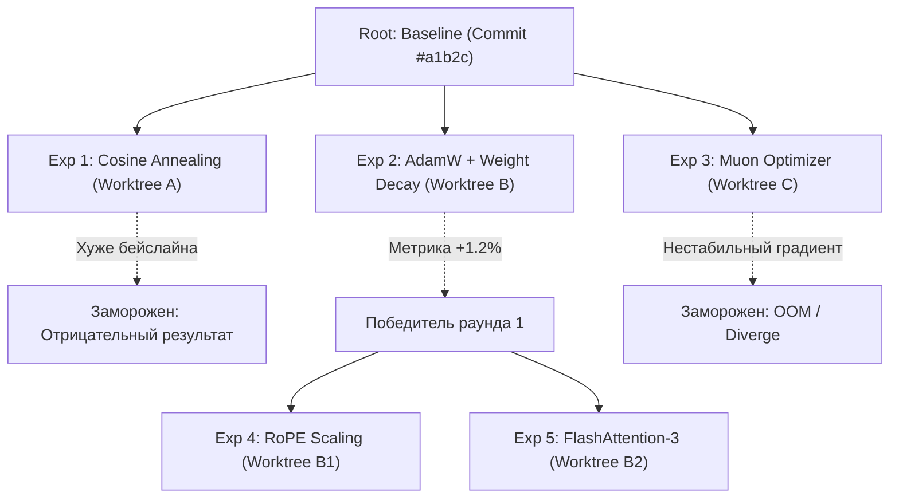

# 🔬 alphaXiv OpenResearch: Local-First воркспейс для автономных исследований (Autoresearch)

> **Ссылка на репозиторий:** [https://github.com/alphaXiv/OpenResearch](https://github.com/alphaXiv/OpenResearch)  
> **Организация:** [alphaXiv](https://alphaxiv.org) (Open Science & AI Research Community)  
> **Официальный сайт документации:** [openresearch.sh](https://openresearch.sh)  
> **Слоган:** *«The local-first workspace for research agents and autoresearch. Turn your coding agents into research agents.»*  
> **Звёзды GitHub:** 4,200+ ★ (Лидер трендов GitHub Trendshift)  
> **Стек:** Rust (высокоскоростное ядро и CLI `orx`), Web UI (локальный дашборд `127.0.0.1:4791`), SQLite, Git Worktrees, Claude Code / Cursor Skills  
> **Лицензия:** MIT  

---

## 🎯 1. В чем проблема классического R&D и почему OpenResearch?

Появление мощных кодинг-агентов ([Claude Code](https://claude.ai/code), Cursor, Codex) породило волну попыток использовать их для научных исследований (ML Research, оптимизация архитектур нейросетей, подбор гиперпараметров, биоинформатика). Однако в автономном режиме агенты быстро скатываются в хаос:
1. **Кризис воспроизводимости (Reproducibility Crisis):** Агент хаотично меняет код в одном файле, перезаписывает удачные веса, запускает скрипты с разными переменными окружения и теряет контекст того, какая именно правка привела к улучшению метрики.
2. **Линейный брутфорс вместо научного метода:** Вместо проверки структурированного дерева гипотез агенты часто «застревают» в локальных минимумах.
3. **Отрыв от научной литературы:** Кодинг-агенты изолированы от актуальных препринтов arXiv и не умеют сопоставлять свои гипотезы с опубликованными статьями.

**Ответ команды alphaXiv:**
> **OpenResearch** — это локально-ориентированная (Local-First) среда на Rust, которая превращает любого кодинг-агента в строгого, методологически дисциплинированного исследователя. Она обеспечивает параллельный поиск гипотез в изолированных **Git Worktrees**, гарантирует воспроизводимость каждого эксперимента и напрямую связывает процесс с базой препринтов arXiv.

---

## 📜 2. Четыре кардинальных правила OpenResearch (Cardinal Rules)

В основе OpenResearch лежит жесткая научная дисциплина, зафиксированная в агентном манифесте `SKILL.md`. Нарушение любого из этих правил делает результаты исследования недействительными:



1. **Никогда не редактируй узел после того, как запуск дал результат:**
   * Как только эксперимент проверил гипотезу или установил бейслайн, узел замораживается навсегда (отрицательный результат — это тоже ценный результат). 
   * Чтобы проверить новую идею, агент обязан **ответвить дочерний узел (child)**.
2. **Команда запуска и окружение — неизменный контракт:**
   * Дочерний узел наследует команду запуска родителя дословно. Запрещено передавать параметры через переменные окружения (`LR=3e-4 python run.py`). Единственное различие между узлами — **закоммиченный код и конфигурация** в соответствующей ветке Git.
3. **Меняй код, а не ручки в командной строке:**
   * Все гиперпараметры должны быть закодированы в файлах конфигурации репозитория. Это гарантирует, что любой шаг в истории можно повторить через 5 лет.
4. **Расти дерево вглубь, а не вширь (Down, not sideways):**
   * Разрешается короткое ветвление вариантов в рамках одного раунда принятия решений (например, 3 варианта функции активации), после чего агент обязан **выбрать победителя раунда** и продолжать исследования уже от него.

---

## 🏗️ 3. Архитектура: Дерево экспериментов на Git Worktrees

OpenResearch использует возможности **Git Worktrees**, позволяя параллельно исследовать несколько независимых гипотез без конфликтов за рабочую директорию:



### Преимущества Git-нативного подхода:
* **Изолированное окружение для каждого агента:** Агент А может менять код в `worktree A`, пока Агент Б тестирует архитектуру в `worktree B`.
* **Неизменяемый снапшот доказательств:** Для каждого запуска `orx` сохраняет точный хэш коммита, полный diff изменений, логи stdout/stderr, скалярные метрики и сгенерированные артефакты (графики, веса, отчеты).
* **Local-First & Приватность:** Все данные хранятся локально на машине исследователя в SQLite (`~/.config/openresearch/`). Никакой код и промпты не уходят в облако без явного желания пользователя.

---

## 📚 4. Научная интроспекция: Связка с arXiv и alphaXiv

OpenResearch напрямую подключен к глобальному репозиторию научных статей arXiv и дискуссионной платформе alphaXiv:

```bash
# Поиск релевантных статей по ключевым словам прямо из терминала
orx discover keyword "state space models long context"

# Загрузка статьи, абстракта, ссылок и формул по arXiv ID или DOI
orx paper 2402.12345
```

Агент может:
1. Запросить у `orx` статьи по теме исследования;
2. Извлечь ключевые гипотезы и архитектурные решения авторов;
3. Создать дочернюю ветку эксперимента, имплементирующую идею из статьи;
4. Сравнить полученные эмпирические результаты с опубликованными в статье заявлениями.

---

## 🖥️ 5. Вычислительный бэкенд: Run Anywhere

Хотя рабочее место организовано локально (`orx up` на порту `127.0.0.1:4791`), вычисления могут выполняться на любой инфраструктуре:

| Вычислительная среда | Как запускается | Для каких задач |
|---|---|---|
| **Локальные GPU** | `orx exp run <id>` | Отладка кода, быстрые прототипы, инференс на Mac/NVIDIA |
| **Удаленный сервер по SSH** | `orx up --remote user@gpu-server` | Обучение моделей на мощных выделенных серверах (H100/A100) |
| **Slurm кластеры** | Интеграция с очередями HPC | Академические суперкомпьютерные центры и университеты |
| **Cloud Compute (Modal / Ray / K8s)** | Экспорт снапшота коммита в облачный раннер | Масштабируемые распределенные эксперименты |
| **Managed OpenResearch Compute** | `orx login` $
ightarrow$ запуск в облаке | Готовая облачная инфраструктура без настройки драйверов |

---

## ⚡ 6. Интеграция с кодинг-агентами: CLI `orx`

Установка CLI и скилла для Claude Code, Cursor, OpenCode или Codex:

```bash
# Установка CLI на macOS / Linux
curl -LsSf https://openresearch.sh/install.sh | sh

# Запуск локального демона и веб-дашборда (http://127.0.0.1:4791)
orx up

# Регистрация скилла в установленных агентах
orx install-skills
```

### Основные команды утилиты `orx`:
* `orx projects` — список активных исследовательских проектов;
* `orx project view <id>` — подробный статус проекта и дерево гипотез;
* `orx runs <project-id>` — история запусков вычислений;
* `orx logs <run-id>` — просмотр логов конкретного эксперимента;
* `orx exp run <experiment-id>` — старт выполнения эксперимента на выбранном узле;
* `orx telemetry off` — полное отключение сбора телеметрии.

---

## 📊 7. Сравнительный анализ исследовательских платформ

| Характеристика | alphaXiv OpenResearch | [Hyperresearch](file:///home/blackzeshi/Documents/Notes/04_scientific_research_and_discovery/hyperresearch.md) | [PRAXIST](file:///home/blackzeshi/Documents/Notes/04_scientific_research_and_discovery/praxist.md) | Weights & Biases / MLflow |
|---|---|---|---|---|
| **Стек ядра** | Rust (`orx-cli`) | Python | Python / Docker | Python / Cloud |
| **Фокус системы** | **Autoresearch: полный цикл от идеи до кода** | Deep Research: синтез литературы | Бенчмарк лаб. протоколов | Трекинг метрик и логов |
| **Управление кодом** | **Git Worktrees (Дерево гипотез)** | Хранилище отчетов Markdown | Docker-контейнеры | Только логи и артефакты |
| **Интеграция с LLM** | Claude Code, Cursor, Codex | Claude Code | Платформа бенчмарка | SDK в коде на Python |
| **Связка с arXiv** | ✅ Нативная (`orx discover/paper`) | ✅ Через Crawl4AI / Semantic Scholar | ❌ Нет | ❌ Нет |
| **Приватность** | **100% Local-First (SQLite)** | Local SQLite | Local | В основном Cloud |

---

## 🔗 8. Синергия с базой знаний

* [04. Hyperresearch: Автономный Deep Research харнес](file:///home/blackzeshi/Documents/Notes/04_scientific_research_and_discovery/hyperresearch.md) — идеальный компаньон: Hyperresearch выполняет глубокий многошаговый аналитический обзор литературы, а OpenResearch берет синтезированные гипотезы и прогоняет их через воспроизводимые вычислительные эксперименты.
* [04. Academic Research Skills](file:///home/blackzeshi/Documents/Notes/04_scientific_research_and_discovery/academic-research-skills.md) — навыки оформления полученных результатов в научные статьи и верификации цитирований.
* [04. PRAXIST: Автономные лаборатории](file:///home/blackzeshi/Documents/Notes/04_scientific_research_and_discovery/praxist.md) — валидация экспериментальных протоколов в реальном и виртуальном мире.
* [01. AI Infra Book Ли Боцзе](file:///home/blackzeshi/Documents/Notes/01_llm_architecture_and_training/ai-infra-book.md) — системный расчет ограничений оборудования (GPU, Memory, Bandwidth) перед запуском тяжелых тренировочных узлов в OpenResearch.
