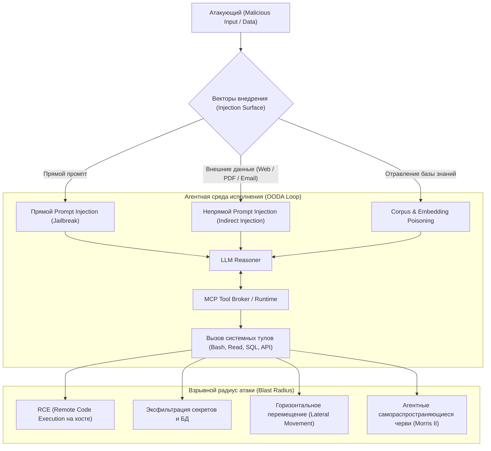

# 🛡️ AI/ML Pentesting Roadmap (2026 Edition): Наступательная безопасность LLM, Агентов, MCP и RAG

> **Ссылка на репозиторий:** [https://github.com/anmolksachan/AI-ML-Free-Resources-for-Security-and-Prompt-Injection](https://github.com/anmolksachan/AI-ML-Free-Resources-for-Security-and-Prompt-Injection)  
> **Автор:** Анмол К. Сачан (Anmol K. Sachan)  
> **Слоган:** *«A comprehensive, structured guide to learning AI/ML security and penetration testing — from zero to practitioner.»*  
> **Звёзды GitHub:** 800+ ★  
> **Фокус:** OWASP Top 10 for LLM (2025/2026), OWASP Top 10 for Agentic Applications (ASI01–ASI10), MCP Security, RAG Poisoning, Red Teaming  
> **Лицензия:** MIT / Open Guide  

---

## 🎯 1. В чем концептуальная суть современного AI/ML пентеста?

В индустрии кибербезопасности произошел фундаментальный сдвиг. Если в 2023–2024 годах безопасность LLM сводилась к банальным джейлбрейкам чат-ботов («напиши рецепт взрывчатки»), то в 2025–2026 годах фокус сместился на **автономные агентные системы (Agentic AI), протокол MCP (Model Context Protocol) и корпоративный RAG**.

> [!IMPORTANT]
> **Золотое правило AI Bug Bounty:**  
> Подавляющее большинство критических уязвимостей в корпоративных AI-приложениях — это классические ошибки авторизации (**AuthZ, IDOR, SSRF, Cache Deception и SQLi**), доступ к которым получен *через* модель. LLM выступает не отдельным объектом атаки, а новым динамическим интерфейсом ввода (Attack Surface Vector) к традиционному бэкенду.



---

## 🧭 2. Структура дорожной карты: ключевые фазы изучения

Дорожная карта структурирует путь этичного хакера и AppSec-инженера от базовых веб-уязвимостей до сложных многоагентных атак:

### Фаза 1–2: Фундамент и традиционный WebSec
* **API & OAuth 2.0/2.1:** Понимание потоков токенов JWT, инспекция через Burp Suite и Postman. (Критично для анализа авторизации в серверах MCP).
* **Модели машинного обучения:** Классические атаки на состязательных примерах (Adversarial Perturbations), кража весов модели (Model Inversion/Extraction) и атаки отравления обучающих выборок.

---

### Фаза 3: Продвинутый Prompt Injection (OWASP LLM01:2026)
* **Direct vs Indirect Injection:** Эксплуатация через внешние документы, парсинг чужих репозиториев, чтение писем или веб-страниц агентом.
* **Структурная нерешаемость проблемы:** Промпт-инъекции не устраняются текстовыми фильтрами, так как в архитектуре современных трансформеров команды и данные передаются в одном общем контекстном канале.
* **Мультимодальные инъекции:** Внедрение инструкций в метаданные изображений, шрифты или аудиопотоки.

---

### Фаза 4: Безопасность Agentic AI и протокола MCP (OWASP ASI01–ASI10)
Самая опасная и критическая область 2026 года. Агенты с циклом OODA (Observe-Orient-Decide-Act) обладают доступом к терминалу и API:
1. **Tool Confused Deputy:** Манипуляция агентом для вызова привилегированного инструмента с параметрами атакующего (например, чтение приватного ключа и отправка во внешний вебхук).
2. **Вредоносные MCP-серверы:** Подмена схем инструментов, инъекция скрытых инструкций в tool description, захват локальных сокетов.
3. **Горизонтальное перемещение в мультиагентных контурах:** Компрометация слабого периферийного агента (например, резюматора) с последующей эскалацией команд главному оркестратору (Lead Agent).
4. **Агентные черви нового поколения (Morris II AI Worms):** Самовоспроизводящийся код, который заставляет агента заражать соседние базы данных и передавать зловредный промпт другим агентам через общие каналы коммуникации.

---

### Фаза 5: Безопасность RAG и векторных хранилищ (OWASP LLM09)
* **Corpus Poisoning:** Исследования показывают, что внедрение всего нескольких специально сформулированных документов в миллионный корпус RAG способно с вероятностью 90%+ сместить ответы системы на целевые запросы.
* **Embedding Inversion:** Реконструкция исходного приватного текста из векторных эмбеддингов (эмбеддинги **не являются** анонимизацией данных).
* **Authorization Drift:** Ретривер RAG выполняет поиск под общей сервисной учетной записью, выдавая пользователю фрагменты документов, к которым у него нет прямых прав в корпоративной системе (ACL Bypass).

---

### Фаза 7: Методы скрытой эксфильтрации данных (Data Exfiltration)
* **Эксфильтрация через Markdown-рендеринг:** Заставить агента отрендерить невидимую картинку вида:
  ```markdown
  
  ```
  Клиентский рендерер автоматически делает GET-запрос к серверу злоумышленника, унося секреты.
* **Blind Side-Channel Exfil:** Слив данных через DNS-запросы, время задержки ответа (Timing Attacks) или параметры поиска в тулах.

---

## 🛠️ 3. Инструментарий пентестера AI/ML (Arsenal 2026)

| Инструмент | Разработчик | Назначение |
| :--- | :--- | :--- |
| **Garak** | Open Source | Автоматизированный сканер уязвимостей LLM (аналог Nmap для языковых моделей). |
| **PyRIT** | Microsoft | Red Teaming фреймворк для автоматизации многошаговых атак и тестирования барьеров. |
| **Inspect AI** | UK AI Safety Institute | Платформа глубокой оценки безопасности, рассуждений и автономности моделей. |
| **Promptfoo** | Open Source | Инструмент пентеста промптов, CI/CD ассертов и оценки безопасности guardrails. |
| **Darkmoon** | Open Source | Автономная платформа пентеста на базе AI для Web, API, Active Directory и K8s. |
| **CyberSecEval** | Meta | Бенчмарк оценки рисков кибербезопасности моделей (эксплойты, небезопасный код). |

---

## 🏆 4. Практические полигоны и CTF для тренировки

1. **Gandalf (Lakera):** Классический тренажер по преодолению защитных барьеров и фильтров LLM по уровням сложности.
2. **BIPIA Benchmark:** Тестирование устойчивости систем к непрямым промпт-инъекциям (Indirect Prompt Injection).
3. **Tensor Trust:** Состязательная игра по взлому и защите LLM-приложений.
4. **HackTheBox AI Challenges:** Лабораторные стенды с реальными сценариями эксплуатации уязвимостей моделей и API.
