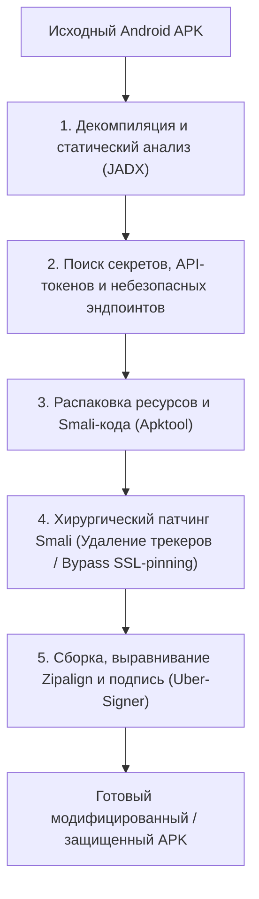

# 🛡️ APK-Reverse: Агентный навык (Agent Skill) для глубокого реверс-инжиниринга и патчинга Android-приложений

> **Ссылка на репозиторий:** [https://github.com/newliver666/apk-reverse](https://github.com/newliver666/apk-reverse)  
> **Автор:** newliver666  
> **Слоган:** *«An Agent Skill for Android APK reverse engineering, debloating, ad removal, surgical dex patching, repacking, and runtime/server analysis.»*  
> **Звёзды GitHub:** 850+ ★  
> **Формат:** Agent Skill (стандарт `SKILL.md` для Claude Code, Codex, Antigravity)  
> **Инструменты конвейера:** JADX, Apktool, Uber-APK-Signer, Smali/Baksmali, Python  
> **Лицензия:** MIT  

---

## 🎯 1. В чем уникальность формата Agent Skill?

В отличие от традиционных туториалов и разрозненных скриптов, `apk-reverse` спроектирован по стандарту **Agent Skill**:
* **Прогрессивное раскрытие (Progressive Disclosure):** Компактный корневой файл `SKILL.md` содержит матрицу быстрых решений для кодинг-агента, а детальные справочники по Smali-инструкциям и байткоду загружаются только по мере необходимости.
* **Параметризованные CLI-скрипты:** Агент не галлюцинирует команды терминала, а вызывает готовые проверенные утилиты с жесткой валидацией аргументов.
* **Автономия от декомпиляции до сборки:** Способность автономно вскрыть APK, локализовать уязвимость, пропатчить DEX-байткод и собрать подписанный релиз.



---

## ⚡ 2. Ключевые возможности конвейера

1. **Анализ сетевой безопасности и эндпоинтов:** Автоматическое извлечение всех внешних URL, скрытых REST-эндпоинтов, хардкодных API-ключей (AWS, Firebase, Stripe) и конфигураций сетевой безопасности (`network_security_config.xml`).
2. **Обход SSL Pinning:** Внедрение универсальных скриптов перехвата сертификатов для последующего динамического анализа трафика в MITM-прокси (Reaper, Burp Suite, Charles).
3. **Хирургический патчинг Smali:** Безопасная модификация методов проверки лицензий, рекламы или телеметрии без поломки остальной логики приложения.
4. **Автоматическая переподпись:** Выравнивание ресурсов (`zipalign`) и наложение новой тестовой подписи с поддержкой схем v1, v2 и v3.

---

## 💻 3. Пример использования агентом через SKILL.md

```bash
# Быстрый аудит секретов и структуры APK
python3 scripts/analyze_apk.py --target target_app.apk --extract-secrets --export-urls

# Патчинг проверки SSL Pinning и перепаковка
python3 scripts/patch_ssl_pinning.py --apk target_app.apk --out patched_app.apk
```

---

## 🎯 4. Практическая ценность для AppSec

Проект демонстрирует зрелость концепции **наступательных и защитных навыков для AI-агентов**: исследователь безопасности может поручить агенту рутинный первоначальный аудит мобильного клиента, сэкономив часы ручной работы в декомпиляторе.
