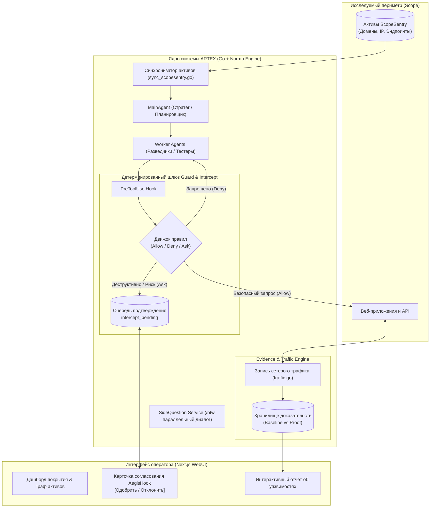
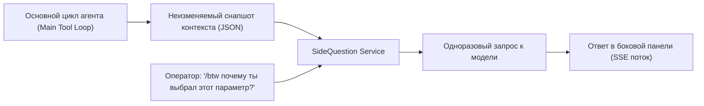

# 🎯 ARTEX: Архитектура автономного агентного пентестинга и управляемого аудита безопасности

> **Ссылка на репозиторий:** [https://github.com/mhtsec/ARTEX](https://github.com/mhtsec/ARTEX)  
> **Организация / Авторы:** mhtsec / Autumn-27  
> **Статус:** Проект-победитель хакатона кибербезопасности Baidu «agent+» Attack & Defense Challenge  
> **Звёзды GitHub:** 1,900+ ★ (#5 в Daily топе Trendshift, +1.2k ★ за сутки)  
> **Стек:** Go 1.23+ (бэкенд на агентном фреймворке Norma), PostgreSQL, Next.js (Tailwind CSS, Resizable Panels, Lucide), Model Context Protocol (MCP), Playwright  
> **Лицензия:** MIT / Open Source  

---

## 🧭 1. В чем концептуальная ценность ARTEX для безопасности?

В традиционном аудите безопасности существовал жесткий разрыв:
* **Классические сканеры уязвимостей (Nessus, Nuclei, Acunetix):** Работают по жестким детерминированным сигнатурам, генерируют сотни ложных срабатываний и не способны рассуждать логически или выстраивать многошаговые цепочки атак.
* **Ручной пентестинг людьми:** Качественный и глубокий, но медленный, дорогой и плохо масштабируемый при постоянных релизах микросервисов.
* **Наивные LLM-агенты:** Легко зацикливаются, склонны к галлюцинациям уязвимостей без доказательств и могут случайно нанести непоправимый ущерб инфраструктуре (удалить рабочую БД или выйти за границы разрешенного периметра Scope).

**ARTEX решает эту трилемму через архитектуру «Автономное исследование с жестким детерминированным контуром подтверждения» (Autonomous Planning + Strict Human-in-the-Loop Interception):**
1. **Граф разведки и атаки (Attack & Asset Graph):** Агент не атакует вслепую, а динамически строит граф цифровых активов и потенциальных векторов.
2. **Шлюз перехвата опасных действий (Guard & Intercept Layer):** Любой потенциально деструктивный запрос блокируется рантаймом на уровне хука `PreToolUse` до получения явного подтверждения оператора.
3. **Строгая доказательная база (Traffic Evidence Store):** Ни одна уязвимость не фиксируется в отчете без прикрепленного сырого HTTP-дампа подтверждающего трафика (`proof` request/response).



---

## 🛡️ 2. Механизм перехвата и согласования (Human-in-the-Loop Interception)

Главная архитектурная угроза любого наступательного AI-агента — неконтролируемые побочные эффекты (*Side Effects*). В ARTEX эта проблема решена на уровне пакетов `guard/` и `intercept/`.

### 1. Архитектура хука `PreToolUse`:
Перед исполнением абсолютно любого инструмента (HTTP-запрос, выполнение команды, запуск браузера) вызов проходит через перехватчик:

```go
// Package intercept: три детерминированных решения
type Action string

const (
    ActionAllow Action = "allow" // Авто-пропуск безопасных запросов разведки
    ActionDeny  Action = "deny"  // Блокировка вызова с возвратом ошибки агенту
    ActionAsk   Action = "ask"   // Приостановка агента до одобрения человеком
)
```

### 2. Жизненный цикл статуса `Ask`:
1. Модель формирует вызов тула с потенциально опасным пейлоадом (например, попытка обновления данных или тяжелый SQL-запрос).
2. Движок правил перехватывает вызов, блокирует выполнение горутины агента и создает запись в таблице `intercept_pending`.
3. В интерфейсе оператора (Next.js) всплывает интерактивная карточка в стиле **AegisHook**:
   * Точная цель (Target URL / IP);
   * Метод и тело запроса;
   * Рассуждение агента (Thought), почему он считает этот шаг необходимым;
   * Исторический контекст цепочки шагов.
4. Оператор нажимает **[Approve]** или **[Reject]** через защищенный эндпоинт `/api/intercept/pending/{id}/decide`.
5. При отказе агенту возвращается причина отклонения, заставляя модель скорректировать гипотезу без нанесения ущерба системе.

---

## 📊 3. Интеграция активов через ScopeSentry и картирование периметра

Автономность ARTEX базируется на бесшовной интеграции с платформой управления поверхностью атаки **ScopeSentry** через протокол **MCP (Model Context Protocol)**:

* **Импорт периметра:** Через `sync_scopesentry.go` агент получает авторизованный список доменов, субдоменов, портов и конечных точек.
* **Строгое соблюдение границ (Scope Enforcement):** Запросы за пределы разрешенных хостов автоматически блокируются на уровне `guard.Guard`.
* **Динамический граф покрытия (Asset Coverage Graph):** Веб-интерфейс визуализирует силовую диаграмму связанных активов, где подсвечиваются исследованные эндпоинты, найденные технологии и открытые порты.

---

## 🔍 4. Навык `api-recon`: Бескреденшиальная разведка SPA

Один из самых элегантных скиллов в репозитории — `skills/api-recon/SKILL.md`:
* **Проблема:** Современные Single Page Applications (React, Vue, Angular) скрывают все свои внутренние API за формой логина. Без учетных данных сканер не видит функционал.
* **Решение ARTEX:**
  1. Агент запускает Playwright и внедряет скрипты `preload.js` / `runtime_harvest.js`.
  2. Браузер перехватывает исходящие запросы авторизации и подставляет синтетические mock-ответы с валидной структурой (mocking bootstrap endpoints).
  3. Фронтенд-приложение «думает», что пользователь успешно вошел, и начинает монтировать внутренние компоненты, табы, таблицы и дашборды.
  4. Агент пассивно записывает все исходящие сетевые обращения (`outbound requests`) к скрытым бэкенд-эндпоинтам, собирая полную карту API без реальной учетной записи.

---

## 📦 5. Доказательная база уязвимостей (Traffic Evidence Store)

Большинство отчетов сканеров страдают от ложных срабатываний (False Positives). ARTEX внедряет стандарт доказательной валидации:

Каждая найденная уязвимость (`Finding`) обязана иметь связанные дампы трафика с конкретными ролями:

```json
{
  "finding_title": "BOLA / IDOR в профиле пользователя",
  "traffic_refs": [
    {
      "traffic_id": "tr_98213",
      "role": "baseline",
      "note": "Легитимный запрос к собственному профилю (User A, HTTP 200)"
    },
    {
      "traffic_id": "tr_98244",
      "role": "proof",
      "note": "Запрос к чужому профилю с подменой ID без авторизации (User B, HTTP 200)"
    }
  ]
}
```

* **Роли трафика:**
  * `baseline`: эталонное поведение системы при штатном обращении.
  * `proof`: воспроизводимое доказательство уязвимости с сырыми заголовками и телом ответа.
  * `verification`: повторный контрольный замер.
* Если агент не может предоставить доказательный сетевой дамп, уязвимость помечается как неподтвержденная гипотеза, предотвращая засорение отчета.

---

## 💬 6. Архитектура параллельных вопросов `/btw` (Side-Question Branching)

Во время многочасового тестирования оператору часто требуется уточнить ход мыслей агента, не прерывая выполнение текущей задачи. Для этого в ARTEX реализован механизм `/btw` (By the way):



* Оператор вводит в чат `/btw <вопрос>`.
* Бэкенд делает легковесный форк текущего контекста агента (структурированные сообщения, системный промпт, схема инструментов) без захвата блокировок базы данных.
* Ответ генерируется асинхронно в боковой панели без прерывания основного процесса разведки.

---

## ⚖️ 7. Сравнительный анализ: ARTEX vs Традиционные DAST vs Агентные сканеры

| Критерий | Традиционные сканеры (Nuclei / Burp) | Типовые LLM-агенты (AutoGPT-подобные) | ARTEX (`mhtsec/ARTEX`) |
| :--- | :--- | :--- | :--- |
| **Логика разведки** | Статические шаблоны, линейный фаззинг | Хаотичные рассуждения, галлюцинации | Динамический граф активов и гипотез на базе LLM |
| **Безопасность среды** | Детерминированные запросы | Прямой запуск команд без ограничений | **PreToolUse Interceptor** (Allow / Deny / Ask) |
| **Human-in-the-Loop** | Отсутствует во время скана | Сложно интегрировать | Нативный шлюз согласования опасных шагов (AegisHook) |
| **Валидация находок** | Код ответа, совпадение regex | Текстовые утверждения LLM | **Обязательная привязка сырых дампов трафика (Traffic Store)** |
| **Разведка SPA / API** | Ограничена краулером | Не умеет обходить UI-барьеры | **Бескреденшиальный мокинг в Playwright (`api-recon`)** |

---

## 💡 8. Архитектурные выводы для проектирования безопасных AI-агентов

1. **Контроль побочных эффектов на уровне рантайма:** Никакой агент, оперирующий в продакшн-сети или на хосте, не должен иметь прямого немодерируемого доступа к инструментам. Модель обязана быть отделена от исполнения детерминированным Reference Monitor с поддержкой Human-in-the-Loop.
2. **Верификация через доказательства (Proof of Exploit / Traffic):** Доверие к выводам агента должно основываться на детерминированных артефактах (хэши, дампы трафика, логи), а не на естественном языке модели.
3. **Разветвление контекста для наблюдения:** Механизм `/btw` — идеальный паттерн для мониторинга длительных агентных сессий без риска сломать контекстное окно основной задачи.

---

## 🔗 Связанные материалы базы знаний

* 🛡️ [AI/ML Pentesting & Prompt Injection Roadmap](file:///home/blackzeshi/Documents/Notes/05_security_osint_and_guardrails/ai-ml-pentest-roadmap.md)
* 🛡️ [Архитектура доверенной базы вычислений: TCB & Reference Monitor](file:///home/blackzeshi/Documents/Notes/05_security_osint_and_guardrails/tcb-agent-security.md)
* 🐳 [Docker Agent: Декларативный OCI-рантайм и паспорта безопасности](file:///home/blackzeshi/Documents/Notes/02_agent_runtimes_and_harnesses/docker-agent.md)
* 🛡️ [Headless Security Workbench: HuntProxy](file:///home/blackzeshi/Documents/Notes/05_security_osint_and_guardrails/huntproxy.md)
* 🛡️ [Безопасный рантайм ядра и формальная верификация: NVIDIA OpenShell](file:///home/blackzeshi/Documents/Notes/05_security_osint_and_guardrails/openshell.md)
