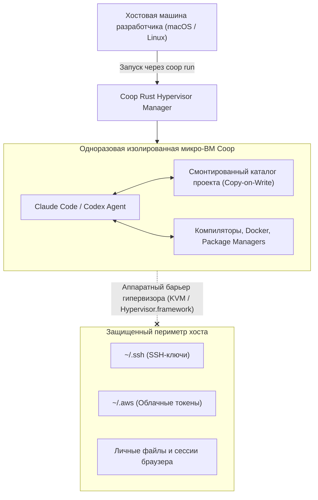

# 🛡️ Coop: Аппаратная микро-ВМ песочница для безопасной работы автономных кодинг-агентов

> **Ссылка на репозиторий:** [https://github.com/trailofbits/coop](https://github.com/trailofbits/coop)  
> **Организация:** Trail of Bits (Ведущая мировая исследовательская лаборатория кибербезопасности)  
> **Произношение:** *«coop» (/kuːp/) — один слог, рифмуется с «loop» (курятник для изоляции)*  
> **Слоган:** *«Isolated VM environment for running Claude Code and Codex without risk to your host machine.»*  
> **Звёзды GitHub:** 560+ ★ (Топ чартов Trendshift)  
> **Стек:** Pure Rust, MicroVM / KVM / Hypervisor.framework, Linux, macOS  
> **Лицензия:** Apache-2.0  

---

## 🎯 1. В чем критическая угроза бесконтрольного запуска агентов?

Современные автономные кодинг-агенты (Claude Code, OpenAI Codex, OpenClaw) требуют широких привилегий:
* Доступ к терминалу и исполнению произвольного bash-кода;
* Установка сторонних пакетов (`npm install`, `pip install`, `cargo build`);
* Доступ к сети для скачивания зависимостей и документации.

**Риски запуска агента напрямую на хостовой машине разработчика:**
1. **Катастрофические ошибки команд:** Случайное выполнение `rm -rf /` или перезапись критических конфигов системы.
2. **Supply-Chain атаки:** Агент может установить вредоносный пакет с закладкой, которая украдет SSH-ключи, токены AWS или файлы сессий браузера (`~/.ssh`, `~/.aws`).
3. **Prompt Injection из внешних данных:** Читая недоверенный issue или веб-страницу, агент может получить скрытую инструкцию эксфильтровать приватный код на удаленный сервер.

**Решение Coop от Trail of Bits:**
> Легковесный CLI на Rust, который мгновенно поднимает **одноразовую микро-виртуальную машину (Disposable Micro-VM)**, где агент получает полный доступ к компиляторам, git и Docker, но **наглухо изолирован от хостовой операционной системы**.



---

## ⚡ 2. Ключевые архитектурные преимущества

* **Аппаратная изоляция гипервизора:** В отличие от обычных Docker-контейнеров, где ядро Linux разделяется с хостом (риск Container Escape), Coop использует полноценную виртуализацию на уровне гипервизора (KVM на Linux, Hypervisor.framework на macOS).
* **Мгновенный запуск и уничтожение:** Старт микро-ВМ занимает считанные секунды. После завершения задачи виртуальная машина уничтожается, не оставляя мусора в системе.
* **Снапшоты с Copy-on-Write:** Изменения в кодовой базе проекта изолируются: при сбое или неверных правках агента состояние репозитория можно откатить к исходному за миллисекунды.
* **Прозрачность для инструментов:** Агент даже не подозревает, что находится в клетке: ему доступны все стандартные утилиты сборки и пакетные менеджеры.

---

## 💻 3. Пример использования CLI

```bash
# Установка coop через cargo
cargo install coop-cli

# Безопасный запуск Claude Code внутри изолированной микро-ВМ в текущей папке
coop run claude-code

# Запуск Codex с лимитированным сетевым доступом
coop run --network restricted --codex
```

---

## 🎯 4. Значение для корпоративной безопасности

Coop решает одну из самых острых проблем практической безопасности 2026 года: он позволяет разработчикам свободно использовать мощь автономных AI-агентов на рабочих ноутбуках, полностью соблюдая корпоративные стандарты защиты от утечек конфиденциальных данных.
