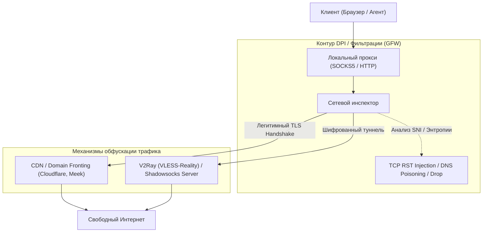

# 🌐 FQ-Book: Архитектура сетевых прокси, туннелей и механизмов обхода DPI-систем

> **Ссылка на репозиторий:** [https://github.com/hoochanlon/fq-book](https://github.com/hoochanlon/fq-book)  
> **Автор:** hoochanlon  
> **Название:** *«这本书能让你连接互联网» (The Book That Connects You to the Internet)*  
> **Звёзды GitHub:** 6.8k+ ★  
> **Стек:** Linux Networking, TCP/IP, Shadowsocks, V2Ray/Xray, WireGuard, IPFS, DNSCrypt  
> **Лицензия:** CC BY-NC 4.0  

---

## 🎯 1. В чем фундаментальная ценность книги?

Большинство материалов по сетевой безопасности либо слишком теоретические (абстрактные модели OSI), либо сводятся к примитивным инструкциям по установке готовых клиентов.

**FQ-Book — это глубокая инженерная анатомия противостояния систем глубокой фильтрации пакетов (DPI / GFW) и протоколов маскировки трафика:**
* Детальный разбор техник цензуры: от базовой блокировки портов и IP-адресов до отравления DNS-кэша, внедрения пакетов TCP RST, атак на цифровые сертификаты (Active Probing) и анализа энтропии зашифрованного потока.
* Архитектурный анализ протоколов обхода: почему классический OpenVPN легко детектируется по заголовкам, как Shadowsocks и VMess/VLESS мимикрируют под случайный шум или легитимный HTTPS-трафик (TLS in TLS).

---

## 🔍 2. Ключевые разделы сетевой инженерии в книге

1. **Анатомия DNS-атак и защита:** Анализ DNS Hijacking и DNS Cache Poisoning. Настройка защищенных резолверов через DNS over HTTPS (DoH), DNS over TLS (DoT) и DNSCrypt.
2. **Эволюция туннелей и прокси:**
   * **SOCKS5 / Shadowsocks:** Симметричное шифрование потока, защита от replay-атак через AEAD-шифры.
   * **V2Ray / Xray (VMess, VLESS, Trojan):** Полная имитация стандартного веб-сервера (Nginx/Caddy) с передачей трафика через реальные домены с валидными SSL-сертификатами (Reality protocol).
3. **Децентрализованные сети:** Практическое использование протокола IPFS (InterPlanetary File System) и ZeroNet для создания неуязвимых к блокировкам узлов хранения данных.
4. **Сетевая операционная безопасность (OpSec):** Оценка чистоты IP-адресов (Datacenter vs Residential), борьба со снятием цифровых отпечатков (Browser Fingerprinting) и изоляция сетевых стеков через виртуальные интерфейсы.
