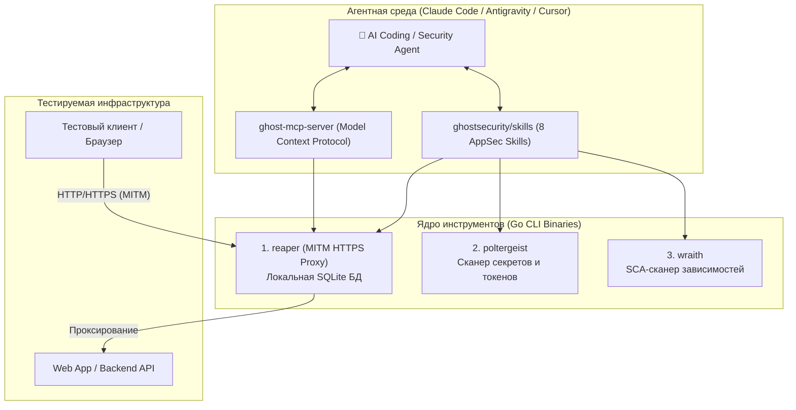

# 👻 Ghost Security: Экосистема AI-Native AppSec инструментов для автономных агентов

> **Организация:** [Ghost Security (GitHub)](https://github.com/ghostsecurity)  
> **Официальный сайт:** [ghostsecurity.com](https://ghostsecurity.com) / [ghostsecurity.ai](https://ghostsecurity.ai)  
> **Ключевые репозитории:**  
> * [ghostsecurity/reaper](https://github.com/ghostsecurity/reaper) (890+ ★) — Агентный MITM HTTPS-прокси на Go со SQLite  
> * [ghostsecurity/skills](https://github.com/ghostsecurity/skills) (405+ ★) — Набор AppSec-навыков для Claude Code  
> * [ghostsecurity/poltergeist](https://github.com/ghostsecurity/poltergeist) — Сверхбыстрый сканер секретов на Go  
> * [ghostsecurity/wraith](https://github.com/ghostsecurity/wraith) — Сканер уязвимостей зависимостей (SCA)  
> * [ghostsecurity/ghost-mcp-server](https://github.com/ghostsecurity/ghost-mcp-server) — MCP-сервер для подключения сканеров к LLM  
> **Категория:** `05_security_osint_and_guardrails`  
> **Стек:** Go 1.22+, SQLite, CLI, Claude Code Plugin / Skills, Model Context Protocol (MCP)  
> **Лицензия:** Apache-2.0  

---

## 🎯 1. В чем главная философия Ghost Security?

Традиционный арсенал инженера по безопасности веб-приложений (AppSec / PenTest) разделен на два лагеря:
1. **Инструменты под ручной труд человека с мышкой:** [Burp Suite](https://portswigger.net/burp), OWASP ZAP, Postman. У них тяжелые графические интерфейсы (GUI), рассчитанные на визуальный просмотр вкладок человеком-аналитиком. Автономному ИИ-агенту крайне тяжело и вычислительно дорого взаимодействовать с такими системами.
2. **Классические брутфорс-сканеры (Fuzzers / DAST):** Nikto, sqlmap, ffuf, DAST-комбайны. Они генерируют десятки тысяч слепых запросов по словарям, вызывая бессмысленный DoS на тестируемом сервисе и порождая колоссальный шум в логах без понимания бизнес-контекста.

**Концепция Ghost Security:**
> *«Давайте создадим инструменты безопасности, спроектированные с первого дня для автономных ИИ-агентов: CLI-first, SQLite-хранилище перехваченных сессий, минимальные накладные расходы и нативные интерфейсы MCP/Skills.»*

Вместо слепого брутфорса агент:
1. Изучает исходный код приложения и архитектуру (SAST);
2. Запускает легковесный прокси **Reaper**;
3. Прогоняет штатные сценарии использования сервиса, накапливая реальный трафик в структурированной локальной SQLite БД;
4. Точечно формирует выверенные запросы для проверки гипотез (IDOR, BOLA, SQLi, SSRF, обход авторизации) без мусорного трафика.

---

## 🏗️ 2. Архитектура экосистемы Ghost Security

Экосистема состоит из модульных инструментов на чистом Go, объединенных через протокол MCP и плагины навыков:



---

## 🔬 3. Флагманский проект: Reaper (Агентный MITM-прокси)

**[ghostsecurity/reaper](https://github.com/ghostsecurity/reaper)** — это компактный, скомпилированный в один бинарник прокси-сервер для перехвата и интроспекции веб-трафика.

### Архитектурные особенности:
* **Embedded SQLite Persistence:** Каждый перехваченный запрос и ответ немедленно парсится и сохраняется в локальную реляционную БД SQLite (`~/.reaper/reaper.db`). Это избавляет агента от необходимости парсить гигабайтные текстовые логи или pcap-дампы.
* **Детерминированный CLI-интерфейс:**
  * `reaper start` — запуск фонового прокси-демона;
  * `reaper search --url "/api/v1" --method POST --status 200` — структурированный поиск по параметрам запросов;
  * `reaper get <id>` — извлечение полных заголовков и тела конкретной транзакции;
  * `reaper req <id>` / `reaper res <id>` — детальный просмотр запроса или ответа;
  * `reaper tail` — стриминг трафика в реальном времени;
  * `reaper shutdown` / `reaper clear` — управление демоном и сброс сессий.
* **REST API:** Демон поднимает локальный API-сервер, к которому агент может обращаться напрямую по HTTP или через вызовы тулов MCP.

### Пример сценария поиска уязвимостей агентом:
```bash
# 1. Агент поднимает прокси
reaper start --port 8080

# 2. Выполняется штатный клиентский вызов через прокси
curl -x http://localhost:8080 -H "Authorization: Bearer token_A" https://target.local/api/user/101

# 3. Агент запрашивает у Reaper ID перехваченного вызова
reaper search --url "/api/user/"

# 4. Агент точечно проверяет BOLA/IDOR, модифицируя ID на 102 с тем же токеном
curl -x http://localhost:8080 -H "Authorization: Bearer token_A" https://target.local/api/user/102

# 5. Агент сверяет ответы в Reaper SQLite и подтверждает уязвимость
reaper res <id_new>
```

---

## 🧰 4. Статический анализ: Poltergeist и Wraith

Помимо динамического анализа трафика, Ghost Security разработала специализированные CLI-утилиты для фазы разведки (Reconnaissance):

| Инструмент | Роль в конвейере | Аналоги в индустрии | В чем инженерное отличие |
|---|---|---|---|
| **[poltergeist](https://github.com/ghostsecurity/poltergeist)** | Поиск жестко зашитых секретов (API ключи, приватные ключи, токены AWS/GCP, пароли) в репозитории. | Gitleaks, TruffleHog | Написан на Go с фокусом на минимальное время холодного старта и моментальный JSON-вывод для агентов. |
| **[wraith](https://github.com/ghostsecurity/wraith)** | Анализ состава ПО (Software Composition Analysis — SCA), поиск уязвимостей в сторонних библиотеках (`package.json`, `go.mod`, `pom.xml`). | Trivy, Snyk, Grype | Легковесный парсер манифестов с прямым сопоставлением баз уязвимостей без развертывания тяжелых контейнеров. |

---

## 🤖 5. Агентные навыки: Ghost Skills и MCP

Репозиторий **[ghostsecurity/skills](https://github.com/ghostsecurity/skills)** содержит официальный маркетплейс навыков для [Claude Code](https://claude.ai/code) и агентных сред.

### 8 Специализированных навыков:
1. **`ghost-repo-context`**: Исследует репозиторий, определяет критичность бизнес-компонентов, карту модулей и точки хранения чувствительных данных.
2. **`ghost-scan-code`**: AI-ассистированный SAST-анализ исходного кода на предмет логических уязвимостей.
3. **`ghost-scan-deps`**: Анализ эксплуатабельности уязвимостей в зависимостях (на базе `wraith`).
4. **`ghost-scan-secrets`**: Оценка контекста найденных секретов (на базе `poltergeist`).
5. **`ghost-validate`**: Динамическая валидация находок против работающего стенда (Live DAST Verification).
6. **`ghost-proxy`**: Автоматическое управление прокси `reaper` для перехвата сессий валидации.
7. **`ghost-report`**: Генерация консолидированного отчета по безопасности.
8. **`ghost-exo`**: Оркестрация сложных мульти-агентных пайплайнов на платформе Exo.

### Установка в Claude Code:
```bash
# Добавление маркетплейса Ghost Security
claude plugin marketplace add ghostsecurity/skills

# Установка плагина Ghost
claude plugin install ghost@ghost-security
```

---

## ⚖️ 6. Инженерный анализ: Плюсы, Ограничения и Сравнение

### 🟢 Преимущества:
* **Создано под ИИ, а не человека:** Нет перегруженных интерфейсов, кликов мыши, лишней абстракции. Нативный CLI, чистый JSON и реляционная база SQLite.
* **Единый компилируемый стек (Go):** Быстрый запуск, отсутствие JVM (в отличие от Burp Suite и ZAP), минимальное потребление оперативной памяти.
* **Бесшовная интеграция с LLM:** Наличие готовых плагинов под Claude Code и сервера MCP (`ghost-mcp-server`) позволяет подключить инструменты в 1 клик.

### ⚠️ Ограничения и риски:
* **Молодость проектов:** По широте сигнатурных баз `wraith` и `poltergeist` пока уступают ветеранам `gitleaks` и `trivy`.
* **Open-Core модель:** Открытые CLI-инструменты являются фундаментом коммерческой платформы Ghost Security (Ghost Agent Platform).

### 📊 Сравнение Reaper vs HuntProxy vs Burp Suite:

| Критерий | Ghost Reaper | [HuntProxy (Rust)](file:///home/blackzeshi/Documents/Notes/05_security_osint_and_guardrails/huntproxy.md) | Burp Suite Pro |
|---|---|---|---|
| **Язык разработки** | Go | Rust | Java |
| **Интерфейс** | CLI / REST API | Headless CLI / IPC | Богатый GUI |
| **Основной потребитель** | ИИ-агенты / CLI скрипты | ИИ-агенты / Автоматизаторы | Пентестер-человек |
| **Хранилище сессий** | Локальный SQLite (`reaper.db`)| Локальный SQLite / RAM | Собственный бинарный `.burp` файл |
| **Нативная поддержка MCP** | ✅ Через `ghost-mcp-server` | ✅ Нативная архитектура | ❌ Только через сторонние плагины |
| **Аппаратные накладные расходы** | Минимальные (~20 МБ RAM) | Ультранизкие (~8 МБ RAM) | Высокие (~1–4 ГБ RAM) |

---

## 🎯 7. Резюме и рекомендации

* **Для AppSec-инженеров и исследователей уязвимостей:** `reaper` — один из лучших современных специализированных инструментов для создания автономных пентест-агентов. Он позволяет агенту выполнять валидированное динамическое тестирование без хаотичного флуда.
* **Для CI/CD пайплайнов:** Если нужна только статическая проверка коммитов на утечку токенов, проверенный временем `gitleaks` пока надежнее `poltergeist` за счет многолетней базы регулярных выражений.
* **Для агентных кодинг-сред:** Связка `Claude Code / Antigravity + ghostsecurity/skills` превращает агента в автономного аудитора перед отправкой Pull Request в продакшн.

---

## 🔗 8. Синергия с базой знаний

* [05. HuntProxy: Headless Security воркбенч на Rust](file:///home/blackzeshi/Documents/Notes/05_security_osint_and_guardrails/huntproxy.md) — альтернативный Rust-рантайм перехвата трафика для агентных систем.
* [05. Cloudflare Security Audit Skill](file:///home/blackzeshi/Documents/Notes/05_security_osint_and_guardrails/security-audit-skill.md) — шестифазный аудит кода, идеально дополняемый динамической проверкой через `ghost-validate` и `reaper`.
* [05. SkillSpector: Сканер агентных навыков (NVIDIA)](file:///home/blackzeshi/Documents/Notes/05_security_osint_and_guardrails/skillspector.md) — сканирование сторонних навыков на предмет несанкционированного доступа.
* [05. Pipelock: Агентный файрвол и Egress-контроль](file:///home/blackzeshi/Documents/Notes/05_security_osint_and_guardrails/pipelock.md) — контроль исходящего сетевого трафика самого агента.
* [02. Agent-Skills (Tech Leads Club)](file:///home/blackzeshi/Documents/Notes/02_agent_runtimes_and_harnesses/agent-skills.md) — реестр проверенных навыков для LLM.
