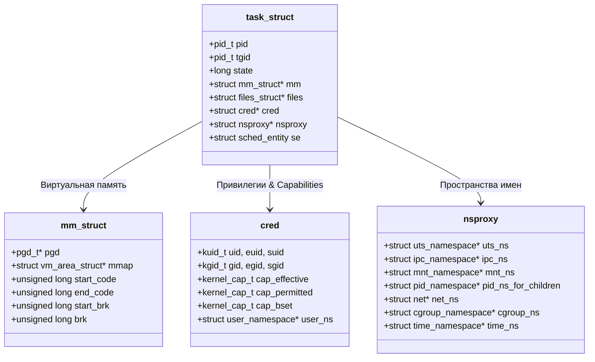
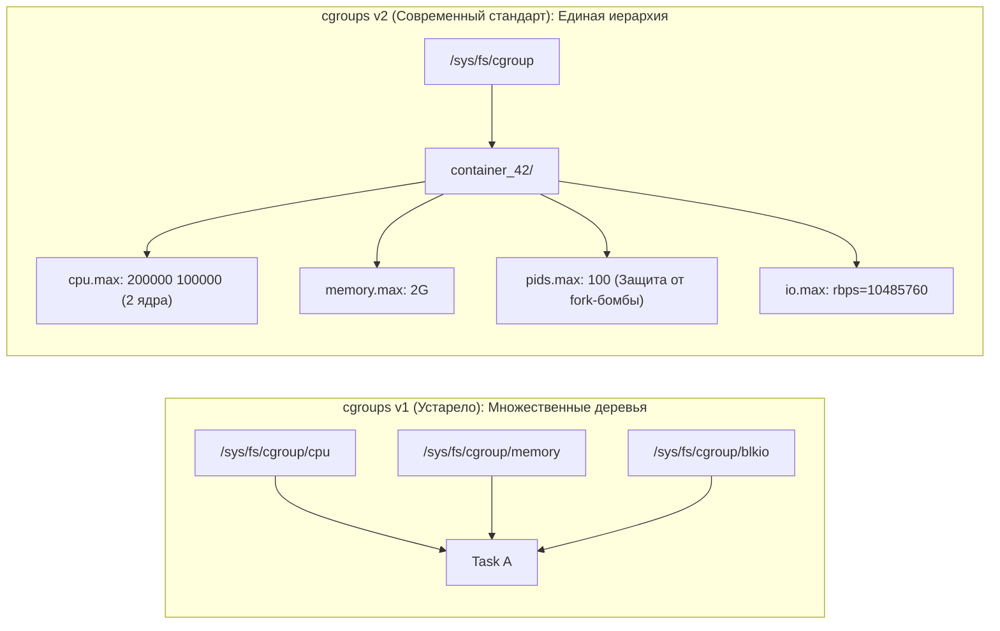
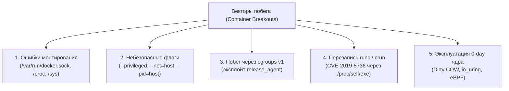

# 🐧 Анатомия ядра Linux и харденинг контейнеров: От Linux Insides до NCC Group

> **Первоисточники:**  
> * [0xAX/linux-insides (GitHub)](https://github.com/0xAX/linux-insides) — 33,500+ ★ | [Русский перевод proninyaroslav](https://github.com/proninyaroslav/linux-insides-ru) (510+ ★)  
> * [NCC Group Whitepaper: Understanding and Hardening Linux Containers](https://www.nccgroup.com/media/kqafubgg/_ncc_group_understanding_hardening_linux_containers-1-1-1.pdf) (v1.1, Aaron Grattafiori, 120+ стр.)  
> **Категория:** `05_security_osint_and_guardrails`  
> **Ключевые сущности:** `task_struct`, `mm_struct`, Namespaces, cgroups v1/v2, POSIX Capabilities, Seccomp-BPF, LSM (AppArmor/SELinux), Container Breakouts, eBPF  

---

## 🎯 1. Введение: Почему невозможно понять контейнеры без знания ядра?

В индустрии распространено фундаментальное заблуждение: многие воспринимают «контейнер» как отдельный программный объект, аналог легковесной виртуальной машины. 

На самом деле **в ядре Linux сущности «контейнер» не существует**. Контейнер — это иллюзия в пользовательском пространстве (User Space), создаваемая оркестровкой нескольких независимых низкоуровневых механизмов ядра:
1. **Namespaces** (Пространства имен) $
ightarrow$ изоляция *видимости* ресурсов (что процесс может видеть).
2. **Control Groups (cgroups)** $
ightarrow$ ограничение и учет *потребления* ресурсов (сколько процесс может использовать).
3. **POSIX Capabilities** $
ightarrow$ декомпозиция и урезание *полномочий* суперпользователя (root).
4. **Seccomp-BPF** $
ightarrow$ фильтрация системных вызовов к ядру (какие инструкции ОС можно вызвать).
5. **LSM (AppArmor / SELinux)** $
ightarrow$ принудительное мандатное разграничение доступа к объектам ФС и сокетам.
6. **pivot_root / chroot** $
ightarrow$ ограничение видимости файлового дерева.

Если инженеры не понимают, как эти механизмы реализованы в структурах данных ядра (о чем подробно рассказывает книга **Linux Insides**), они неизбежно допускают архитектурные ошибки при настройке окружения. А легендарное исследование **NCC Group («Understanding and Hardening Linux Containers»)** детально математически и практически доказало: любая брешь в конфигурации этих примитивов приводит к мгновенному **побегу из контейнера (Container Escape)** и полной компрометации хоста.

---

## 🧠 2. Анатомия ядра: Ключевые структуры данных (Linux Insides)

Ядро Linux представляет собой монолитное, управляемое прерываниями многозадачное ядро. Все примитивы изоляции опираются на фундаментальные структуры:



### 1. `struct task_struct` — Дескриптор процесса
В ядре Linux нет концептуальной разницы между процессом и потоком. Любая единица исполнения — это `task_struct`. Потоки создаются системным вызовом `clone()` с флагами `CLONE_VM | CLONE_FS | CLONE_FILES | CLONE_SIGHAND`, разделяя адресное пространство и открытые дескрипторы с родителем.

### 2. `struct mm_struct` и страничная организация памяти (Paging)
Каждый процесс с собственным адресным пространством содержит указатель на `mm_struct`. 
* На 64-битной архитектуре x86_64 используется 4-уровневая (или 5-уровневая с 57-битным VA) трансляция адресов: `PGD (Page Global Directory) -> P4D -> PUD -> PMD -> PTE (Page Table Entry)`.
* При переключении контекста процессов процессор загружает физический адрес PGD в регистр управления `CR3`.
* Физическая память управляется **Buddy Allocator** (аллокатор парных блоков страниц степеней двойки $2^k$), а объекты ядра внутри — через **SLUB Allocator** (кэши структур `task_struct`, `inode`, `sk_buff`).

### 3. Системные вызовы и прерывания (Syscalls & IDT)
* Переход из Ring 3 (User Space) в Ring 0 (Kernel Space) на архитектуре x86_64 происходит аппаратно по инструкции `SYSCALL`.
* Процессор считывает адрес обработчика из модельно-специфичного регистра `MSR_LSTAR` и передает управление в `arch/x86/entry/entry_64.S`.
* Номер системного вызова передается в регистре `RAX`, аргументы — в `RDI, RSI, RDX, R10, R8, R9`. Далее ядро обращается к таблице `sys_call_table`.

---

## 📦 3. Пространства имен (Namespaces) и их системные вызовы

Пространства имен изолируют глобальные системные ресурсы в структуре `task_struct->nsproxy`.

### 8 Пространств имен ядра Linux:

| Имя Namespace | Флаг ядра | Что изолирует | Появился в ядре |
|---|---|---|---|
| **Mount (mnt)** | `CLONE_NEWNS` | Таблица точек монтирования ФС | 2.4.19 |
| **UTS** | `CLONE_NEWUTS` | Hostname и NIS domain name | 2.6.19 |
| **IPC** | `CLONE_NEWIPC` | Очереди сообщений POSIX, семафоры System V, разделяемая память | 2.6.19 |
| **PID** | `CLONE_NEWPID` | Дерево идентификаторов процессов (процесс получает PID 1) | 2.6.24 |
| **Network (net)** | `CLONE_NEWNET` | Сетевые интерфейсы, маршруты, сокеты, iptables/nftables | 2.6.29 |
| **User (user)** | `CLONE_NEWUSER` | Маппинг UID/GID (root внутри = обычный юзер снаружи) | 3.8 |
| **Cgroup** | `CLONE_NEWCGROUP`| Видимость собственной иерархии cgroups | 4.6 |
| **Time** | `CLONE_NEWTIME` | Смещение системных часов (`CLOCK_MONOTONIC`, `CLOCK_BOOTTIME`) | 5.6 |

### Системный интерфейс управления:
1. `clone(..., flags)` — создание нового дочернего процесса в указанных новых пространствах имен.
2. `unshare(flags)` — отсоединение текущего процесса от родительского namespace и создание нового.
3. `setns(fd, nstype)` — присоединение процесса к существующему пространству имен по дескриптору `/proc/<PID>/ns/<TYPE>`.

---

## ⚖️ 4. Ограничение ресурсов: cgroups v1 vs cgroups v2

Control Groups управляют аллокацией аппаратных ресурсов хоста:



### Прорыв cgroups v2 (Unified Hierarchy):
В cgroups v1 контроллеры `memory` и `blkio` существовали в независимых деревьях, из-за чего ядро не могло корректно учитывать сброс «грязных страниц» (Page Cache writeback) для конкретного контейнера. В **cgroups v2** иерархия унифицирована:
* **`pids.max`** — жесткий лимит на количество задач внутри cgroup. Полностью нивелирует DoS-атаки типа `fork-bomb` (`:(){ :|:& };:`).
* **`memory.high` vs `memory.max`** — двухуровневый лимит памяти: при превышении `memory.high` ядро плавно замедляет аллокации процесса и сбрасывает кэш, предотвращая резкий сброс контейнера OOM-киллером (`memory.max`).

---

## 📑 5. Разбор исследования NCC Group: «Understanding and Hardening Linux Containers»

Белый документ **NCC Group (автор: Aaron Grattafiori, v1.1)** является фундаментальным исследованием безопасности контейнерных сред. Ниже приведены его ключевые выводы и анализы.

### 5.1. Модель угроз и Shared Kernel Attack Surface
Главный постулат NCC Group:
> *«Контейнеры делят одно физическое ядро операционной системы. Поэтому любая локальная уязвимость ядра (LPE) превращает границу контейнера в фикцию.»*

В традиционных гипервизорах (Type-1 / Type-2) гостевая ОС изолирована виртуализацией оборудования (Intel VT-x, AMD-V, EPT/NPT). В контейнерах процесс из Ring 3 напрямую выполняет инструкцию `SYSCALL` в ядро хоста (Ring 0). Если в ядре есть уязвимость:
* Гонка в сетевом стеке (e.g., `netfilter`, сокеты AF_PACKET);
* Ошибка валидации в eBPF Verifier;
* Повреждение памяти в драйверах устройств или файловых системах (e.g., Dirty COW CVE-2016-5195, Dirty Pipe CVE-2022-0847, GameOver(lay) CVE-2023-2640);
— атакующий получает root-права непосредственно **на хостовой машине**.

---

### 5.2. Анатомия опасных POSIX Capabilities

Linux делит права `root` (UID 0) на 41 независимую capability (`include/uapi/linux/capability.h`). По умолчанию Docker/containerd отсекают большую часть, однако ошибки конфигурации часто возвращают опасные флаги:

| Capability | В чем угроза по анализу NCC Group | Способ побега / компрометации |
|---|---|---|
| **`CAP_SYS_ADMIN`** | «Новый root». Включает сотни привилегированных системных операций. | Монтирование ФС хоста, манипуляция с cgroups, загрузка BPF-программ, вызовы `lookup_dcookie`. |
| **`CAP_SYS_PTRACE`** | Право отлаживать и инспектировать любые процессы. | Если PID namespace разделяется с хостом (`--pid=host`), позволяет через `ptrace(PTRACE_POKETEXT)` внедрить шеллкод в хостовые демоны. |
| **`CAP_DAC_OVERRIDE`** | Игнорирование прав чтения/записи/исполнения файлов (rwx). | Чтение любых секретов и перезапись критических конфигов, доступных в смонтированных томах. |
| **`CAP_NET_RAW`** | Создание сырых сетевых пакетов (RAW / PACKET сокеты). | ARP-спуфинг, перехват межузлового трафика в оверлейной сети, DNS-спуфинг. |
| **`CAP_NET_ADMIN`** | Модификация интерфейсов, маршрутов, фаервола iptables. | Снятие фильтров, перенаправление внутреннего трафика хоста. |
| **`CAP_SYS_MODULE`** | Загрузка и выгрузка модулей ядра (`init_module`). | Мгновенное выполнение произвольного кода в Ring 0 хоста. |

---

### 5.3. Классические векторы побега из контейнеров (Breakout Vectors)

NCC Group систематизировала основные векторы выхода за пределы изолированного окружения:



#### 1. Эксплойт `release_agent` в cgroups v1 (при наличии `CAP_SYS_ADMIN`):
Если контейнер запущен с `CAP_SYS_ADMIN` или в privileged-режиме:
1. Контейнер монтирует собственную контрольную группу `cgroup` типа memory или rdma:  
   `mount -t cgroup -o memory cgroup /tmp/cgrp`
2. Активирует флаг `notify_on_release`:  
   `echo 1 > /tmp/cgrp/notify_on_release`
3. Записывает путь к своему скрипту-пейлоаду в `release_agent`:  
   `echo "$HOST_PATH/payload.sh" > /tmp/cgrp/release_agent`
4. По завершении процесса в этой группе **ядро хоста от имени настоящего root хоста** выполняет указанный в `release_agent` скрипт.

#### 2. Монтирование `/var/run/docker.sock`:
Предоставление доступа к сокету демона Docker внутри контейнера эквивалентно выдаче root-доступа к хосту: контейнер отправляет команду API Docker на создание нового привилегированного контейнера со смонтированным корнем хоста:
`docker run -v /:/host -it alpine chroot /host`

#### 3. Атака на runtime через `/proc/self/exe` (CVE-2019-5736):
Когда администратор выполняет `docker exec` в скомпрометированный контейнер, процесс `runc` временно входит в пространство имен контейнера. Атакующий процесс перезаписывает бинарник `/proc/self/exe`, получая контроль над бинарным файлом `runc` на хосте.

---

## 🛡️ 6. Полная матрица харденинга (Hardening Checklist)

На базе рекомендаций NCC Group и современных стандартов (CIS Benchmark, NIST SP 800-190):

### 1. Seccomp-BPF (Secure Computing)
В ядре Linux существует более 450 системных вызовов. Обычному веб-сервису или микросервису требуется не более 50–70. 
* Включение профиля Seccomp по умолчанию блокирует ~300 опасных системных вызовов (`reboot`, `kexec_load`, `iopl`, `ptrace`, `sysfs`, `acct`).
* **Правило:** Никогда не отключайте seccomp (`--security-opt seccomp=unconfined` — табу в продакшне).

### 2. User Namespaces (`userns-remap`)
* Главная защита от компрометации: процесс с UID 0 (root) внутри контейнера мапится, например, на UID 100000 на хосте.
* Даже если процесс вырвется из песочницы или сможет записать файл через смонтированный том, ядро проверит `task_struct->cred` на хосте и отклонит операцию с ошибкой `EACCES` (Permission Denied).

### 3. Принцип минимальных Capabilities
* Сбрасывать все привилегии по умолчанию:
  ```bash
  docker run --cap-drop=ALL --cap-add=NET_BIND_SERVICE ...
  ```
* Запрет повышения привилегий через SUID-бинарники:
  Флаг ядра `PR_SET_NO_NEW_PRIVS` (`--security-opt no-new-privileges:true`).

### 4. Неизменяемая файловая система (Read-Only Root FS)
* Запуск с флагом `--read-only`.
* Временные файлы перенаправляются в эфемерный `tmpfs` с флагами `noexec, nosuid, nodev`:
  ```bash
  docker run --read-only --tmpfs /tmp:rw,noexec,nosuid,nodev ...
  ```

### 5. Харденинг ядра хоста (Kernel Sysctl)
Настройка хостовой ОС для предотвращения атак со стороны контейнеров:
```ini
# Запрет непривилегированной загрузки eBPF-программ
kernel.unprivileged_bpf_disabled = 1

# Сокрытие адресов ядра в /proc/kallsyms (противодействие ROP-цепочкам)
kernel.kptr_restrict = 2

# Ограничение чтения dmesg непривилегированными пользователями
kernel.dmesg_restrict = 1

# Защита от создания жестких и символических ссылок в /tmp
fs.protected_hardlinks = 1
fs.protected_symlinks = 1

# Полный запрет динамической подгрузки новых модулей ядра после старта
kernel.modules_disabled = 1
```

---

## 🔬 7. Практикум: Исследование изоляции в терминале

### 1. Просмотр всех пространств имен в системе:
```bash
# lsns отображает все активные namespaces и их процессы
lsns -t pid,net,mnt
```

### 2. Создание изолированного окружения вручную через `unshare`:
Без всякого Docker вы можете создать контейнер встроенными утилитами Linux:
```bash
# Запуск bash в изолированных PID, Mount и Network namespaces
sudo unshare --pid --net --mount --fork /bin/bash

# Внутри нового шелла:
ps aux   # PID-дерево изолировано, текущий процесс видит себя как PID 1
```

### 3. Инспекция capabilities текущего процесса:
```bash
# Декодирование битовой маски возможностей
capsh --print
```

---

## 🔗 8. Синергия с базой знаний

* [05. TCB & Reference Monitor для AI-агентов](file:///home/blackzeshi/Documents/Notes/05_security_osint_and_guardrails/tcb-agent-security.md) — математическая модель границы доверия и монитора ссылок, опирающаяся на изоляцию `task_struct`.
* [05. Cloudflare Security Audit Skill](file:///home/blackzeshi/Documents/Notes/05_security_osint_and_guardrails/security-audit-skill.md) — шестифазный аудит кода и песочница с защитой от symlink/fd traversal.
* [05. SkillSpector: Сканер агентных навыков (NVIDIA)](file:///home/blackzeshi/Documents/Notes/05_security_osint_and_guardrails/skillspector.md) — проверка зависимостей и системных манифестов на вредоносные инструкции.
* [02. ArcBox: Изолированные песочницы на Rust](file:///home/blackzeshi/Documents/Notes/02_agent_runtimes_and_harnesses/arcbox.md) — реализация безопасного выполнения через `cgroups v2`, `pivot_root` и `seccomp`.
* [02. ZeroBoot: Микро-виртуализация за 15 мс](file:///home/blackzeshi/Documents/Notes/02_agent_runtimes_and_harnesses/zeroboot.md) — альтернатива разделяемому ядру: запуск полноценных изолированных KVM MicroVM.
