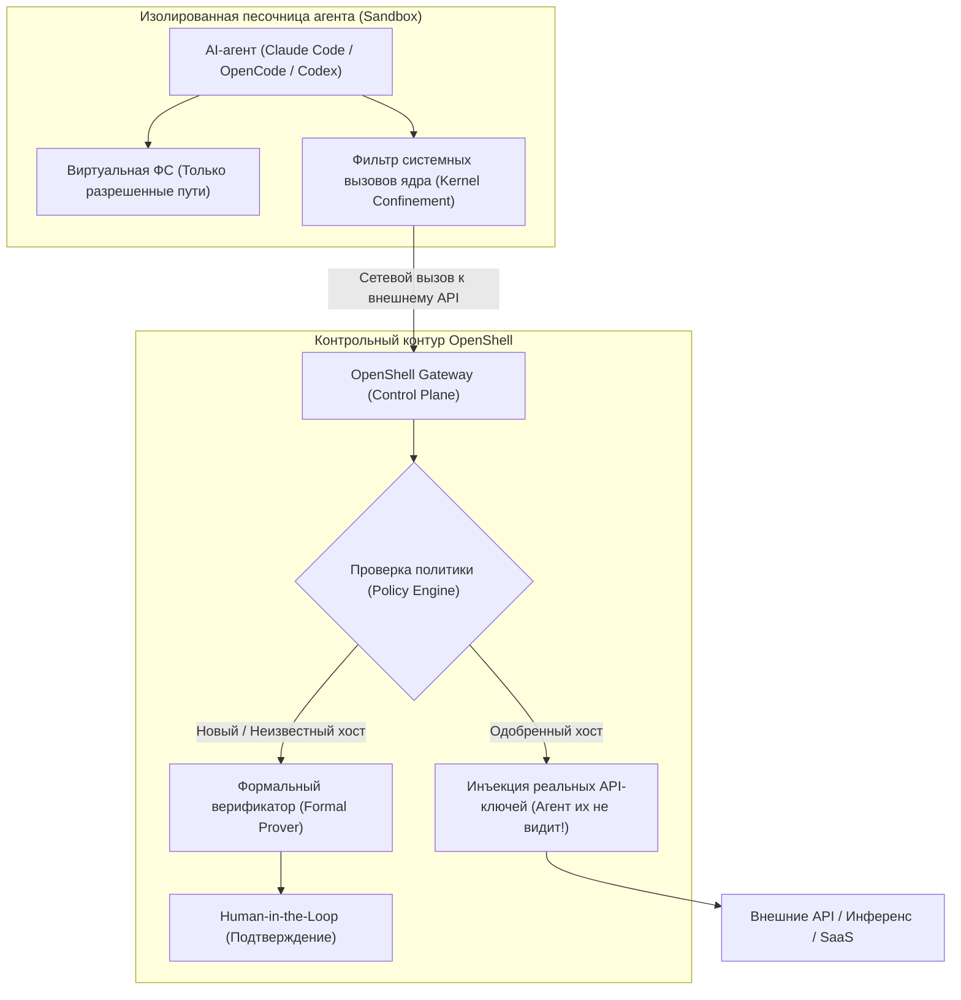

# 🛡️ NVIDIA OpenShell: Безопасный рантайм и песочница ядра для автономных AI-агентов

> **Ссылка на репозиторий:** [https://github.com/NVIDIA/OpenShell](https://github.com/NVIDIA/OpenShell)  
> **Организация:** NVIDIA Corporation  
> **Слоган:** *«The safe, private runtime for fleets of autonomous AI agents. Kernel-level enforcement and formally verified policies.»*  
> **Звёзды GitHub:** 14.7k+ ★ (#4 Weekly в чартах Trendshift)  
> **Стек:** Rust, Go, Python, TypeScript, Linux Kernel Sandbox, eBPF / cgroups, Docker / Podman, Kubernetes  
> **Лицензия:** Apache-2.0  

---

## 🎯 1. В чем фундаментальный вызов безопасности агентов?

Автономные AI-агенты приносят максимальную пользу тогда, когда они обладают реальными полномочиями: читают и модифицируют файлы, устанавливают пакеты, вызывают внешние API и используют учетные данные. Однако предоставление агенту прямого доступа к хост-системе сопряжено с колоссальными рисками:
* **Неконтролируемые утечки секретов:** Агент может залогировать или слить API-ключи, токены доступа к облаку и приватные ключи SSH.
* **Вредоносный Prompt Injection:** Сторонний код или документ с вредоносной инструкцией может заставить агента выполнить `rm -rf`, скачать бэкдор или отправить конфиденциальные файлы на внешний сервер.
* **Неограниченные системные вызовы (Syscalls):** Стандартные контейнеры без жестких seccomp/apparmor профилей не защищают от побега из песочницы.

**NVIDIA OpenShell решает проблему через двухуровневый контур защиты:**
1. **Принудительное исполнение на уровне ядра (Kernel-level enforcement):** Каждый агент запускается в изолированной песочнице, где каждое обращение к файловой системе, каждый системный вызов и сетевое соединение перехватываются и проверяются на соответствие декларативной политике.
2. **Формальная верификация политик (Formally Verified Policy Changes):** Прежде чем разрешить агенту доступ к новому хосту или методу API, математический прувер (`prover` & `advisor`) анализирует последствия изменения прав и эскалирует рискованные шаги на подтверждение человеку (Human-in-the-Loop).
3. **Полная изоляция учетных данных (Credential Redaction & Injection):** Агенты **никогда не видят реальных паролей и токенов**. Они оперируют абстрактными именами провайдеров, а OpenShell шлюз прозрачно внедряет секреты в заголовки сетевых пакетов **только для одобренных адресов назначения**.



---

## ⚡ 2. Ключевые компоненты архитектуры

### 1. Sandboxes (Изолированные песочницы)
Среды исполнения на базе минимальных легковесных образов (Ubuntu, Alpine) с поддержкой монтирования GPU от NVIDIA. Обеспечивают строгую изоляцию процессов, сетевых интерфейсов и файловой системы через механизмы ядра Linux (Namespaces, cgroups v2, Seccomp).

### 2. Policies & Prover (Декларативные политики и верификатор)
Политики описывают доступные файлы, разрешенные CIDR-диапазоны и методы API. Компонент **OpenShell Prover** проводит формальный анализ: доказывает, что изменение политики не создаст побочных каналов утечки данных и не предоставит избыточных прав.

### 3. Providers & Credential Vault
Механизм безопасного делегирования полномочий. В конфигурации объявляются провайдеры (GitHub, AWS, OpenAI, Anthropic). Агент обращается к локальному эндпоинту `http://gateway/v1/chat/completions`, а шлюз подставляет валидный API-ключ только после верификации целевого адреса.

### 4. Мульти-языковые SDK
Для интеграции OpenShell в любые внешние пайплайны и оркестраторы доступны официальные SDK:
* **Python:** `uv add openshell`
* **TypeScript:** `npm install @nvidia/openshell-sdk`
* **Go:** `go get github.com/NVIDIA/OpenShell/sdk/go`
* **Rust:** `cargo add openshell-sdk`

---

## 🚀 3. Быстрый старт и запуск

### Установка CLI и локального шлюза:
```bash
# Установка OpenShell одной командой (Linux / macOS Apple Silicon / WSL2)
curl -LsSf https://raw.githubusercontent.com/NVIDIA/OpenShell/main/install.sh | sh

# Создание первой изолированной песочницы
openshell sandbox create --name dev-agent
```

### Подключение навыков для кодинг-агентов:
```bash
# Обучение Claude Code / Cursor управлению OpenShell
npx skills add NVIDIA/OpenShell
```

### Пример декларативной политики безопасности (`policy.yaml`):
```yaml
version: "v1"
name: "strict-coding-policy"
filesystem:
  readOnly:
    - "/usr"
    - "/lib"
  readWrite:
    - "/workspace"
  deny:
    - "~/.ssh"
    - "~/.aws"
    - "/etc/shadow"

network:
  allowedHosts:
    - "api.github.com"
    - "registry.npmjs.org"
    - "pypi.org"
  denyAllOthers: true

providers:
  github:
    secretRef: "vault://github-token"
    bindToEndpoints:
      - "https://api.github.com/*"
```

---

## 🏢 4. Корпоративное масштабирование в Kubernetes

Для производственных сред OpenShell развертывается как кластерный контроллер через Helm-чарты. Он интегрируется с CNI-плагинами Kubernetes (Cilium, Calico) для принудительного применения `NetworkPolicy` на уровне сетевой фабрики кластера, защищая внутренний периметр компании от компрометации через скомпрометированных агентов.
