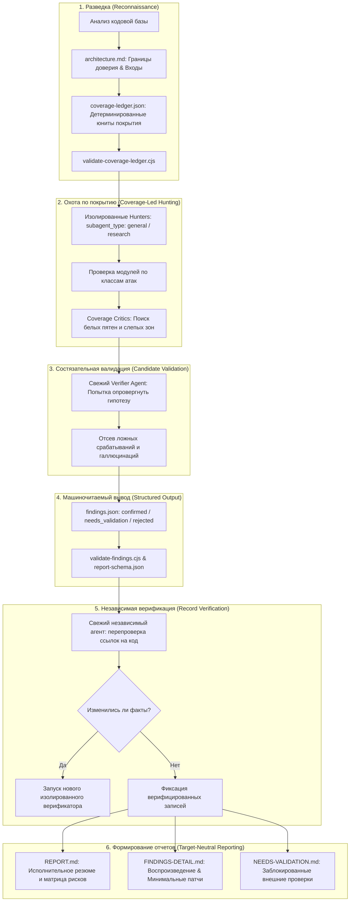

# 🛡️ Cloudflare Security Audit Skill: Шестифазный агентный аудит уязвимостей

> **Ссылка на репозиторий:** [https://github.com/cloudflare/security-audit-skill](https://github.com/cloudflare/security-audit-skill)  
> **Организация:** Cloudflare (Security & AI Systems Team)  
> **Официальный анонс:** [Build your own vulnerability harness (Cloudflare Blog)](https://blog.cloudflare.com/build-your-own-vulnerability-harness)  
> **Категория:** `05_security_osint_and_guardrails`  
> **Звёзды GitHub:** 4,680+ ★  
> **Стек:** Агентный навык (`SKILL.md`), Node.js (CommonJS, Zero-Dependency валидаторы), JSON-Schema (`report-schema.json`), Bash/POSIX Sandbox  
> **Лицензия:** Apache-2.0  

---

## 🎯 1. В чем революционность подхода Cloudflare?

Традиционные SAST/DAST-сканеры и простые LLM-промпты («Найди баги в коде») страдают от двух фундаментальных проблем:
1. **Колоссальный уровень False Positives:** Нейросеть генерирует гипотезы об уязвимостях, не проверяя достижимость кода (reachability), влияние санитайзеров и контекст выполнения.
2. **Отсутствие гарантий покрытия (Coverage Gaps):** Агент «залипает» на случайных участках кодовой базы, игнорируя критические границы доверия (trust boundaries), внешние протоколы и парсеры.

**Security Audit Skill** от Cloudflare — это производственный агентный навык (`SKILL.md`), выросший из внутреннего харнеса поиска уязвимостей распределенной инфраструктуры Cloudflare. Он превращает любого автономного кодинг-агента ([Claude Code](https://claude.ai/code), Antigravity, OpenCode, Codex) в строгого, методологически изолированного аудитора безопасности.

### Ключевая догма аудита:
> *«Кандидат в уязвимости без конкретного скомпрометированного субъекта (affected principal), ресурса или доказуемого последствия для безопасности НЕ является подтвержденной находкой.»*

---

## 🏗️ 2. Шестифазный пайплайн аудита (Six-Phase Pipeline)

Процесс аудита жестко регламентирован и разделен на 6 последовательных фаз, управляемых родительским координатором (`Parent Agent`):



### Подробное описание каждой фазы:

| Фаза | Роль и входные данные | Ключевые артефакты | Критерий завершения |
|---|---|---|---|
| **1. Reconnaissance** | Родительский агент исследует стек, топологию, внешние точки входа и компоненты авторизации. | `architecture.md`, `coverage-ledger.json` | Прохождение детерминированного валидатора `validate-coverage-ledger.cjs`. |
| **2. Coverage-led hunting** | Назначение изолированных хантеров (`hunters`) на конкретные разделы леджера с применением специализированных классов атак. | Логи хантеров, обновленный `coverage-ledger.json` | Отсутствие белых пятен; критики покрытия подтвердили полноту обхода. |
| **3. Candidate validation** | Каждый уникальный кандидат передается **свежему независимому верификатору**, цель которого — *опровергнуть* уязвимость. | Черновик доказательств, PoC-сценарии | Попытка доказать отсутствие уязвимости в текущем коде; отсев гипотез без фактического воздействия. |
| **4. Structured output** | Формирование машиночитаемых записей по строгому стандарту с детерминированными статусами. | `findings.json` | Валидация через `validate-findings.cjs` по схеме `report-schema.json`. |
| **5. Independent verification** | Новые независимые агенты сверяют финальные утверждения с исходным кодом. Если вносятся правки, запускается дополнительный верификатор. | Верифицированный `findings.json` | Каждая строка исходного кода в подтвержденных находках перепроверена независимым субагентом. |
| **6. Target-neutral reporting** | Синтез отчетов для людей и систем CI/CD. | `REPORT.md`, `FINDINGS-DETAIL.md`, `NEEDS-VALIDATION.md` | Полное соответствие отчетов записям в леджере и верифицированным находкам. |

---

## 🔒 3. Архитектура безопасности: Sandboxing и Write-Isolation

Одной из самых передовых инженерных находок Cloudflare в данном скилле является **абсолютная изоляция выполнения и защита от вредоносного анализируемого репозитория (Hostile Target Protection)**.

```
<output-dir>/
├── run-metadata.json             (Только Parent)
├── architecture.md               (Только Parent)
├── coverage-ledger.json          (Только Parent)
├── findings.json                 (Только Parent)
├── REPORT.md                     (Только Parent)
└── agents/
    └── hunter-agent-42/
        ├── scratch/              <-- Доступно агенту на запись в песочнице
        │   ├── build.log
        │   └── tmp_fixture.json
        └── artifacts/            <-- ТОЛЬКО ЧТЕНИЕ ДЛЯ РОДИТЕЛЯ (FD Promotion)
            └── finding-candidate.json
```

### Защитные барьеры при выполнении:
1. **OS-Enforced Sandbox:** Сборка, тесты, запуск фаззеров и эмуляторов производятся исключительно в песочнице с отключенной внешней сетью (только loopback для локальных клиент-серверных тестов), ограниченными переменными окружения, изолированным `HOME` и жесткими лимитами CPU/RAM/времени.
2. **Write Isolation:** Агент и порождаемые им процессы имеют право записи исключительно внутри папки `scratch/`. Папка `artifacts/` недоступна для записи из песочницы.
3. **Дескрипторный промоушен (Trusted FD Promotion):**
   * Родительский процесс открывает доверенные non-inheritable файловые дескрипторы для `scratch/` и `artifacts/`.
   * Дескрипторы **никогда не передаются** в дочерний процесс.
   * Перенос файлов из `scratch/` в `artifacts/` осуществляется доверенным родительским кодом через системные вызовы без следования по символическим ссылкам (`no-follow`, `fstat` с проверкой `link count == 1`, проверка жестких лимитов байт, запрет traversal путей `..`). Это исключает эксплуатацию агента через вредоносный репозиторий с symlink-бомбами.

---

## 📊 4. Таксономия вердиктов в findings.json

В отличие от многих сканеров, генерирующих «High/Medium/Low» на основе догадок, в `security-audit-skill` используется строгая триада вердиктов:

```json
{
  "$schema": "./report-schema.json",
  "verdict": "confirmed",
  "id": "SEC-001",
  "class": "ai-and-llm/indirect-prompt-injection",
  "source_claim": {
    "file": "src/agents/tools/web_fetch.py",
    "lines": "84-102",
    "evidence": "Raw HTML content piped directly into planner prompt without delimiter sanitization."
  },
  "impact": {
    "affected_principal": "system-agent-context",
    "security_outcome": "Arbitrary tool execution via unsanitized web page content."
  },
  "remediation": {
    "minimal_effective_fix": "Wrap fetched content in strict XML-tags and enforce tool-call confirmation."
  }
}
```

* **`confirmed`**: Имеет полную трассировку по исходному коду (Source Trace), доказанную достижимость и воспроизведенный ограниченный эффект.
* **`needs_validation`**: Имеет строго сформулированный неразрешенный факт (например, конфигурация продакшн-окружения или поведение внешнего сервиса). **Severity не присваивается до подтверждения!**
* **`rejected`**: Доказательно опровергнутый кандидат (сохраняется для предотвращения повторных пустых циклов при итеративном аудите).

---

## 📚 5. Библиотека классов атак (Attack Classes)

Скилл включает в себя набор узкоспециализированных гайдов для поиска уязвимостей в различных средах:

* **`AI-AND-LLM.md`**: Непрямые инъекции промптов (Indirect Prompt Injection), захват вызовов инструментов (Tool Hijacking), побег из песочницы агента, небезопасная обработка вывода LLM в системных командах.
* **`MEMORY-SAFETY-AND-BINARY.md`**: Buffer overflow, Use-After-Free, неопределенное поведение в `unsafe`-блоках Rust/Go cgo, гонки в ядре и бинарных демонах.
* **`WEB-PROTOCOL-AND-AUTH.md`**: HTTP Request Smuggling, десинхронизация кэшей, обход JWT/OAuth2, SSRF, небезопасный CORS.
* **`CLIENT-SIDE.md`**: DOM XSS, prototype pollution, postMessage-уязвимости, UI-redress.
* **`SUPPLY-CHAIN-AND-RELEASE.md`**: Тайпсквоттинг зависимостей, компрометация GitHub Actions, инъекции в пайплайны сборки, неподписанные бинарники.
* **`CLOUD-AND-DEPLOYMENT.md`**: Слишком широкие роли IAM, уязвимости Kubernetes Ingress, утечка метаданных инстансов.
* **`DATA-ISOLATION-AND-LIFECYCLE.md`**: Межклиентская изоляция в Multi-Tenant сервисах, утечки через кэш и поисковые индексы.

---

## ⚙️ 6. Установка и практическое применение

Установка скилла в любое агентное окружение через универсальный менеджер скиллов:

```bash
# Локальная установка для проекта
npx skills add https://github.com/cloudflare/security-audit-skill --skill security-audit

# Глобальная установка для рабочего места
npx skills add https://github.com/cloudflare/security-audit-skill --skill security-audit --global
```

### Запуск аудита:
В диалоге с агентом (Claude Code / Antigravity / Cursor):
```text
security audit this codebase
```
или для сфокусированной проверки:
```text
audit ./src/auth for web protocol and auth bypass vulnerabilities
```

---

## 🔗 7. Синергия с базой знаний

* [05. SkillSpector (NVIDIA)](file:///home/blackzeshi/Documents/Notes/05_security_osint_and_guardrails/skillspector.md) — если SkillSpector сканирует сами скиллы на вредоносность перед установкой, то `security-audit-skill` сам выступает скиллом-аудитором для любого кода.
* [05. TCB & Reference Monitor для AI-агентов](file:///home/blackzeshi/Documents/Notes/05_security_osint_and_guardrails/tcb-agent-security.md) — архитектурная основа изоляции агентов (`scratch/` vs `artifacts/`), предотвращающая побег за пределы песочницы.
* [05. HuntProxy: Headless Security воркбенч](file:///home/blackzeshi/Documents/Notes/05_security_osint_and_guardrails/huntproxy.md) — идеальный инструмент динамического перехвата трафика для фазы Candidate Validation.
* [02. Open Code Review (Alibaba)](file:///home/blackzeshi/Documents/Notes/02_agent_runtimes_and_harnesses/open-code-review.md) — дополнение SAST-анализом и гибридным AST-парсингом на этапе формирования `architecture.md`.
* [02. Agent-Skills (Tech Leads Club)](file:///home/blackzeshi/Documents/Notes/02_agent_runtimes_and_harnesses/agent-skills.md) — эталонный формат манифестов `SKILL.md` и спецификации интерфейсов.
