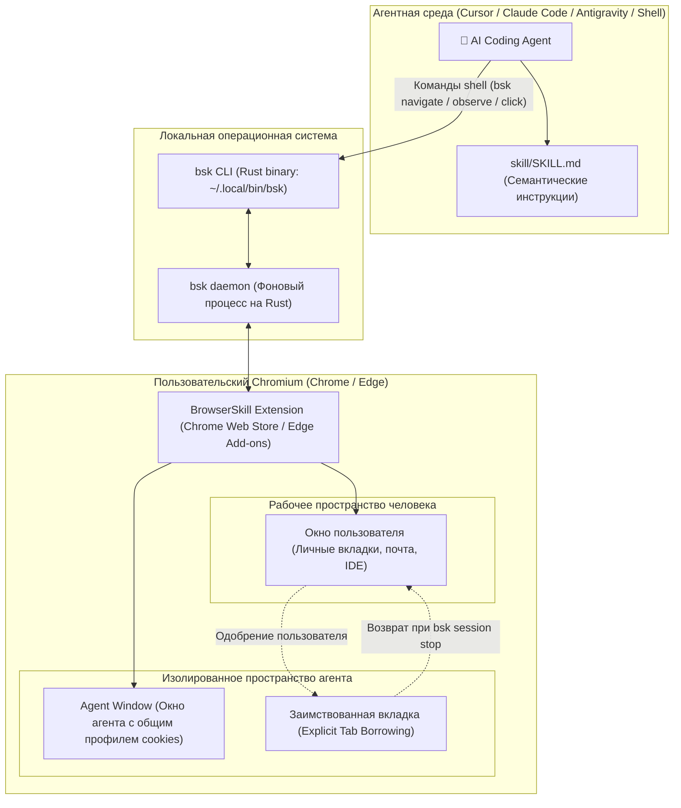

# 🌐 Tencent BrowserSkill: Агентная автоматизация реального браузера без перехвата фокуса

> **Ссылка на репозиторий:** [https://github.com/Tencent/BrowserSkill](https://github.com/Tencent/BrowserSkill)  
> **Организация:** Tencent (Tencent Open Source)  
> **Слоган:** *«Let AI agents use your real, logged-in browser without interrupting your work.»*  
> **Звёзды GitHub:** 2,820+ ★ (Топ-8 ежедневного чарта Trendshift)  
> **Стек:** Rust (CLI и IPC-демон `bsk-cli`), TypeScript (Chromium Extension для Chrome/Edge), манифесты `SKILL.md` для агентных харнесов  
> **Поддерживаемые агенты:** Cursor, Claude Code, OpenAI Codex, Antigravity, OpenClaw, CodeBuddy, WorkBuddy, Pi, Hermes Agent, DeepSeek Harness  
> **Лицензия:** MIT  

---

## 🎯 1. В чем фундаментальная проблема существующих браузерных агентов?

Попытки доверить AI-агенту выполнение задач в веб-браузере (тестирование интерфейсов, сбор данных в закрытых сервисах, заполнение форм, прогон UI-регрессий) ранее упирались в три непреодолимых барьера:

1. **Потеря состояния авторизации (No Login State):**
   * Традиционные инструменты (Playwright, Puppeteer, `browser-use`) запускают свежий временный профиль Chromium (`--user-data-dir` в `/tmp`). В нем нет сохраненных cookies, сессий SSO, активных токенов и локального хранилища.
   * Агенту приходится заново логиниться в GitHub, Jira, AWS Console или корпоративные порталы, что ломается на SMS-кодах и аппаратных 2FA-ключах (YubiKey).
2. **Кража пользовательского фокуса (Work Interruption):**
   * Решения класса *Computer Use* (управление курсором и кликами через доступность ОС) дергают системную мышь, переключают активные окна и воруют фокус клавиатуры. Человек вынужден сидеть сложа руки и смотреть на экран, пока агент кликает по вкладкам.
3. **Хрупкость навигации и раздувание контекста (DOM Bloat):**
   * Передача сырого HTML-дерева в промпт сжигает сотни тысяч токенов, а координаты пикселей с скриншотов «плывут» при малейшем изменении разрешения или прокрутке.

**Архитектурный ответ Tencent BrowserSkill:**
> *«Дать ИИ-агенту безопасный программный доступ к **реальному браузеру разработчика** с уже имеющимися авторизациями, но изолировать его работу в отдельном окне (Agent Window) с явным протоколом заимствования вкладок (Tab Borrowing), не мешая человеку.»*

---

## 🏗️ 2. Архитектура: Двухкомпонентный рантайм

Система BrowserSkill разделена на легковесный локальный нативный сервис и браузерное расширение, связанные через IPC:



### Ключевые компоненты:
1. **`bsk` CLI & Daemon (`crates/bsk-cli`, `crates/bsk-protocol`):**
   * Написан на чистом Rust. Компилируется в один независимый бинарник без внешних тяжелых рантаймов.
   * Управляет сессиями (`bsk session start`, `bsk session stop`), взаимодействует с расширением браузера через WebSocket/IPC, транслирует команды агента в события браузера.
2. **Browser Extension (`apps/extension`):**
   * Официальное расширение для Chrome и Microsoft Edge (Manifest V3).
   * Подключается к локальному демону `bsk`. 
   * Отвечает за безопасное создание выделенного окна **Agent Window**, перехват событий, инъекцию скриптов наблюдения (VOM) и организацию диалогов подтверждения.

---

## 🔒 3. Изоляция и безопасность: Механизм Tab Borrowing

Главная инновация BrowserSkill — концепция **«Заимствования вкладок» (Explicit Tab Borrowing)**:

* **Изолированное окно агента (Agent Window):** По умолчанию все новые сессии агента открываются в отдельном окне. Агент не видит и не трогает вкладки пользователя, открытые в основном окне.
* **Заимствование открытой вкладки:** Если задача требует взаимодействия с конкретной страницей, уже открытой пользователем:
  ```bash
  bsk tab borrow <tab-id> --session <id>
  ```
  1. В браузере пользователя появляется интерактивный запрос на подтверждение: *«Agent запрашивает доступ к вкладке [Jira / AWS Console]. Разрешить?»*
  2. После одобрения вкладка временно переносится в Agent Window.
  3. По завершении задачи (`bsk session stop <id>`) вкладка **автоматически возвращается обратно в пользовательское окно** ровно в том состоянии, в котором ее оставил агент.
* **Строгий запрет на эксфильтрацию секретов:** В системном манифесте `SKILL.md` зафиксировано жесткое защитное правило:
  > *«Never extract credentials, cookies, tokens, or other secrets.»*
  Агенту запрещено извлекать сырые токены авторизации и пароли из полей ввода или хранилища cookies.

---

## 👁️ 4. Семантическое зрение: Рефы `@eN` вместо сырого DOM

Вместо скармливания нейросети сотен килобайт HTML-кода BrowserSkill использует технологию **VOM (Virtual Object Model)**. Команда `bsk observe` строит компактное дерево доступности с номерами интерактивных элементов (`@eN` refs):

```text
[Page: "GitHub - Settings"]
├── @e1 [Link: "Profile"]
├── @e2 [Input: "Public email" value="dev@corp.local"]
├── @e3 [Button: "Update preferences"]
└── @e4 [Checkbox: "Include private contributions" checked=true]
```

### Команды взаимодействия агента:
Агент манипулирует элементами через лаконичные детерминированные команды:

| Действие | Команда `bsk` | Описание |
|---|---|---|
| **Клик** | `bsk click @e3 --session <id>` | Клик по кнопке или ссылке с генерацией нативных событий браузера. |
| **Ввод текста** | `bsk fill @e2 --value "new@corp.local" --session <id>` | Безопасная вставка значения в поле ввода. |
| **Выбор из списка**| `bsk select @e5 --value "dark" --session <id>` | Выбор опции по её машинному значению. |
| **Клавиши** | `bsk press Enter --ref @e2 --session <id>` | Отправка клавиатурных нажатий (`Enter`, `Tab`, `Escape`). |
| **Ховер** | `bsk hover @e1 --session <id>` | Наведение курсора для раскрытия выпадающих меню. |
| **Скроллинг** | `bsk scroll-to @e4 --session <id>` / `bsk wheel --delta-y 600` | Прокрутка к элементу или эмуляция колеса мыши. |
| **Скриншот** | `bsk screenshot --full-page --out page.png` | Создание длинного скриншота всей страницы для визуального контроля. |

---

## 🤝 5. Human-in-the-Loop (HITL)

Если в процессе выполнения сценария агент сталкивается с препятствием, требующим обязательного участия человека (капча Cloudflare, биометрия TouchID/Windows Hello, двухфакторный пуш-код, подтверждение списания средств), он не зависает и не сыплет ошибками:

1. Агент вызывает команду запроса помощи:
   ```bash
   bsk request-help --message "Пожалуйста, подтвердите 2FA-уведомление на телефоне" --session <id>
   ```
2. В браузере пользователя всплывает баннер с пояснением от агента.
3. Человек совершает необходимое действие и нажимает «Продолжить».
4. Агент мгновенно возобновляет автоматическое выполнение сценария.

---

## ⚙️ 6. Установка и подключение к кодинг-агентам

### 1. Установка CLI (написан на Rust):
```bash
# macOS / Linux
curl -fsSL https://raw.githubusercontent.com/Tencent/BrowserSkill/main/install.sh | sh
export PATH="$HOME/.local/bin:$PATH"

# Проверка установки
bsk --version
```

### 2. Установка расширения браузера:
Доступно официально в магазинах:
* [Chrome Web Store: BrowserSkill](https://chromewebstore.google.com/detail/hhcmgoofomhgciiibhipgmgkgnoenaoi)
* [Edge Add-ons: BrowserSkill](https://microsoftedge.microsoft.com/addons/detail/browserskill/emacgiaaaiojkkpkddmmdfhmokgmnikg)

### 3. Регистрация навыка в агентном харнесе:
Утилита `bsk` автоматически определяет установленные агентные среды и устанавливает манифест `SKILL.md`:
```bash
# Интерактивный выбор харнеса (Cursor, Claude Code, Codex и др.)
bsk install-skill

# Или автоматическая установка для конкретного агента
bsk install-skill --harness cursor --json
bsk install-skill --harness claude-code
```

### 4. Проверка здоровья связки:
```bash
bsk doctor
```

---

## 📊 7. Сравнительный анализ браузерных решений для ИИ

| Критерий | Tencent BrowserSkill | [AIHawk](file:///home/blackzeshi/Documents/Notes/06_developer_tools_and_apps/ai-hawk.md) | [Obscura](file:///home/blackzeshi/Documents/Notes/06_developer_tools_and_apps/obscura.md) | Классический Playwright |
|---|---|---|---|---|
| **Стек ядра** | Rust (`bsk-cli`) + TS Ext | Python + Playwright | Rust (Headless Chrome) | Node.js / Python |
| **Профиль пользователя** | **Реальный профиль человека** | Изолированный профиль | Изолированный sandbox | Временный профиль (`/tmp`) |
| **Сохраненные сессии/куки**| ✅ Полный доступ к логинам | ⚠️ Требуется экспорт кук | ❌ Отсутствуют | ❌ Отсутствуют |
| **Влияние на работу человека**| **Нулевое (отдельное Agent Window)** | Захватывает окно | Нулевое (Headless) | Захватывает фокус |
| **Модель представления DOM** | Семантические `@eN` рефы (VOM) | Промпты + скриншоты | JSON AST / Accessibility | Огромный сырой HTML |
| **Human-in-the-Loop** | ✅ Встроенный `request-help` | ❌ Ручное вмешательство | ❌ Автономный | ❌ Нет |
| **Интеграция с агентами** | Нативный `SKILL.md` под все IDE | Сервер MCP | IPC / CLI | Написание кода тестов |

---

## 🔗 8. Синергия с базой знаний

* [06. AIHawk: Скрытный антибот-браузер с MCP](file:///home/blackzeshi/Documents/Notes/06_developer_tools_and_apps/ai-hawk.md) — альтернативный подход, когда задачу нужно решить в скрытом фоновом режиме с обходом систем обнаружения ботов.
* [06. Obscura: Headless браузер на Rust для AI-агентов](file:///home/blackzeshi/Documents/Notes/06_developer_tools_and_apps/obscura.md) — решение для полностью автономных песочниц без GUI и без участия пользователя.
* [06. Crawl4AI: LLM-friendly веб-краулер](file:///home/blackzeshi/Documents/Notes/06_developer_tools_and_apps/crawl4ai.md) — идеальный экстрактор для чтения и конвертации веб-страниц в чистый Markdown перед передачей в планировщик.
* [02. Agent-Skills (Tech Leads Club)](file:///home/blackzeshi/Documents/Notes/02_agent_runtimes_and_harnesses/agent-skills.md) — стандарты спецификации навыков для кодинг-агентов, по которым оформлен `skill/SKILL.md` в BrowserSkill.
* [02. Архитектура Tool Broker & Execution Blocker](file:///home/blackzeshi/Documents/Notes/02_agent_runtimes_and_harnesses/tool-broker-architecture.md) — концепция контроля выполнения инструментов и выноса учетных данных.
