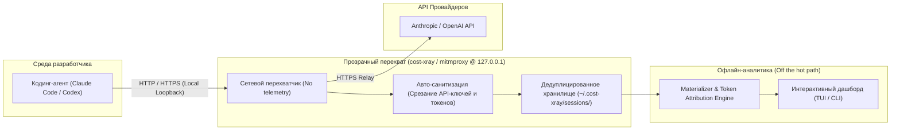

# 🔬 cost-xray: Детальный рентген сетевого трафика и стоимости контекста LLM-агентов

> **Ссылка на репозиторий:** [https://github.com/tigerless-labs/cost-xray](https://github.com/tigerless-labs/cost-xray)  
> **Разработчик:** Tigerless Labs  
> **Слоган:** *«See what your AI coding agent actually sends to the API — and what each part costs.»*  
> **Звёзды GitHub:** 2.3k+ ★  
> **Стек:** Python 3.11+, mitmproxy, Textual (TUI), tiktoken, LiteLLM Pricing  
> **Поддерживаемые агенты:** Claude Code, OpenAI Codex CLI  
> **Лицензия:** MIT  

---

## 🎯 1. В чем фундаментальная проблема анализа логов?

Инструменты анализа затрат предыдущего поколения (такие как `ccusage`, `codeburn` и др.) строят статистику на базе локальных транскриптов сессий. Они способны ответить на вопрос **«Сколько суммарно потрачено за день или за сессию?»**, но не могут ответить на критический инженерный вопрос: **«Какие именно байты и структуры были отправлены в модель перед вызовом, и кто отвечает за раздувание счета?»**

### Разница между анализом логов и перехватом сетевого трафика:
* **Локальный лог агента (Transcript):** Формируется постфактум. В него попадают только сообщения диалога и результаты завершенных шагов.
* **Реальный HTTP-запрос (Request-time wire context):** Перед отправкой в API провайдера рантайм агента на лету конструирует гигантский префикс: **системные промпты**, **JSON-схемы десятков инструментов**, **определения подключенных MCP-серверов**, скрытые системные напоминания (reminders) и блоки кэширования. 

> [!WARNING]
> В реальных задачах разработчика невидимый в логах префикс контекста занимает **от 40% до 70%** всего контекстного окна модели! Без анализа сетевого уровня этот оверхед остается «слепым пятном».



---

## ⚡ 2. Ключевые возможности и преимущества cost-xray

### 1. Атрибуция затрат глубже уровня инструментов (Below the Tool)
В отличие от стандартных систем, которые выдают агрегированную сумму («Инструмент Read потребил $12 за сессию»), cost-xray декомпозирует каждый отдельный вызов:
* Сколько стоил именно этот вызов `Read` для файла `schema.prisma`.
* Какая доля пришлась на `cache-read`, `cache-write`, `fresh input` и `output/thinking tokens`.

### 2. Заполненность контекстного окна (Window Occupancy)
Показывает физическую раскладку контекста в каждом конкретном раунде:
* Объем системных инструкций рантайма.
* Доля JSON-схем базовых инструментов.
* Доля подключенных MCP-серверов.
* Реальный диалоговый контекст и результаты вызовов терминала.

### 3. Детектирование паразитного оверхеда MCP (Unused MCP Waste)
Часто разработчики подключают несколько MCP-серверов (PostgreSQL, GitHub, Slack, AWS). Их схемы инжектируются в каждый запрос к модели. Если за 50 раундов инструмент из MCP-сервера ни разу не был вызван, cost-xray подсветит его как «мертвый груз», вымывающий контекст и увеличивающий задержки.

### 4. Отсутствие влияния на сетевую задержку (Off the Hot Path)
Сетевой прокси занимается исключительно прозрачной пересылкой байтов и потоковым сохранением дедуплицированного сырого трафика. Все тяжелые операции — токенизация, расчет пересечений кэша и калибровка стоимости — производятся асинхронно отдельным материализатором.

---

## 🛠️ 3. Сравнение аналитики: Логи vs cost-xray

| Диагностический вопрос | Парсеры логов (`ccusage`, `codeburn`) | Сетевой перехват `cost-xray` |
| :--- | :--- | :--- |
| Общая стоимость сессии и вызовов | ✅ Да | ✅ Да |
| Видимость системных промптов и инжектированных схем | ❌ Нет (отсутствуют в логах) | ✅ **Полная видимость сырого запроса** |
| Точный объем контекста под схемы инструментов | ❌ Нет | ✅ **С точностью до байта и токена** |
| Выявление неиспользуемых MCP-серверов в префиксе | ⚠️ Приблизительная оценка | ✅ **Точная идентификация мертвого веса** |
| Разделение стоимости кэша (`cache read/write/fresh`) на уровне блоков | ❌ Нет (в логах только общий итог запроса) | ✅ **Построчная атрибуция по границам кэша** |
| Инспекция реального контекстного окна в реальном времени | ❌ Нет | ✅ **Да (Live TUI-инспектор)** |

---

## 🔍 4. Инженерная диагностика: как читать сигналы дашборда

Панель cost-xray визуализирует аномалии, указывающие на ошибки конфигурирования агентов:

| Визуальный паттерн в TUI | Инженерная причина | Рекомендуемое действие |
| :--- | :--- | :--- |
| **Блок MCP-схем занимает 40k+ токенов на каждом ходу** | Подключен тяжелый MCP-сервер, инструменты которого не задействованы в задаче. | Отключить нерелевантный MCP-сервер для текущего проекта. |
| **Повторяющиеся `cache-write` на одном и том же источнике** | Префикс контекста постоянно инвалидируется из-за динамических вставок в начале промпта (например, плавающего timestamp). | Стабилизировать порядок системных инструкций для работы Prompt Caching. |
| **Токены `thinking` доминируют в стоимости вывода** | Модель тратит чрезмерный бюджет размышлений на тривиальные шаги. | Настроить `thinking budget` или скорректировать промпт. |
| **Гигантские строки `tool_result` у команд `Read` / `Bash`** | Неконтролируемый вывод больших файлов или дампов команд без лимитов строк. | Настроить пагинацию вывода (`head`, `grep`, ограничение `offset`). |

---

## 🔒 5. Безопасность, перехват и отказоустойчивость

### Механика перехвата трафика:
1. **Claude Code:** Использует режим обратного прокси через переопределение переменной окружения базового URL (`ANTHROPIC_BASE_URL`). Корневые сертификаты в систему **не устанавливаются**.
2. **Codex CLI:** Использует прямой форвард-прокси с изолированным локальным CA, который монтируется исключительно в процесс команды `codex` и не затрагивает общесистемное хранилище сертификатов.

### Принцип Self-Healing (Отказоустойчивость):
Обертки команд агентов работают по принципу самовосстановления:
* Если демон прокси выключен, обертка пытается автоматически его поднять.
* Если поднять прокси невозможно, агент переключается на прямое соединение с API провайдера без перехвата — **работа разработчика никогда не прерывается из-за сбоя мониторинга**.

### Локальная приватность:
* Прокси слушает исключительно `127.0.0.1`.
* Никакая телеметрия во внешние облака не отправляется.
* Заголовки авторизации (`Authorization`, `x-api-key`), куки и приватные поля вырезаются из сетевого дампа перед записью на диск в `~/.cost-xray/`.

---

## 🚀 6. Установка и запуск

```bash
# Установка через pip / uv
pip install cost-xray

# Запуск службы перехвата и TUI дашборда
cost-xray

# Либо через быстрый алиас
cx

# Запуск Claude Code под мониторингом cost-xray
cx claude

# Остановка мониторинга и возврат к прямому соединению
cx stop
```
