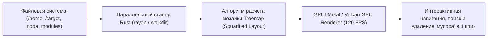

# ⚡ Disktree: Визуальный анализатор файловой системы нового поколения от CEO Shopify

> **Ссылка на репозиторий:** [https://github.com/tobi/disktree](https://github.com/tobi/disktree)  
> **Автор:** Тобиас Лютке (Tobias Lütke, @tobi — основатель и CEO Shopify)  
> **Слоган:** *«A treemap for finding and removing what fills your disk, for Omarchy. Rust + GPUI.»*  
> **Звёзды GitHub:** 660+ ★ (#8 Daily в чартах Trendshift)  
> **Стек:** Pure Rust 1.85+, GPUI (графический фреймворк редактора Zed), Cross-Platform  
> **Лицензия:** MIT / Apache-2.0  

---

## 🎯 1. В чем проблема классических анализаторов диска?

Утилиты вроде GrandPerspective, DaisyDisk, Baobab или WinDirStat либо морально устарели, либо написаны на тяжелых web-оболочках (Electron), либо страдают от медленного сканирования файловых систем с миллионами мелких файлов (особенно каталогов `node_modules`, `target`, кэшей моделей и виртуальных окружений Python).

**Disktree от Тоби Лютке решает задачу на острие инженерного стека:**
1. **Параллельное сканирование на чистом Rust:** Использование эффективного обхода дерева каталогов с минимальным числом системных вызовов `stat()`.
2. **Движок рендеринга GPUI:** Тот же ультрабыстрый графический движок с аппаратным GPU-ускорением, на котором построен редактор кода **Zed**.
3. **120 FPS и плавная анимация:** Интерфейс не зависает и мгновенно масштабирует мозаику вложенных блоков при кликах и навигации.

---

## ⚡ 2. Ключевые возможности

* **Цветовая дифференциация типов данных:** Визуальное разделение исходного кода, мультимедиа, образов виртуальных машин, кэшей пакетов и бинарных артефактов.
* **Штриховка удаляемого пространства (Reclaimable Space):** Интуитивное выделение файлов под удаление с отображением того, сколько места освободится на томе прямо сейчас.
* **Постоянный индикатор свободного места:** Полоса свободного пространства диска всегда перед глазами в едином масштабе с анализируемыми директориями.
* **Поддержка проекта Omarchy:** Разрабатывается в рамках личной экосистемы высокопроизводительных системных инструментов Тоби Лютке.

---

## 🎯 3. Значение для разработчиков и AI-инженеров

Для разработчиков, активно использующих локальные LLM, Docker и компиляторы Rust, `disktree` становится незаменимым инструментом для быстрого освобождения десятков гигабайт дискового пространства за считанные секунды без тормозов интерфейса.
