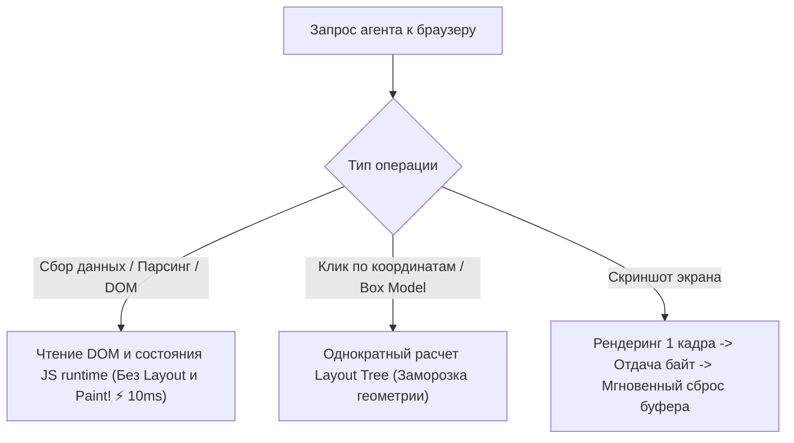

# 🦀 Moli: Headless-браузер на чистом Rust для автономных AI-агентов

> **Ссылка на репозиторий:** [https://github.com/lexmount/moli](https://github.com/lexmount/moli)  
> **Разработчик:** Lexmount  
> **Слоган:** *«Structure first. Pixels on demand. Open source browser for AI agents.»*  
> **Звёзды GitHub:** 6.8k+ ★ (№3 Daily, №7 Weekly в Trendshift)  
> **Стек:** Pure Rust, CDP (Chrome DevTools Protocol), WebDriver Classic & BiDi, Playwright Integration  
> **Платформы:** Linux, macOS, Windows  
> **Лицензия:** MIT / Apache-2.0  

---

## 🎯 1. Почему стандартные headless-браузеры не подходят для AI-агентов?

Традиционные браузерные решения (Chromium, Firefox, WebKit в связке с Puppeteer или Playwright) создавались для людей. Они непрерывно поддерживают полный графический конвейер:
* Непрерывный расчет геометрии и раскладки (Layout Tree).
* Растеризация пикселей и композитинг на GPU.
* Потребление 300–800 МБ оперативной памяти на каждую пустую вкладку.

Однако **90–95% действий AI-агента не требуют отрисовки пикселей**: агенту нужны структурированный текст, семантическое дерево доступности (accessibility tree), выполнение JavaScript, инспекция сетевых запросов и клики по селекторам.

**Moli меняет парадигму: «Сначала структура, пиксели — только по запросу» (Structure First, Pixels on Demand):**
1. **DOM и стили как единый источник правды:** При сборе страниц Moli исполняет JavaScript и строит DOM, но полностью пропускает этапы Layout и Paint, экономя до 90% CPU и памяти.
2. **Ленивый расчет геометрии:** Расчет координат элементов и хит-тестинг производятся только тогда, когда агенту явно нужны физические координаты для клика мыши.
3. **Отрисовка в память с мгновенным сбросом:** Если агенту требуется скриншот экрана, Moli рендерит один кадр, отдает байты и мгновенно освобождает буфер кадра.



---

## ⚡ 2. Сравнение производительности: Chromium vs Moli

| Характеристика | Chromium (Headless) | Moli (Rust Headless) |
| :--- | :--- | :--- |
| **Базовое потребление RAM** | ~350–600 МБ на контекст | **~30–60 МБ (в 10 раз легче)** |
| **Время холодного старта** | 800–1500 мс | **15–40 мс** |
| **Отрисовка пикселей** | Непрерывно в цикле кадров | **Только On-Demand по запросу** |
| **Формат вывода для LLM** | Сырой HTML (требует очистки) | **Нативный Markdown или компактное семантическое дерево** |
| **Протоколы управления** | CDP | **CDP + WebDriver Classic + WebDriver BiDi** |

---

## 🚀 3. Быстрый старт и интеграция с Playwright

### Установка бинарника (Linux / macOS):
```bash
curl --proto '=https' --tlsv1.2 -fsSL https://github.com/lexmount/moli/releases/latest/download/moli-installer.sh | sh
```

### Извлечение страниц через CLI:
```bash
# Мгновенная выгрузка страницы в чистый Markdown для LLM
moli fetch --dump markdown --wait-until done https://example.com

# Выгрузка компактного дерева доступности для агента
moli fetch --dump semantic_tree_text https://example.com

# Скриншот страницы (включает ленивый расчет раскладки)
moli fetch --layout --dump screenshot https://example.com > screenshot.png
```

### Подключение через Playwright по протоколу CDP:
```javascript
import { chromium } from "playwright";

// Запуск Moli сервера: moli serve --port 9222
const browser = await chromium.connectOverCDP("http://127.0.0.1:9222");
const context = browser.contexts()[0];
const page = await context.newPage();

await page.goto("https://news.ycombinator.com");
console.log(await page.locator("body").innerText());

await browser.close();
```
