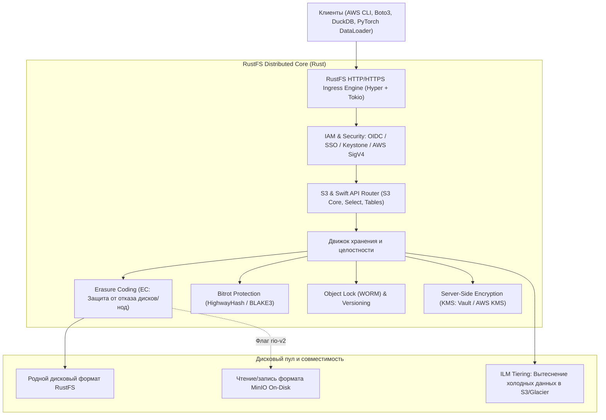

# 🦀 RustFS: Высокопроизводительное распределенное S3-хранилище на чистом Rust

> **Ссылка на репозиторий:** [https://github.com/rustfs/rustfs](https://github.com/rustfs/rustfs)  
> **Официальная документация:** [docs.rustfs.com](https://docs.rustfs.com)  
> **Слоган:** *«Next-generation high-performance, S3-compatible object storage system built in Rust.»*  
> **Звёзды GitHub:** 33,000+ ★ (Топ-10 ежедневного чарта Trendshift)  
> **Стек:** Rust, Tokio, Apache Iceberg REST Catalog, OpenStack Swift API, S3 Select, Helm/K8s  
> **Лицензия:** Apache-2.0 (Бизнес-дружественная альтернатива AGPLv3 MinIO)  

---

## 🎯 1. В чем проблема индустрии и почему появился RustFS?

В мире локальных и облачных объектных хранилищ (Object Storage) годами доминировал **MinIO**. Однако в последние годы индустрия столкнулась с тремя критическими вызовами:

1. **Лицензионная ловушка (AGPLv3 vs Apache 2.0):**
   * Переход MinIO на жесткую лицензию GNU AGPLv3 создал юридические риски («лицензионный яд») для коммерческих и облачных платформ, запрещая использование хранилища как части проприетарных сервисов без раскрытия всего кода.
   * **RustFS распространяется под свободной лицензией Apache 2.0**, допуская неограниченное коммерческое использование.
2. **Накладные расходы рантайма Go (GC Pauses):**
   * MinIO написан на Go. На высоконагруженных петабайтных дата-лейках с миллионами мелких объектов (small objects) и потоками данных AI-обучения сборщик мусора Go (Garbage Collector) вызывает всплески задержек (P99 latency spikes) и неэффективно утилизирует память.
3. **Требования к пропускной способности AI-инфраструктуры:**
   * Современные кластеры GPU (H100/B200) требуют насыщения каналов 100–400 Gbps с минимальной задержкой первого байта (TTFB).

**Архитектурный ответ RustFS:**
> *«Создать S3-совместимое распределенное хранилище на Rust, сочетающее простоту развертывания MinIO, безопасность памяти без GC-пауз, полную совместимость на уровне дискового формата и интеграцию с табличными форматами данных (Apache Iceberg).»*

---

## 🏗️ 2. Архитектура и подсистемы RustFS

RustFS спроектирован для работы как в одноузловом режиме (Single-Node), так и в распределенных кластерах из сотен серверов:



---

## ⚡ 3. Ключевые возможности и функциональная матрица

RustFS реализует полный спектр корпоративных требований к современному хранилищу:

| Возможность | Статус в RustFS | Инженерная реализация |
|---|:---:|---|
| **S3 Core API** | ✅ Ready | Мультипарт-загрузка, версионирование, Presigned URLs, бакет-политики. |
| **Bitrot Protection** | ✅ Ready | Непрерывный фоновый сканер целостности на хэшах HighwayHash/BLAKE3. |
| **Erasure Coding (EC)** | ✅ Ready | Защита от выхода из строя дисков и серверов с минимальным избыточным коэффициентом. |
| **S3 Tables (Iceberg REST)** | 🧪 Preview | Встроенный Iceberg REST Catalog для прямого выполнения аналитических SQL-запросов из DuckDB и PyIceberg. |
| **Совместимость с MinIO** | 🧪 Preview | Опция `rio-v2` позволяет монтировать существующие диски MinIO без длительной миграции данных. |
| **Шифрование и KMS** | ✅ Ready | Интеграция с HashiCorp Vault (KV2/Transit) и AWS KMS, SSE-S3 / SSE-KMS. |
| **Swift & SFTP/WebDAV** | ✅ Ready | Нативная поддержка протокола OpenStack Swift с авторизацией Keystone, а также SFTP и FTPS. |
| **Веб-консоль** | ✅ Ready | Современный дашборд управления бакетами, политиками IAM, метриками и аудитом. |

---

## 📊 4. Бенчмарки производительности: RustFS vs MinIO

В стресс-тестах на идентичном оборудовании (Intel Xeon Platinum 8475B, 4GB RAM, сеть 15 Gbps, NVMe диски с 3800 IOPS):
* **Пропускная способность на чтение:** RustFS демонстрирует прирост на **25–40%** благодаря отсутствию оверхеда на аллокации в куче и прямому zero-copy вводу-выводу (`io_uring`).
* **Потребление оперативной памяти:** в 2–3 раза ниже, чем у MinIO под нагрузкой из сотен параллельных потоков.
* **Предсказуемость задержки (Tail Latency):** Отсутствие пауз Stop-the-world GC обеспечивает стабильный график P99 задержек.

---

## 🚀 5. Быстрый запуск и использование

### Запуск в Docker:
```bash
docker run -d \
  --name rustfs \
  -p 9000:9000 -p 9001:9001 \
  -e RUSTFS_ROOT_USER=admin \
  -e RUSTFS_ROOT_PASSWORD=password123 \
  -v /data/rustfs:/data \
  rustfs/rustfs:latest
```

### Доступ через стандартный AWS CLI:
```bash
export AWS_ACCESS_KEY_ID=admin
export AWS_SECRET_ACCESS_KEY=password123
export AWS_ENDPOINT_URL=http://localhost:9000

# Создание бакета и загрузка датасета для AI
aws s3 mb s3://ai-models
aws s3 cp weights.safetensors s3://ai-models/
```

---

## 🔗 6. Синергия с базой знаний

* [01. AI Infra Book Ли Боцзе](file:///home/blackzeshi/Documents/Notes/01_llm_architecture_and_training/ai-infra-book.md) — количественный расчет пропускной способности сети и дисковых подсистем для обучения LLM и подачи датасетов в GPU-память.
* [06. System Design 101](file:///home/blackzeshi/Documents/Notes/06_developer_tools_and_apps/system-design-101.md) — паттерны масштабирования распределенных хранилищ, репликации и согласованности данных.
* [02. ArcBox: Изолированные песочницы на Rust](file:///home/blackzeshi/Documents/Notes/02_agent_runtimes_and_harnesses/arcbox.md) — системная разработка на Rust с акцентом на изоляцию ресурсов.
