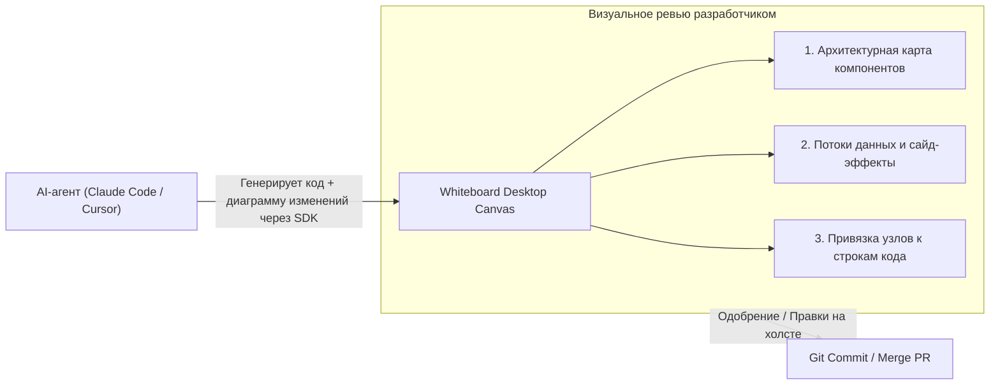

# ⚡ Whiteboard: Архитектурный холст совместного проектирования человека и AI-агентов

> **Ссылка на репозиторий:** [https://github.com/devdotfast/whiteboard](https://github.com/devdotfast/whiteboard)  
> **Организация:** DevDotFast  
> **Слоган:** *«Save time reviewing AI code. An open-source desktop app where humans and agents architect software together.»*  
> **Звёзды GitHub:** 1.1k+ ★ (#5 Daily в чартах Trendshift)  
> **Стек:** TypeScript, Electron / Tauri, Canvas / WebGL, Git, Claude Code SDK  
> **Лицензия:** MIT  

---

## 🎯 1. В чем главная боль эпохи AI-кодинга?

Кодинг-агенты (Claude Code, Cursor, Windsurf, Codex) способны за пару минут сгенерировать Pull Request на 2 000 строк кода, затрагивающий десятки файлов.

**Кризис код-ревью (Review Bottleneck):**
* Человек не способен эффективно вычитывать гигантские плоские текстовые диффы (`git diff`).
* Легко пропустить неявные архитектурные сайд-эффекты, сломанные контракты интерфейсов и скрытые зависимости.
* Разработчик тратит больше времени на ревью сгенерированного кода, чем потратил бы на его написание руками.

**Решение Whiteboard:**
> Превратить плоский дифф в **интерактивную визуальную архитектурную доску**. Агент получает специальный SDK, с помощью которого он **рисует на холсте** структуру своих изменений, связи между модулями и диаграммы потоков данных прямо в процессе работы.



---

## ⚡ 2. Ключевые возможности

1. **Агентный SDK рисования (Whiteboard Agent SDK):** Агент может программно вызывать функции рисования блоков, стрелок, группировки сервисов и аннотаций, объясняя логику своего рефакторинга.
2. **Двусторонняя интерактивность:** Разработчик может перетаскивать блоки на холсте, оставлять комментарии прямо к визуальным узлам или рисовать стрелки, показывая агенту: *«Свяжи этот сервис напрямую через gRPC»*.
3. **Привязка к коду (Code-Linked Nodes):** Клик по любому блоку на холсте мгновенно открывает соответствующий фрагмент исходного кода и дифф.
4. **Интеграция с локальными инструментами:** Нативная поддержка Claude Code, Codex и локальных Git-репозиториев без передачи проприетарного кода в облако.

---

## 💻 3. Пример вызова Whiteboard SDK из агента

```typescript
import { Whiteboard } from "@devdotfast/whiteboard-sdk";

const wb = await Whiteboard.connect();

// Агент визуализирует предложенный рефакторинг авторизации
const authNode = wb.addNode({
  id: "auth-service",
  label: "Auth Service (OAuth2 + JWT)",
  file: "src/auth/service.ts",
  status: "modified"
});

const dbNode = wb.addNode({
  id: "user-store",
  label: "User PostgreSQL Store",
  file: "src/db/users.ts",
  status: "new"
});

wb.addConnection(authNode, dbNode, {
  label: "connection_pool.query()",
  style: "dashed"
});
```

---

## 🎯 4. Значение для командной разработки

Whiteboard переводит взаимодействие с кодинг-агентами на **уровень архитектурного диалога**: инженер утверждает общую картину и контракты на холсте, а детали имплементации делегирует нейросети.
